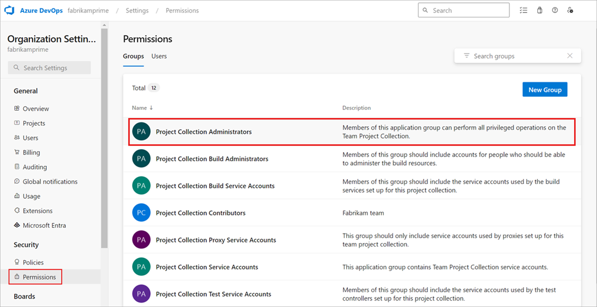
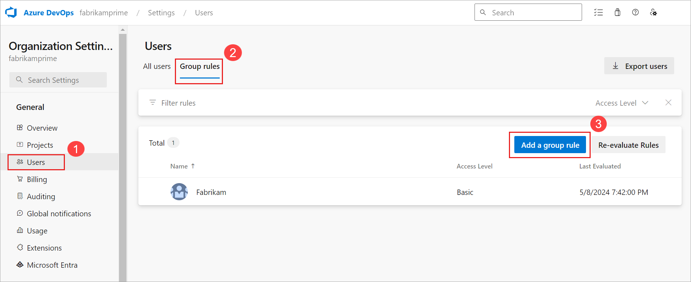
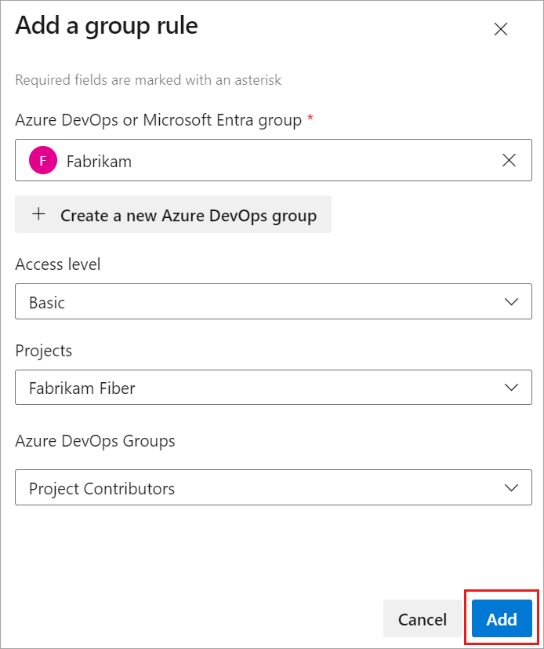
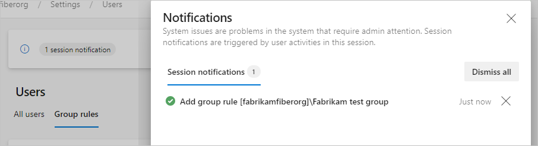
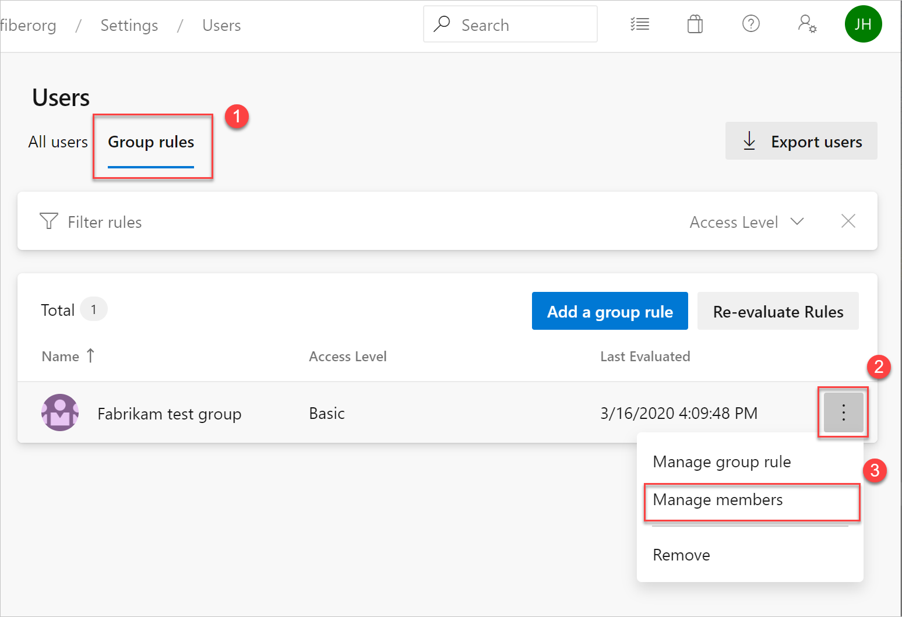
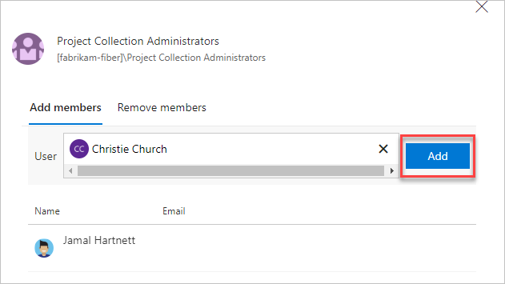
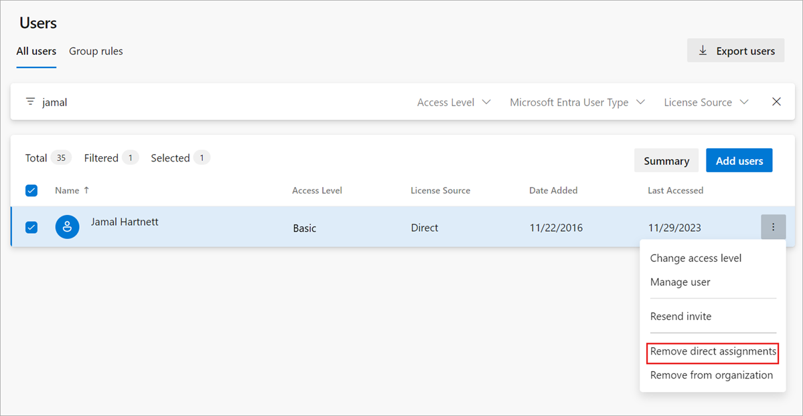
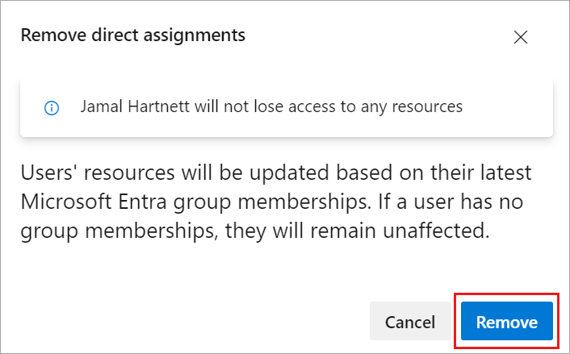
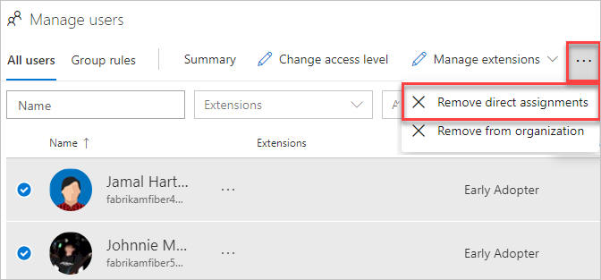

# Add a group rule to assign access levels

[!INCLUDE [version-vsts-only](../../includes/version-vsts-only.md)]

Azure DevOps includes group-based licensing for Azure Active Directory (Azure AD) groups and Azure DevOps groups. Learn how to add a group rule to assign an access level to a group. Resources in Azure DevOps are assigned to all members of the group. Group rules are also used to add users to team projects and other specific groups, like Contributors, Readers, and Administrators.

When users leave the group, the licenses are freed and returned to your pool. You don't need to automate license management to reflect changes in your organizational structure on a per-user basis.

> [!NOTE]
> We recommend that you reevaluate rules regularly on the **Group** rules tab of the **Users** page. Clarify whether any group membership changes in Azure AD might affect your organization. Automated reevaluation occurs every six hours and any time the group rule changes.

## Prerequisites

To manage licenses and group rules, you must be a Project Collection Administrator (PCA) for the organization. If you're not a member of the **Project Collection Administrators** group, [get added as one](../../organizations/security/set-project-collection-level-permissions.md).

## Add group rule

1. Sign in to your organization (```https://dev.azure.com/{yourorganization}```).

2. Select  **Organization settings**.

   

3. Go to the **Permissions** tab, and then verify that you're a member of the **Project Collection Administrators** group.

   

4. Go to the **Users** tab, and then select **Group rules**. This view shows you all of your created group rules. Select **Add a group rule**.

   

	**Group rules** appear only if you're a member of the **Project Collection Administrators** group.  

5. Complete the dialog box for the group for which you want to create a rule. Include an access level for the group and any optional project access for the group. Select **Add**.

   

A notification displays, showing the status and outcome of the rule. If the assignment couldn't be completed (for example, because your organization didn't have enough purchased licenses), select **View status** to see the details.



> [!IMPORTANT]
> Group rules only apply to users without direct assignments and to users added to the group going forward. [Remove direct assignments](#remove-direct-assignments) so the group rules apply to those users.

## Manage group members

1. Select **Group rules** > :::image type="icon" source="../../media/ellipses-reduced-screen-size.png" border="false"::: > **Manage members**.
   

   > [!NOTE]
   > Leave existing automation for managing access levels for users running as-is (for example, PowerShell). The goal is to reflect the same resources that the automation is applying to those users.

2. Add members, and then select **Add**.

   

When you assign the same access level to a user, the user consumes only one access level. User assignments can be made both directly and through a group. No other licenses are required.

> [!NOTE]
> You can assign Group rules to support both access levels and project memberships. Users are granted the highest access level when assigned to more than one rule or Azure AD group which specify different levels of access.  For example, if John is assigned to two Azure AD groups and two different Group rules that specify Stakeholder access and the other Basic access, then John's access level is Basic. 
## Verify group rule

- Verify that the resources are applied to each group and individual user. On the **All users** tab, highlight a user, and then select **Summary**.

   :::image type="content" source="media/assign-access-levels/verify-user-summary.png" alt-text="Verify user summary for group rule":::

## Remove direct assignments

To manage a user's resources only by the groups that they're in, remove their direct assignments. Resources assigned to a user via individual assignment stay assigned to the user. This assignment stays whether the resources are assigned or taken away from the user's groups.

> [!NOTE]   
> To enable the new user interface for the New user hub, see [Enable preview features](../../project/navigation/preview-features.md).

#### [Preview page](#tab/preview-page) 

1. Sign in to your organization (```https://dev.azure.com/{yourorganization}```).

2. Select  **Organization settings**.

   

3. Select the **Users** tab.

   :::image type="content" source="media/assign-access-levels/select-users-in-organization-settings.png" alt-text="Select the Users tab":::

4. Select all users with resources that should be managed only by groups.

   

5. To confirm that you want to remove the direct assignments, select **Remove**.

   

Direct assignments are removed from the users.

> [!Note]
> If a user isn't a member of any groups, then the user isn't affected.

#### [Current page](#tab/current-page)

1. Sign in to your organization (```https://dev.azure.com/{yourorganization}```).

2. Select  **Organization settings**.

   

3. Select the **Users** tab.

   

4. Select all users with resources that should be managed only by groups.

   

5. To confirm that you want to remove the direct assignments, select **Remove**.

Direct assignments are removed from the users.

> [!Note]
> If a user isn't a member of any groups, then the user isn't affected.

* * *

## Related articles

* [Install Active Directory and Azure Active Directory users or groups to a built-in security group](../security/add-ad-aad-built-in-security-groups.md)
* [About accessing your organization with Azure AD](access-with-azure-ad.md)
* [Manage Azure Active Directory groups](manage-azure-active-directory-groups.md)


