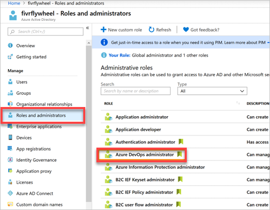
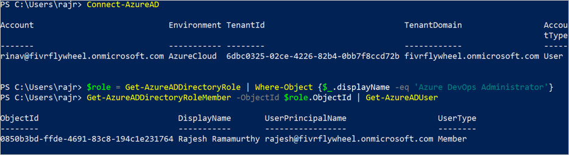
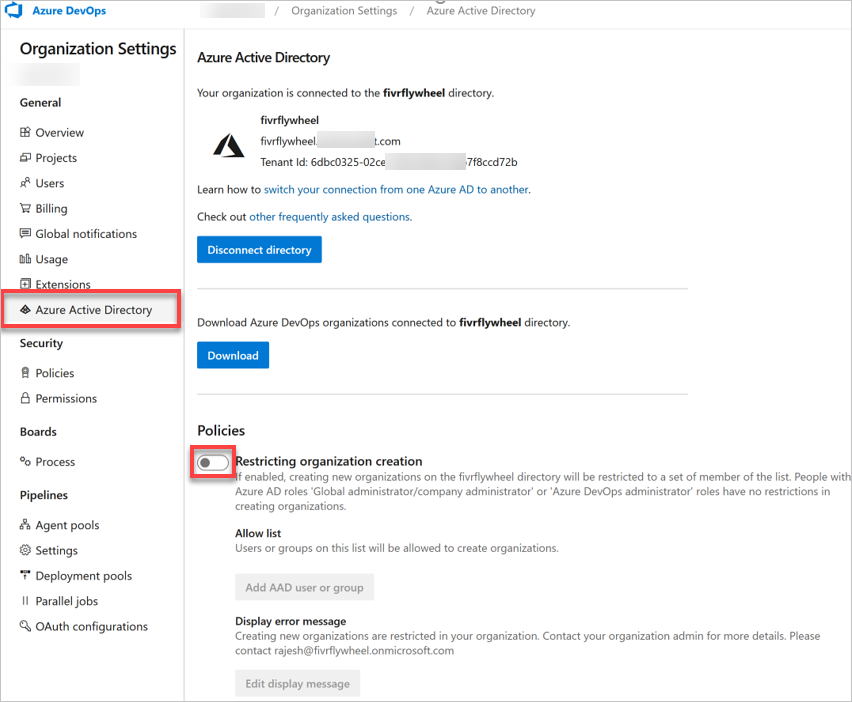
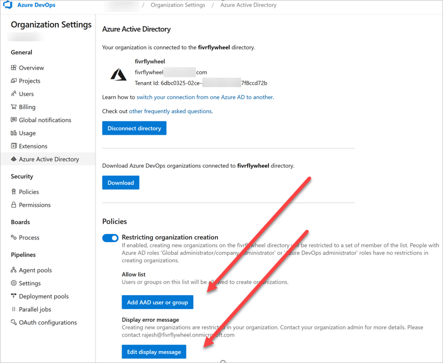
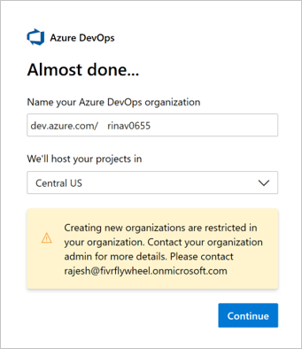
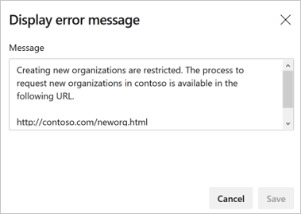
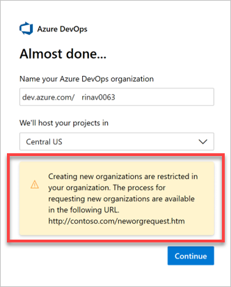
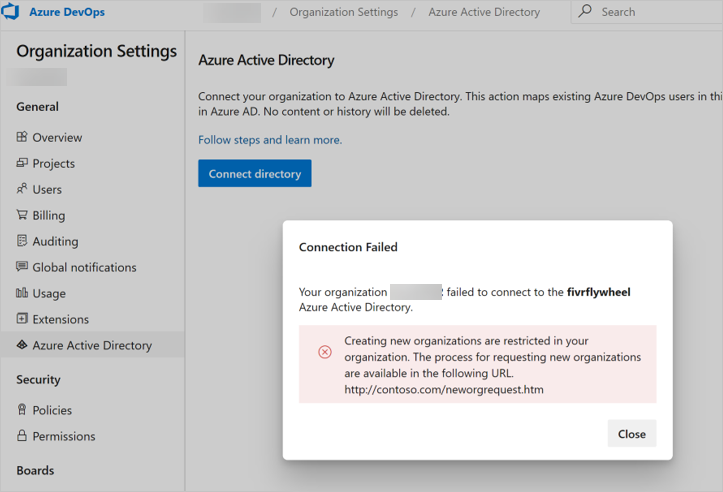

# Restrict organization creation via Azure AD tenant policy

[!INCLUDE [version-vsts-only](../../_shared/version-vsts-only.md)]

In this article, learn how to administer the new tenant policy for restricting new organization creation in Azure DevOps . By default, the policy isn't enabled.

## Prerequisites

Users must be assigned to the role, Azure DevOps Administrator in Azure Active Directory (Azure AD). Any user with this role can administer this tenant policy. Your administrator can help assign this new role to you. If you don't see the policy section, then you aren't an Azure DevOps Administrator. Check [the portal](https://ms.portal.azure.com/#home) or talk to your Azure AD administrator. You can find this role in the [Azure Portal](https://ms.portal.azure.com/#home) under **Azure Active Directory > Roles and administrators**.

You can also check using Azure AD PowerShell module. See the following example image:

## Turn on the restriction policy

As an Azure DevOps Administrator, you can sign into any Azure DevOps organization that's connected to your Azure AD tenant to start managing this policy. 

1. Sign in to the [Azure portal](https://ms.portal.azure.com/#home).
2. To find the policy, select **Organization settings > Azure Active Directory**. 
3. Switch the toggle to turn on the policy, restricting organization creation.
   
   
   
For more information about built-in Azure AD roles, see 
[Administrator role permissions in Azure AD](https://docs.microsoft.com/en-us/azure/active-directory/users-groups-roles/directory-assign-admin-roles).

## Optional: Create allow list

Once you enable the policy, creating new organizations is restricted to everybody except for Azure DevOps Administrators. However, you can create an allow list and add the desired users or groups, who can be granted exception, to continue creating new organizations. People in the allow list can't administer this policy, but they can create new organizations.

 
#### Create error message

When Azure DevOps Administrators, who aren't in the allow list, try to create an organization, they get an error similar to the following image shown. 
 

1. Customize this error message in the tenant policy settings. 
   
   

   See the following error message shown to users after customization.

   
 
> [!NOTE]
> Enabling this policy also prevents Azure DevOps Administrators who're outside of the allow list, from linking their organization to the Azure AD tenant for which the policy is set.
> 

## Related articles

* [Connect your organization to Azure Active Directory](connect-organization-to-azure-ad.md)
* [Access with Azure AD](access-with-azure-ad.md)
