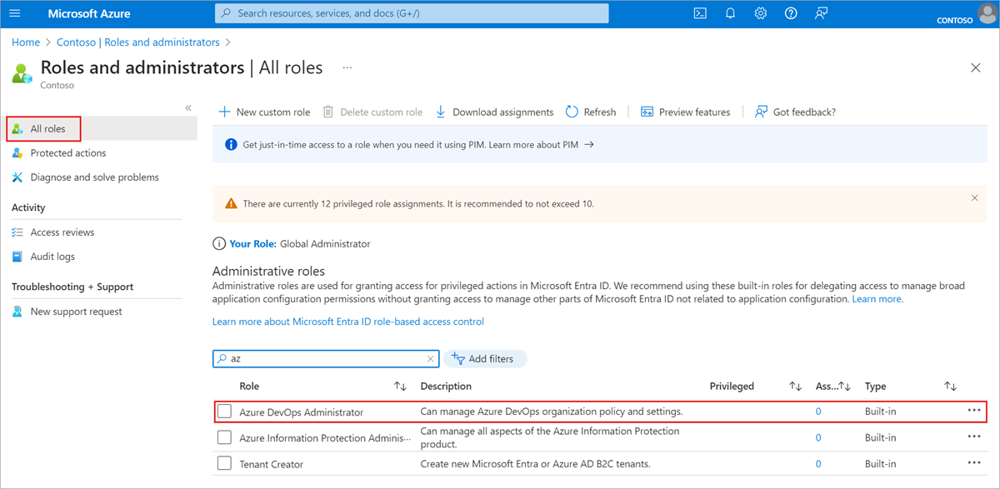
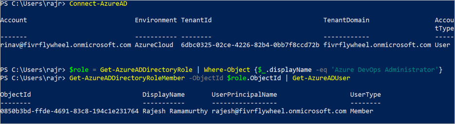
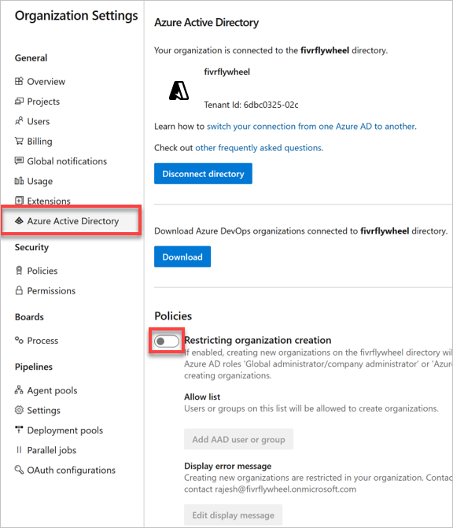
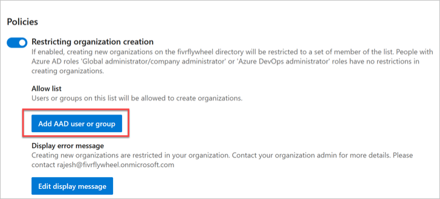
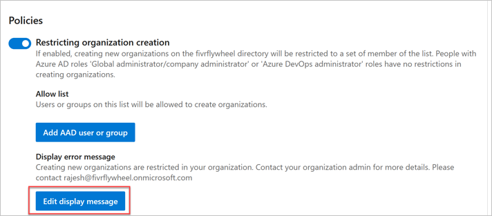
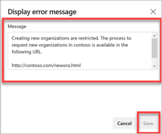
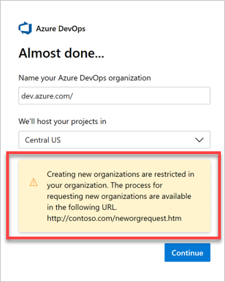
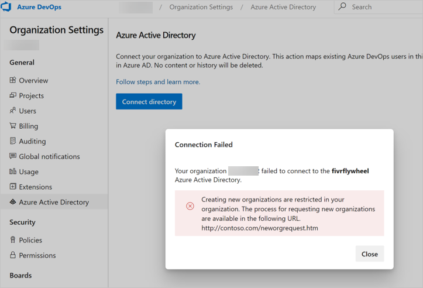

# Restrict organization creation via Azure AD tenant policy

[!INCLUDE [version-vsts-only](../../includes/version-vsts-only.md)]

Learn how to turn on the Azure Active Directory (Azure AD) tenant policy, which restricts users from creating an organization in Azure DevOps. This policy is turned off, by default.

## Prerequisites

You must be an Azure DevOps Administrator in Azure AD to manage this policy. It isn't a requirement to be a Project Collection Administrator.

If you don't see the policy section in Azure DevOps, then you aren't an administrator. To check your role, sign in to the [Azure portal](https://ms.portal.azure.com/#home), and then choose **Azure Active Directory > Roles and administrators**. In case that you aren't an Azure DevOps administrator, talk to your administrator.



You can also check your role using the Azure AD PowerShell module.


For more information about the new built-in Azure AD roles, see [Administrator role permissions in Azure Active Directory](/azure/active-directory/users-groups-roles/directory-assign-admin-roles).

> [!NOTE]
> An Azure DevOps Administrator can only restrict new organization creation for individual users, rather than groups at this time. 

## Turn on the policy

1. Sign in to your organization (```https://dev.azure.com/{yourorganization}```).

2. Select  **Organization settings**.

    
3. Select **Azure Active Directory**, and then switch the toggle to turn on the policy, restricting organization creation.

   

## Optional

### Create allowlist

> [!WARNING]
> We recommend using groups with your tenant policy allow list(s). If you use a named user, be aware that a reference to the named user's identity will reside in the United States, Europe (EU), and Southeast Asia (Singapore).

With the policy turned on, all users are restricted from creating new organizations. Grant an exception to users with an allowlist. Users on the allowlist can create new organizations, but they can't manage the policy.

1. Select **Add AAD user or group**.



### Create error message

When administrators, who aren't on the allowlist, try to create an organization they get an error similar to the following example. 
 


Customize this error message in the policy settings in Azure DevOps.

1. Select **Edit display message**.

   
2. Enter your customized message, and then choose **Save**.

   

The error message is customized.



> [!NOTE]
> Administrators, who aren't on the allow list, can't connect their organization to the Azure AD tenant where the policy is turned on.
>
> 

## Related articles

* [Connect your organization to Azure Active Directory](connect-organization-to-azure-ad.md)
* [About access with Azure AD](access-with-azure-ad.md)
* [Get a list of organizations backed by Azure AD](get-list-of-organizations-connected-to-azure-active-directory.md)
* [Resolve orphaned organization](resolve-orphaned-organization.md)
