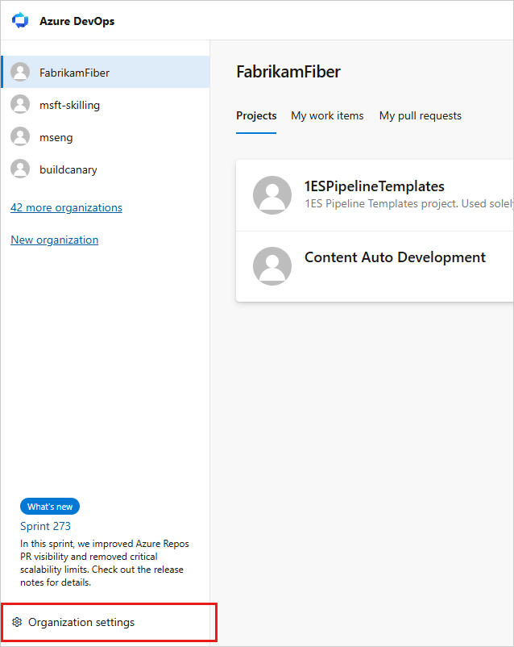
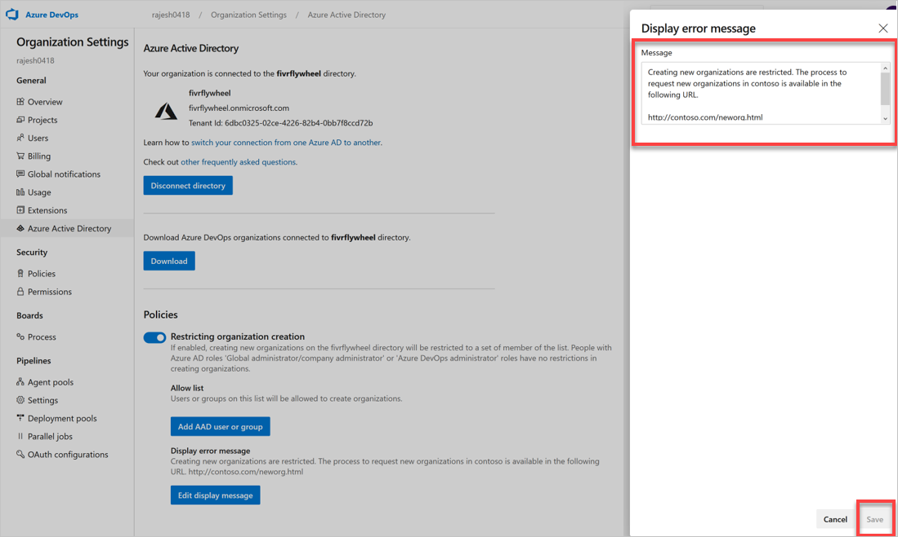
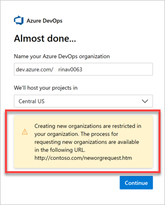

# Restrict organization creation

[!INCLUDE [version-eq-azure-devops](../../includes/version-eq-azure-devops.md)]

By default, any user in a Microsoft Entra tenant can create new Azure DevOps organizations. You can enable the **Restrict organization creation** policy to control this behavior. When you turn on this policy, only users and groups on the allowlist can create organizations. All other users, including Azure DevOps administrators, are blocked unless explicitly added to the allowlist.

> [!NOTE]
> This policy only affects the creation of new organizations. It doesn't change access to existing organizations or affect their settings.

## Prerequisites

| Category | Requirements |
|--------------|-------------|
|**Permissions**|[Azure DevOps Administrator](../security/look-up-azure-devops-administrator.md) role in Microsoft Entra ID. |

## Turn on the policy

To turn on the policy that restricts users from creating new organizations, follow these steps:

1. Sign in to your organization (`https://dev.azure.com/{Your_Organization}`).

2. Select  **Organization settings**.

    

3. Select **Microsoft Entra ID**, and then switch the toggle to turn on the policy, restricting organization creation.

   :::image type="content" source="media/azure-ad-tenant-policy/restrict-organization-creation-toggle.png" alt-text="Screenshot shows highlighted toggle for Restrict organization creation.":::

## Configure the allowlist and error message

After you enable the policy, you can manage which users and groups are allowed to create organizations, and customize the error message that blocked users see.

### Add users or groups to the allowlist

> [!WARNING]
> We recommend using groups with your tenant policy allowlist. If you use a named user, a reference to the named user's identity resides in the United States, Europe (EU), and Southeast Asia (Singapore).

Users or groups on the allowlist can create organizations when you enable the **Restrict organization creation** policy. All other users, including Azure DevOps administrators, are blocked unless they're on this list.

To add a user or group to the allowlist:

1. Go to **Organization settings** > **Microsoft Entra ID**.
2. Under **Allow list**, select **Add Microsoft Entra user or group**.
3. Search for and select the user or group, and then save your changes.

For more information, see [Add organization users and manage access](add-organization-users.md).

### Customize the error message

You can change the error message that users see when they're blocked from creating an organization.

1. Go to **Organization settings** > **Microsoft Entra ID**.
2. Select **Edit display message**.
3. Enter your customized message, and then select **Save**.

   

The following image shows an example of a customized error message.

## Related content

* [Connect your organization to Microsoft Entra ID](connect-organization-to-azure-ad.md)
* [Learn about access with Microsoft Entra ID](access-with-azure-ad.md)
* [Get a list of organizations backed by Microsoft Entra ID](get-list-of-organizations-connected-to-microsoft-entra-id.md)
* [Resolve orphaned organization](resolve-orphaned-organization.md)
* [Manage PAT policies for administrators](manage-pats-with-policies-for-administrators.md)
* [Change application access policies](change-application-access-policies.md)
