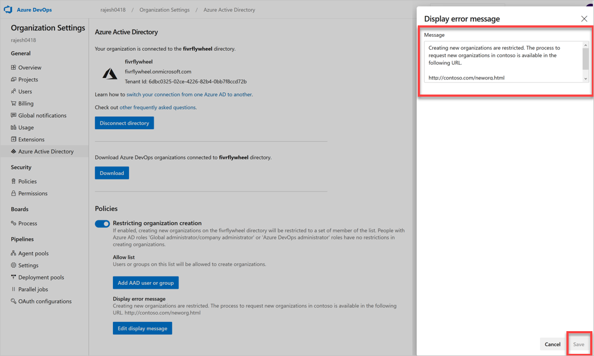

# Restrict organization creation via Azure AD tenant policy

[!INCLUDE [version-vsts-only](../../_shared/version-vsts-only.md)]

In this article, learn how to turn on the Azure Active Directory (Azure AD) tenant policy. This policy restricts users from creating an organization and is turned off, by default.

## Prerequisites

You must be an Azure DevOps Administrator in Azure AD to manage this policy. 

If you don't see the policy section in Azure DevOps, you aren't an administrator. To check your role, sign in to the [Azure portal](https://ms.portal.azure.com/#home), and then choose **Azure Active Directory > Roles and administrators**. In case that you aren't an Azure DevOps administrator, talk to your administrator.


You can also check using the Azure AD PowerShell module.


## Turn on the policy

1. Sign in to your organization (```https://dev.azure.com/{yourorganization}```).

2. Select  **Organization settings**.

    
3. Select Azure Active Directory, and then switch the toggle to turn on the policy, restricting organization creation.
   
   
   
For more information about built-in Azure AD roles, see 
[Administrator role permissions in Azure AD](https://docs.microsoft.com/azure/active-directory/users-groups-roles/directory-assign-admin-roles).

## Optional: Create allow list

With the policy turned on, all users are restricted from creating new organizations. Grant an exception to users or groups with an allow list. Users on the allow list can create new organizations, but they can't manage this policy.


 
### Create error message

When administrators, who aren't on the allow list, try to create an organization they get an error similar to the following. 
 


Customize this error message in the tenant policy settings. 
   


See the following example of a customized error message.


 
> [!NOTE]
> Administrators, who aren't on the allow list, can't connect their organization to the Azure AD tenant where the policy is turned on.
>
> 

## Related articles

* [Connect your organization to Azure Active Directory](connect-organization-to-azure-ad.md)
* [Access with Azure AD](access-with-azure-ad.md)
