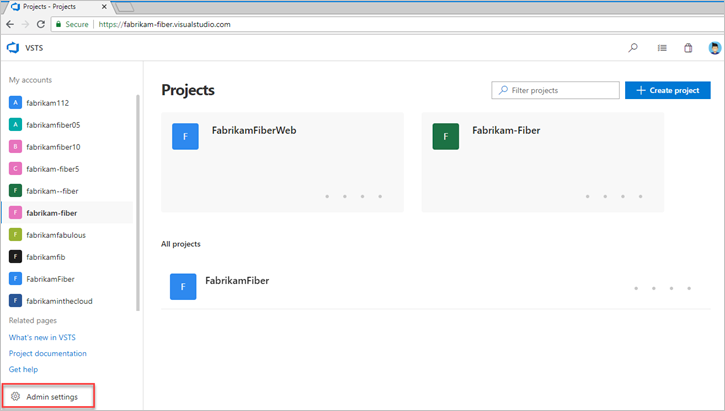
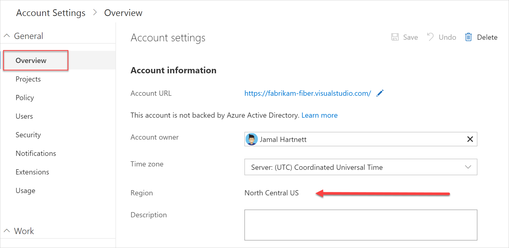

# Find or change your VSTS account location (region)

**VSTS**

When you [create an account](create-account-msa-or-work-student.md), you can choose the region where VSTS hosts your
account.  You may choose your account's region due to locality and network latency or because you have sovereignty
requirements for data centers.  Your account's default location is based on the closest 
[Microsoft Azure region](https://azure.microsoft.com/regions) 
where VSTS is available.

For information on region availability, see [Products available by region](https://azure.microsoft.com/global-infrastructure/services/).

To find the region where your account is located:

[!INCLUDE [temp](../../work/_shared/new-agile-hubs-feature.md)]

# [Vertical navigation](#tab/vertical)

1. Sign in to your VSTS account (```https://{youraccount}.visualstudio.com```).
2. Choose , the gear Admin settings icon.

   

3. Choose **Overview** and you will see the region listed beneath Account information.

   

# [Horizontal navigation](#tab/horizontal)

1. Sign in to your VSTS account (```https://{youraccount}.visualstudio.com```).

2. On your account toolbar, choose the gear icon, and then choose **Settings**: ```https://{youraccount}.visualstudio.com/_admin/_home/settings```

3. Look under **Region**.

To change your account region, you need to call [VSTS Support](https://visualstudio.microsoft.com/team-services/support), and 
they will coordinate changing the region with the account owner.

