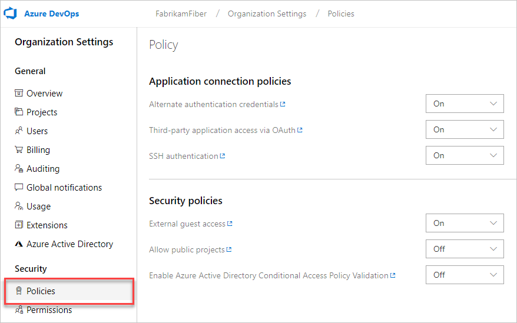

# Change application access policies for your organization

[!INCLUDE [version-vsts-only](../../_shared/version-vsts-only.md)]

You can change your application access policies for your organization in Azure DevOps. Azure DevOps offers the capability for other apps to integrate with its services and resources in your organization. To access your organization without asking for user credentials multiple times, apps can use the following authentication methods:

* [OAuth](../../integrate/get-started/authentication/oauth.md) to generate tokens for accessing [REST APIs for Azure DevOps Services and Team Foundation Server](../../integrate/get-started/rest/basics.md). The [Organizations](/docs/rest/api/vsts/account) and [Profiles](/docs/rest/api/vsts/profile) APIs support only OAuth.

* [Alternate credentials](../../repos/git/auth-overview.md#alternate-credentials) as a single set of credentials across all tools that don't have plug-in, extension, or native support. For example, you can use basic authentication to access [REST APIs for Azure DevOps](../../integrate/get-started/rest/basics.md), but you must turn on alternate credentials.

* [SSH authentication](../../repos/git/use-ssh-keys-to-authenticate.md) to generate encryption keys when you use Linux, macOS, or Windows running [Git for Windows](http://www.git-scm.com/download/win) and can't use [Git credential managers](../../repos/git/set-up-credential-managers.md) or [personal access tokens](use-personal-access-tokens-to-authenticate.md) for HTTPS authentication.

* [Personal access tokens](use-personal-access-tokens-to-authenticate.md) to generate tokens for:

   * Accessing specific resources or activities, like builds or work items
   * Clients like Xcode and Nuget that require usernames and passwords as basic credentials and don't support Microsoft account and Azure Active Directory features like multi-factor authentication
   * Accessing [REST APIs for Azure DevOps](../../integrate/get-started/rest/basics.md)

By default, your organization allows access for all authentication methods.
You can limit access, but you must specifically restrict access for each method.
When you deny access to an authentication method, no app can use that method to access your organization. Any app that previously had access gets an authentication error and can't access your organization.

> To remove access for personal access tokens,
> you must [revoke them](use-personal-access-tokens-to-authenticate.md).

To continue, you'll need at least Basic access and organization owner permissions.
[How do I find the organization owner?](faq-change-app-access.md#find-owner)

## Change application access policies

1. Sign in to your organization (```https://dev.azure.com/{yourorganization}```).

2. Choose  **Organization settings**.

   

3. In the Policy tab, review your application connection settings. Change these settings, based on your security policies.

   

   > [!Note]
   > Anonymous access is used to access both private and public repos. Learn more at [Make your project public](../public/make-project-public.md).

## Related articles

- [Need help?](faq-change-app-access.md#get-support)
- [Assign access levels and extensions by group membership](assign-access-levels-and-extensions-by-group-membership.md)
- [Manage conditional access](manage-conditional-access.md)