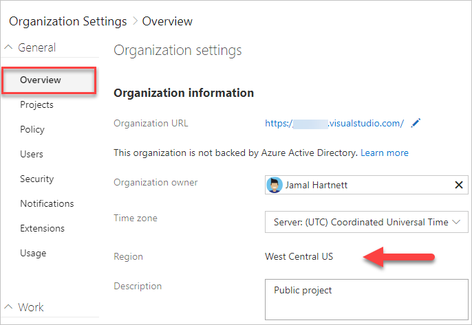

# Find or change your organization location

[!INCLUDE [version-vsts-only](../../_shared/version-vsts-only.md)]

When you [create an organization](create-organization.md), you can choose the region your organization is hosted in Azure DevOps. You may choose your organization's region based on locality and network latency, or because you have sovereignty requirements for data centers. Your organization's default location is based on the closest [Microsoft Azure region](https://azure.microsoft.com/regions) where Azure DevOps is available.

## Find your organization location

1. Sign in to your organization (```https://dev.azure.com/{yourorganization}```).

2. Choose  **Organization settings**.

   
3. Select **Overview**. The region is listed under Organization information.

   

## Change organization location

To change your organization region, call [Azure DevOps Support](https://azure.microsoft.com/support/devops). Support staff coordinates changing the region with the organization owner.
