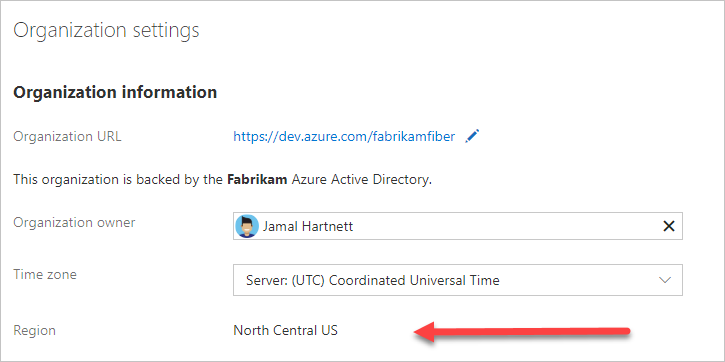

# Find or change your organization location (region) in Azure DevOps

[!INCLUDE [version-vsts-only](../../_shared/version-vsts-only.md)]

When you [create an organization](create-organization.md), you can choose the region your organization is hosted in Azure DevOps. You may choose your organization's region based on locality and network latency, or because you have sovereignty requirements for data centers. Your organization's default location is based on the closest [Microsoft Azure region](https://azure.microsoft.com/regions) where Azure DevOps is available.

For information on region availability, see [Products available by region](https://azure.microsoft.com/global-infrastructure/services/).

## Find your organization location

[!INCLUDE [temp](../../_shared/new-navigation-cloud.md)]

# [New navigation](#tab/new-nav)

1. Sign in to your organization (```https://dev.azure.com/{yourorganization}```).

2. Choose  **Organization settings**.

   
3. Select **Overview**. The region is listed under Organization information.

   

# [Previous navigation](#tab/previous-nav)

1. Sign in as the organization owner to your organization (```https://dev.azure.com/{yourorganization}```).

   [Why am I asked to choose between my work or school account and my personal account?](faq-change-app-access.md#ChooseOrgAcctMSAcct)

2. Select **Organization settings**.

    

3. The region is listed under Organization information, next to  **Region**.

   

---

## Change organization location

To change your organization region, call [Azure DevOps Support](https://azure.microsoft.com/support/devops). Support staff will coordinate changing the region with the organization owner.
