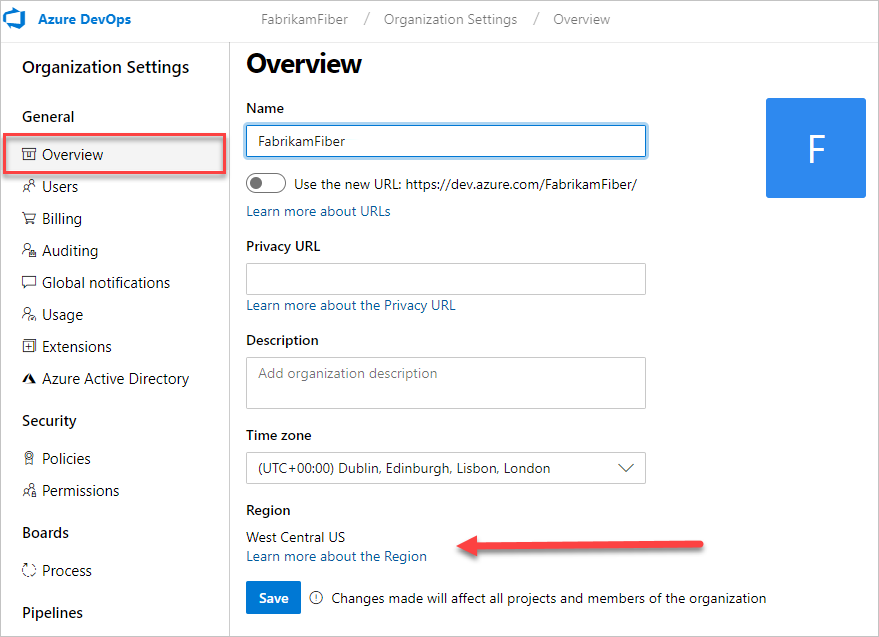

# Find or change your Azure DevOps Services organization location (region)

[!INCLUDE [version-vsts-only](../../_shared/version-vsts-only.md)]

When you [create an organization](create-organization-msa-or-work-student.md), you can choose the region where Azure DevOps Services hosts your organization. You may choose your organization's region based on locality and network latency, or because you have sovereignty requirements for data centers.  Your organization's default location is based on the closest [Microsoft Azure region](https://azure.microsoft.com/regions) where Azure DevOps Services is available.

For information on region availability, see [Products available by region](https://azure.microsoft.com/global-infrastructure/services/).

[!INCLUDE [temp](../../boards/_shared/new-agile-hubs-feature.md)]

# [New navigation](#tab/new-nav)

1. Sign in to your Azure DevOps Services organization (`https://{yourorganization}.visualstudio.com`).

1. Select **Admin settings**.

   

1. Select **Overview**. The region is listed under the **Organization** information.

   

# [Previous navigation](#tab/previous-nav)

1. Sign in to your Azure DevOps Services organization (`https://{yourorganization}.visualstudio.com`).

1. On your **Organization** toolbar, select the gear icon , and then select **Settings**: `https://{yourorganization}.visualstudio.com/_admin/_home/settings`.

1. The region is listed under **Region**.

To change your organization region, call [Azure DevOps Services Support](https://visualstudio.microsoft.com/team-services/support). The Support staff will coordinate changing the region with the organization owner.

