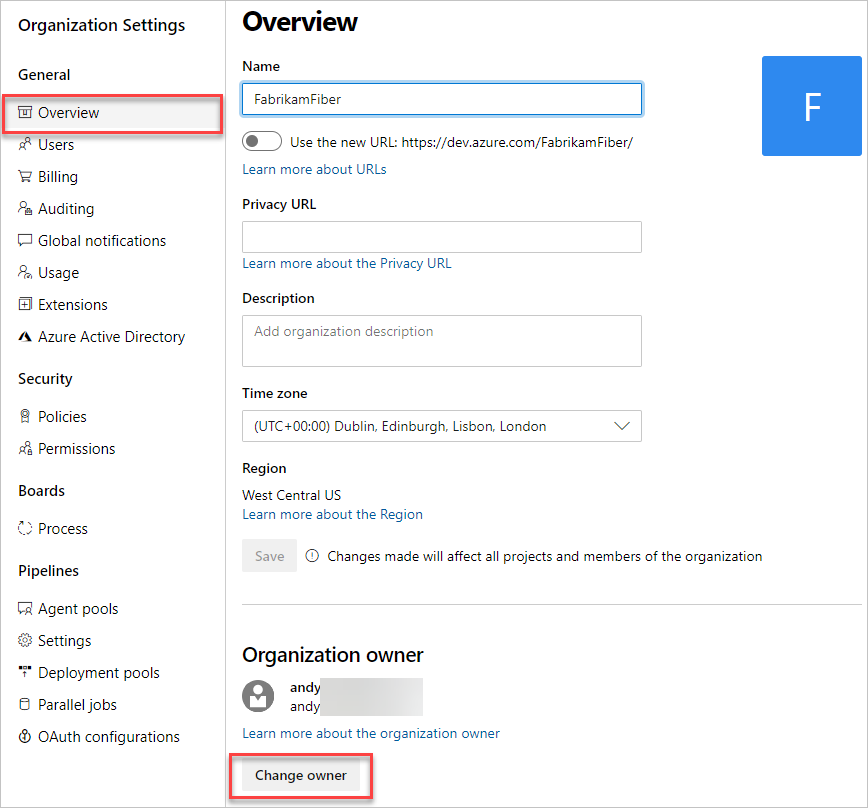

# Change the organization owner for VSTS

[!INCLUDE [version-vsts-only](../../_shared/version-vsts-only.md)]

When your team's roles and responsibilities change, change your Visual Studio Team Services (VSTS) organization owner to another user.

## Prerequisites

To change the organization owner, you must have VSTS [*project collection administrator* or *organization owner* permissions](faq-change-organization-ownership.md#find-owner-pca).
If no one in the organization has these permissions, contact
[VSTS Support](https://visualstudio.microsoft.com/team-services/support).

Make sure that the new owner:

* Has been added and invited to your VSTS organization (`https://<yourorganization>.visualstudio.com`).
* Has signed in to your VSTS organization, created a Visual Studio profile, and agreed to the Terms of Service.
* Has accessed the organization at least once after creating an initial profile.

   

## Change VSTS organization owner

[!INCLUDE [temp](../../_shared/new-navigation.md)] 

# [New navigation](#tab/new-nav)

1. Sign in to your VSTS organization (`https://<yourorganization>.visualstudio.com`).

2. Select **Admin settings** ().

   

3. Select **Overview**.  
    The organization owner is listed under **Organization information**.

   

4. To change the organization owner, select the **X**.

   

5. Enter a new organization owner name, and then select **Save**.

     

# [Previous navigation](#tab/previous-nav)

1. Sign in to your VSTS organization (`https://<yourorganization>.visualstudio.com`).

   [Why am I asked to choose between my work or school account and my personal account?](faq-change-organization-ownership.md)

2. To find the current organization owner, go to your VSTS organization settings pane.

   

3. Under **Settings**, find the current organization owner.

   

4. Change the organization owner.

   

5. Find and select the new organization owner.

   

   [Can't find the person you want?](faq-change-organization-ownership.md#NoNewOwner)

6. Save your changes.

   

---

   You have successfully changed your VSTS organization owner.
