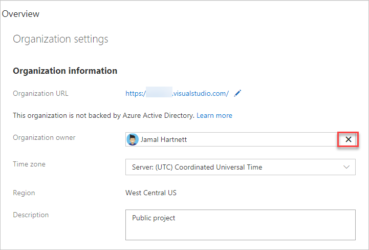

# Change the organization owner in Azure DevOps

[!INCLUDE [version-vsts-only](../../_shared/version-vsts-only.md)]

When your team's roles and responsibilities change, you can assign a different user as the owner for your organization. In this article, we show you what permissions are required and the steps to make this update in Azure DevOps.

> [!NOTE]
> When you remove an owner, they are also removed from the project collection administrator group.

## Prerequisites

To change the organization owner, you must have [*project collection administrator* or *organization owner* permissions](faq-change-organization-ownership.md#find-owner-pca).
If no one in the organization has these permissions, contact
[Azure DevOps Support](https://azure.microsoft.com/support/devops).

Make sure the new owner has completed the following tasks:

* Signed in to your organization, created a profile, and agreed to the Terms of Service.
* Accessed the organization at least once after creating an initial profile.

   

## Change organization owner

[!INCLUDE [temp](../../_shared/new-navigation-cloud.md)] 

# [New navigation](#tab/new-nav)

1. Sign in to your organization (`https://dev.azure.com/{yourorganization}`).

2. Select  **Organization settings** .

   

3. Select **Overview**. The organization owner is listed under *Organization information*.

   

4. To change the organization owner, select **X**.

   

5. Enter a new organization owner name, and then select **Save**.

     

# [Previous navigation](#tab/previous-nav)

1. Sign in to your organization (`https://<yourorganization>.visualstudio.com`).

   [Why am I asked to choose between my work or school account and my personal account?](faq-change-organization-ownership.md)

2. To find the current organization owner, go to **Organization settings**.

   

3. Find the current organization owner.

   

4. To change the organization owner, select **X**.

   

5. Find and select the new organization owner.

   

   [Can't find the person you want?](faq-change-organization-ownership.md#NoNewOwner)

6. **Save** your changes.

   

---

   Your organization has a new owner.
