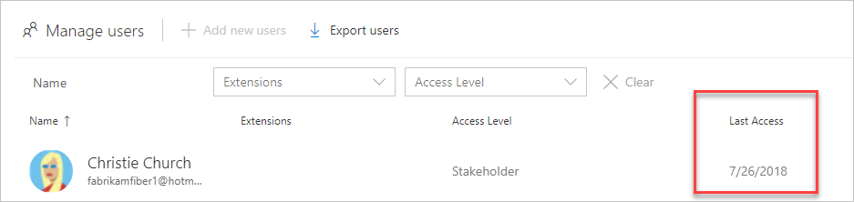

# Change the organization owner

[!INCLUDE [version-vsts-only](../../includes/version-vsts-only.md)]

As roles and responsibilities change, you can change the owner for your organization. Learn how to update the organization owner in Azure DevOps.

> [!TIP]
> For organizations connected to Azure Active Directory (Azure AD),  if your organization Owner and any other Project Collection Administrators are no longer active, you can [transfer ownership to another user](resolve-orphaned-organization.md).  

> [!NOTE]  
> Changing the organization owner does not remove the old owner from the Project Collection Administrators group.

## Prerequisites

- You must be a [Project Collection Administrator or an organization Owner](../security/lookup-organization-owner-admin.md).  
  
  If no one in the organization has these permissions, contact
[Azure DevOps Support](https://developercommunity.visualstudio.com/spaces/21/index.html). Make sure the new owner has completed the following tasks:

  * Signed in to your organization, created a profile, and agreed to the Terms of Service.
  * Accessed the organization at least once after creating an initial profile.

   

## Change organization Owner

1. Sign in to your organization (`https://dev.azure.com/{yourorganization}`).

2. Select  **Organization settings**.

    

3. Select **Overview**, and then **Change owner**.  

    :::image type="content" source="media/change-organization-ownership/change-organization-owner.png" alt-text="Instructions to select Overview, and then Change owner.":::

4. Select a user from the dropdown menu, or search for a user by entering the user's name, and then select **Change**.

    

   Your organization has a new owner.

## Related articles

- [Assign a new owner to your orphaned organization](resolve-orphaned-organization.md)
- [Change organization location](change-organization-location.md)
- [Connect your organization to Azure AD](connect-organization-to-azure-ad.md)

 
