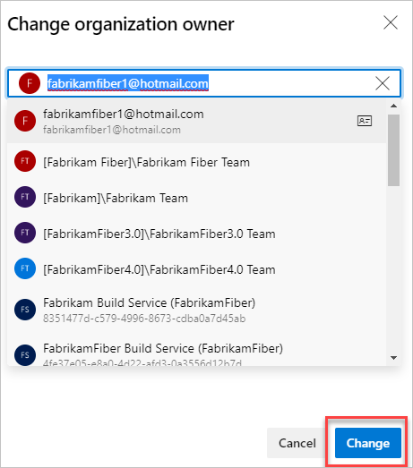

# Change the organization owner in Azure DevOps

[!INCLUDE [version-vsts-only](../../_shared/version-vsts-only.md)]

When your team's roles and responsibilities change, you can assign a different user as the owner for your organization. In this article, we show you what permissions are required and the steps to make this update in Azure DevOps.

> [!NOTE]
> When you remove an owner, they are also removed from the project collection administrator group.

## Prerequisites

To change the organization owner, you must have [*project collection administrator* or *organization owner* permissions](faq-change-organization-ownership.md#find-owner-pca).
If no one in the organization has these permissions, contact
[Azure DevOps Support](https://azure.microsoft.com/support/devops).

Make sure the new owner has completed the following tasks:

* Signed in to your organization, created a profile, and agreed to the Terms of Service.
* Accessed the organization at least once after creating an initial profile.

   

## Change organization owner

1. Sign in to your organization (`https://dev.azure.com/{yourorganization}`).

2. Select  **Organization settings** .

   

3. Select **Overview**, and then **Change owner**.  

   

4. Select a user from the dropdown menu, or search for a user by entering the user's name, and then select **Change**.

   

   Your organization has a new owner.
