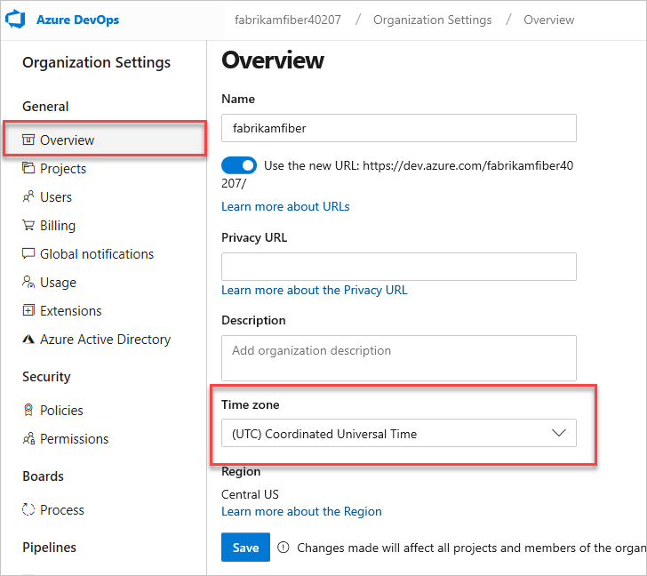
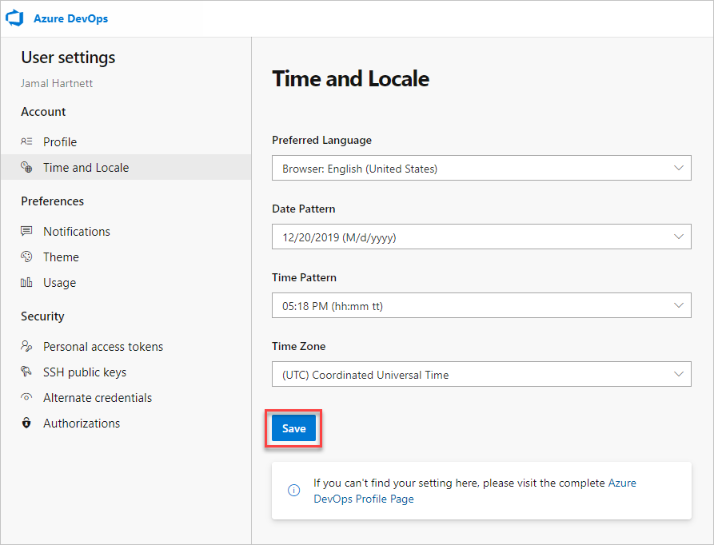
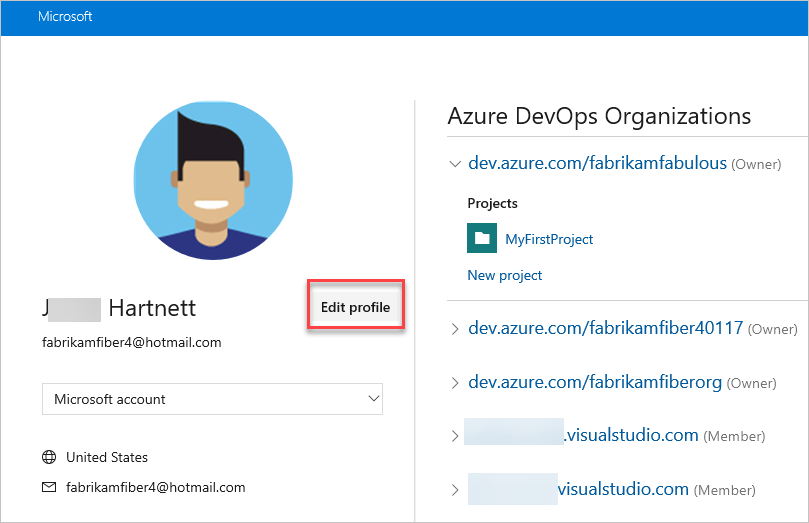
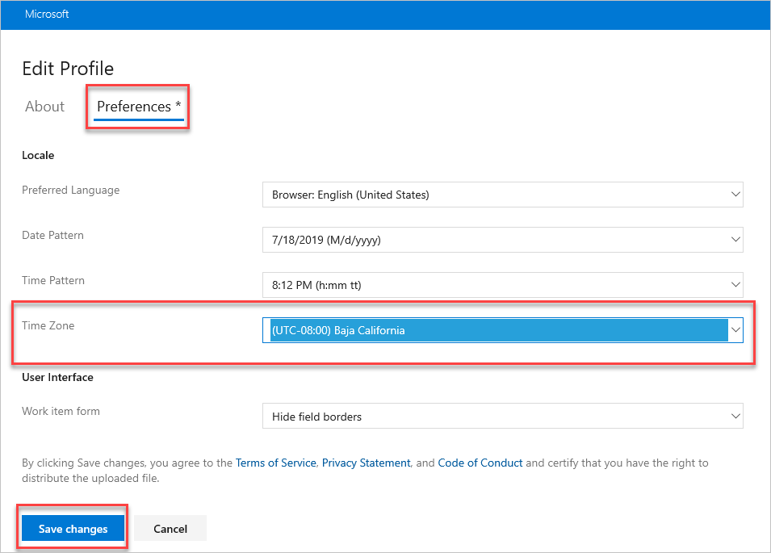

# Change the time zone in Azure DevOps

[!INCLUDE [version-vsts-only](../../_shared/version-vsts-only.md)]

In this article, learn how to change the time zone for your organization or your user profile.

The following time zones are available in Azure DevOps:

* **Azure DevOps organization time zone** - the main time zone setting. This setting is where all your iteration dates, builds, and release schedules depend upon, and so on. Changing your organization time zone affects its dependencies.
* **Azure DevOps user profile time zone** - only used for the user interface (UI). This setting is used for the UI to make your experience more personal and to display timestamps for when users browse Azure DevOps using the time zone configured for that specific user.

If your Azure DevOps organization time zone is set to EST, but your user profile time zone setting is set to PST, all date and time fields are displayed in PST time zone.

## Change your organization time zone

1. Sign in to your organization (```https://dev.azure.com/{yourorganization}```).

2. Select  **Organization settings**.

    

3. Go to **Overview**, and then select the time zone from the dropdown menu.

    

4. Select **Save**.

## Change your user profile time zone

::: moniker range="azure-devops"

> [!NOTE]   
> To enable the new user interface for the New account manager, see [Enable preview features](../../project/navigation/preview-features.md).

#### [Preview page](#tab/preview-page) 

1. From your home page, select the user settings icon , and then select **Time and Locale**.

   

2. You can update your preferred language, date pattern, time pattern, and time zone. When you're done, select **Save**.

   

#### [Current page](#tab/current-page) 

1. From your home page, select your user profile icon, and then select **My profile**.

    

2. Select **Edit profile**.

    

3. Select **Preferences**, set your user profile time zone, and then select **Save changes**.

    

::: moniker-end

***
