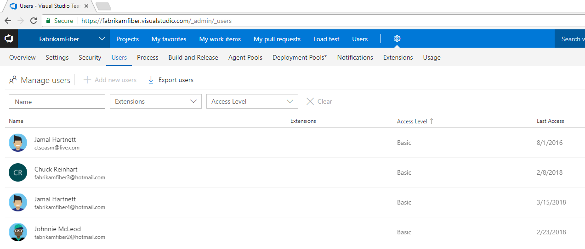
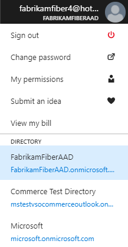

# Tutorial: Connect VSTS account to Azure Active Directory (Azure AD)

**VSTS**

Azure AD users - you can connect your existing Azure AD tenant to VSTS, even if you started with a Microsoft account for your VSTS instance.

In this tutorial, you learn to:
> [!div class="checklist"]
> * Understand where you're starting from
> * Ensure all VSTS users are in the target Azure AD tenant
> * Inform users of the upcoming change
> * Determine which user is performing the connection of VSTS to Azure AD
> * Connect your VSTS account to your organization directory
> * Inform users of the completed change
> * Close the temporary MSA (if you created one)
> * Update the Azure subscription your VSTS account uses for billing

If your VSTS account was created with a Microsoft account,
you can connect your VSTS account to your
organization's directory (tenant) in
[Azure Active Directory (Azure AD)](https://azure.microsoft.com/en-us/documentation/articles/active-directory-whatis/).
You can then sign in to VSTS with the same username
and password that you use with these Microsoft services.
You can also [enforce conditional access policies](https://docs.microsoft.com/en-us/azure/active-directory/active-directory-conditional-access-azure-portal-get-started) for accessing
your team's critical resources and key assets.

If your users are being asked to choose between signing in to VSTS with their personal or work or school account, you will benefit from connecting your VSTS account to your organization's Azure AD.

[Why am I asked to choose between a "work or school account" and a "personal account"?](faq-azure-access.md#ChooseOrgAcctMSAcct)

>[!div class="mx-imgBorder"]

For more information, see the [conceptual overview](access-with-azure-ad.md) for using Azure AD with VSTS.

> [!VIDEO https://www.youtube.com/embed/-LkYGi9orhc] 

## Understand where you're starting from

While the steps to connect your VSTS account to Azure AD are consistent, it's important to understand where you're starting from before connecting your VSTS account to your target Azure AD tenant.

We currently offer a path to connect to a target Azure AD tenant where the email addresses for the users are the same before and after the connection.  For example, you currently sign in with an MSA, jamalhartnett@fabrikam.com, and after connecting you will sign in with an AAD, jamalhartnett@fabrikam.com.

At this time, we are not offering solutions for scenarios where email addresses need to change.  We have work on the backlog to provide this functionality in the first half of 2019 and will update the guidance here accordingly when we have a solution that we can offer.

## Overview of the connection process

The following steps outline the high-level process of connecting VSTS to Azure AD.

1. Ensure all VSTS users are in the target Azure AD tenant, either as members or [Business-to-Business (B2B)](https://docs.microsoft.com/en-us/azure/active-directory/active-directory-b2b-what-is-azure-ad-b2b) guests.
2. Inform your users of the upcoming change and ask them to check in all code changes before the process begins.
3. Connect your VSTS account to your organization's directory.
4. Inform users of the completed change and that they should sign in with their Azure AD credentials from now on.

## Ensure all VSTS users are in the target Azure AD tenant

All users of the VSTS must exist in the target Azure AD tenant. Any user that is not in the tenant will be a "historic" user, unable to log in, however their history is retained.

1. Sign in to your VSTS account and go to the **Users** tab.

    

2. Compare the VSTS list of emails against the list in your target Azure AD tenant.

    * If any users exist on the VSTS Users page, but are missing from your target Azure AD tenant, [add them as B2B guests](https://docs.microsoft.com/en-us/azure/active-directory/active-directory-b2b-iw-add-users).

      

       These guests can be external to your organization (User@othercompany.com) or existing Microsoft account (MSA) users (user@outlook.com or user@gmail.com).

    * If you are notified that you do not have permissions to invite users, verify that your user account is authorized to invite external users under User Settings.

      

       If you have recently modified these settings or assigned the Guest Inviter role to a user, there might be a 15- 60-minute delay before the changes take effect.

    * If no paid Azure AD license exists in the tenant, every invited user gets the rights that the Azure AD Free edition offers.

    * If users exist, but their email addresses are different from their Microsoft accounts, the history will be retained in the system but we don't offer a way to map it to the user's new email address.

## Inform users of the upcoming change

While there is no downtime, users will be affected by this change, so it's best to let them know before you begin this process. Let them know ahead of time that there will be a short series of steps for each user to complete and that as the organization transitions from Microsoft to Azure AD identities and the emails match, users' benefits will continue to work with their new Azure AD identity.

## Determine which user is performing the connection of VSTS to Azure AD

1. Ensure the following about the user performing the connection. This user:

    * Exists in the target Azure AD tenant as a member.
    * Is an [owner of the VSTS account](https://docs.microsoft.com/en-us/vsts/organizations/accounts/faq-change-account-ownership#find-owner-pca).
    * Is not using the Microsoft account identity that matches the Azure AD identity, for example, the Microsoft account you currently use is JamalHarnett@fabrikam.com and the Azure AD identity you will use after connecting is also JamalHarnett@fabrikam.com. You must use a single identity that spans both applications (MSA that's in the target Azure AD tenant), rather than two separate identities using the same email.

   If the emails are the same, then follow these steps, otherwise continue on to Connect your VSTS account to your organization directory.

2. [Create a new MSA](https://signup.live.com/), for example, Fabrikam@outlook.com. This account is only temporary and can be [deleted later](#optional-close-the-temporary-msa-if-you-created-one).

3. Sign in to your VSTS account (as a Project Collection Administrator) and add the new user as a member of the account.

4. [Sign in to the Azure portal](https://portal.azure.com/) and add the new user as a B2B guest of the target Azure AD tenant and an email invitation sent to the new account.

5. Go to your email invitations from Azure and choose the **Call-To-Action** in each email. You will be required to choose **Next/Continue** on a few screens to fully register the new user.

6. Sign in to your VSTS account as the new user.

7. Go to **Settings** in VSTS (as a Project Collection Administrator) and change the owner of the account to the new user, only after the new user has logged in.
   
8. Use this new user to complete the migration.

## Connect your VSTS account to your organization directory

1. [Sign in to the Azure portal](https://portal.azure.com/) with the Microsoft account chosen in the previous step.

   * The target tenant is selected in the upper right corner of the Azure portal.

        

2. Browse to your VSTS account by entering **Team services accounts** into the **Search** box, and choosing **Team Services accounts**.

    > [!div class="mx-imgBorder"]

3. Select your VSTS account. If you don't see your account, check to make sure you are using the expected tenant in the upper right of the Azure portal and confirm that you are logged in with a Microsoft account that is the owner of the VSTS account in question.

   

4. Choose **Connect**.

   > [!div class="mx-imgBorder"]

5. Make sure this is the directory you want to connect to. If you have more than one directory, you can select the directory to connect to in the top right of the menu. 

    > [!div class="mx-imgBorder"]

6. Choose **Yes** to confirm.

   

7. Your account is now connected to your organization's directory.

8. To confirm that the process has been completed, open your favorite browser in a private session and sign in to your VSTS account with your Azure AD/work credentials.
9. If you created a temporary user to complete the migration, change the owner of the VSTS account back to the initial user and delete the temporary Microsoft account, as it is no longer needed.

## Inform users of the completed change

Visual Studio subscription administrators assign subscriptions to a user's corporate email so that they can get the welcome email and notifications about the subscription.  If the email of the identity and the subscription match, the user will be able to access the benefits of that subscription.  As your organization transitions from Microsoft to Azure AD identities and the emails match, your user's benefits will continue to work with their new Azure AD identity.

When you inform your users of the completed change, include the following tasks that each user in the VSTS account must complete:

1. If you use the Git command line tool, the tenant cache for the [Git Credential Manager may need to be cleared](https://github.com/Microsoft/Git-Credential-Manager-for-Windows/blob/master/Docs/Faq.md#q-why-is-gitexe-failing-to-authenticate-after-linkingunlinking-your-visual-studio-team-services-account-from-azure-active-directory).

    Deleting the **%LocalAppData%\GitCredentialManager\tenant.cache** file on each client machine will resolve the issue.

2. If you use alternate authentication tokens used by tools or scripts, [regenerate new tokens](https://docs.microsoft.com/en-us/vsts/organizations/accounts/use-personal-access-tokens-to-authenticate) for the Azure AD user.

    a. On your VSTS page, in the upper right, choose your profile image and choose **Security**.

    b. On the SSH public keys page, choose **Add**. Enter a description. Scroll to the bottom of the page and choose **Create token**.

    c. When the token is created, make a note of it as it cannot be viewed again. Copy it from the browser into the clipboard.

3. If you use SSH tokens, [add new keys for the Azure AD user](https://docs.microsoft.com/en-us/vsts/git/use-ssh-keys-to-authenticate?view=vsts).
4. If you don't want to be prompted to choose between accounts, [rename your Microsoft account](https://support.microsoft.com/en-us/help/11545/microsoft-account-rename-your-personal-account) to a different email that does not conflict with your Azure AD identity or simply [close your Microsoft account](https://docs.microsoft.com/en-us/vsts/organizations/accounts/connect-account-to-aad?view=vsts#optional-close-the-temporary-msa-if-you-created-one) if it's no longer needed.

5. If you used a Microsoft account to sign up for a [Visual Studio with MSDN subscription](https://visualstudio.microsoft.com/vs/pricing/) that includes VSTS as a benefit, you can add a work or school account that's managed by Azure Active Directory to your subscription. Learn [how to link work or school accounts to Visual Studio with MSDN subscriptions](https://docs.microsoft.com/en-us/vsts/billing/link-msdn-subscription-to-organizational-account-vs).

## (Optional) Close the temporary MSA (if you created one)

1. Go to the **Settings** page in VSTS and [change the owner](https://docs.microsoft.com/en-us/vsts/organizations/accounts/change-account-ownership-vs?view=vsts) of the account back to yourself.
2. Go to the **Users** page in VSTS and remove the temporary new user.
3. Go to the Azure portal and remove the new user from the Azure AD tenant.
4. [Close the temporary MSA](https://support.microsoft.com/en-us/help/12412/microsoft-account-how-to-close-account) you created.

   [More questions about connecting?](faq-azure-access.md#faq-connect)

## (Optional) Update the Azure subscription your VSTS account uses for billing

After connecting your account to Azure AD, you may need to update the Azure subscription you've been using to pay for VSTS. 

If the Azure subscription you’ve been using to pay for VSTS is associated with a different directory than the one you connect to, you won’t be able to make purchases or change the purchases you’ve already made. Your existing paid resources will continue to work and charges will renew each month, but when you try to make changes in the Visual Studio Marketplace you’ll see a message like the one below.

> [!div class="mx-imgBorder"]

There are a few options to get VSTS billing set up again correctly.

1. You can [associate the subscription with the directory](https://docs.microsoft.com/en-us/azure/active-directory/active-directory-how-subscriptions-associated-directory) you’re now using to log in to VSTS. If you’re not able to change the directory in the Azure portal, you can [transfer that subscription to your work Azure AD identity](https://docs.microsoft.com/en-us/azure/billing/billing-subscription-transfer).
2. Or if you have a different Azure subscription to use for billing VSTS, you can [change the Azure subscription VSTS uses for billing](https://docs.microsoft.com/en-us/vsts/billing/change-azure-subscription?view=vsts). Read the topic carefully, as this option can disrupt billing for your account if it isn’t set up correctly.

## FAQ

### Q: Will my users still retain their existing Visual Studio subscriptions?

A: Visual Studio subscription administrators typically assign subscriptions to a user's corporate email so that they can get the welcome email and notifications about the subscription. If the email of the identity and the subscription match, the user will be able to access the benefits of that subscription. As your organization transitions from Microsoft to Azure AD identities and the emails match, your user's benefits will continue to work with their new Azure AD identity. If the email that the subscription is assigned to differs from your Azure AD identity's email, then your subscription administrator will need to [reassign the subscription](https://docs.microsoft.com/en-us/vsts/billing/vs-subscriptions/manage-vs-subscriptions#getting-started), or the user will need to [add an alternate identity to their Visual Studio subscription](https://docs.microsoft.com/en-us/vsts/billing/faq-link-msdn-subscription-org-account#steps-to-add-an-alternate-identity-to-your-visual-studio-subscription).

### Q: What if sign-in is required when using the identity picker?

A: Clear the browser cache and delete any cookies for the session.

### Q What if my work items are indicating that the users aren't valid?

A: Clear the browser cache and delete any cookies for the session.

## Next steps

* [Manage users and access](add-account-users-from-user-hub.md)
* [Manage access with Azure AD groups](manage-azure-active-directory-groups-vsts.md)
