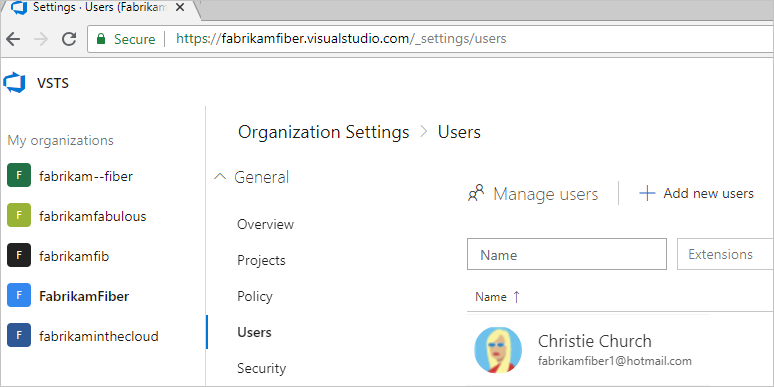

# Tutorial: Connect VSTS organization to Azure Active Directory (Azure AD)

**VSTS**

If your VSTS organization was created with a Microsoft account,
you can connect your VSTS organization to your
organization's directory (tenant) in
[Azure Active Directory (Azure AD)](/azure/active-directory/fundamentals/active-directory-whatis).
You can then sign in to VSTS with the same username
and password that you use with these Microsoft services.
You can also [enforce conditional access policies](https://docs.microsoft.com/en-us/azure/active-directory/active-directory-conditional-access-azure-portal-get-started) for accessing
your team's critical resources and key assets.

In this tutorial, you learn to:
> [!div class="checklist"]
> * Connect your VSTS organization to your Azure Active Directory
> * Close the temporary MSA (if you created one)
> * Update the Azure subscription your VSTS organization uses for billing

For more information, see the [conceptual overview](access-with-azure-ad.md) for using Azure AD with VSTS.

> [!VIDEO https://www.youtube.com/embed/-LkYGi9orhc] 

We offer a path to connect to an Azure Active Directory where the email addresses for the users are the same before and after the connection.  For example, you currently sign in with an MSA, jamalhartnett@fabrikam.com, and after connecting you will sign in with an Azure Active Directory identity, jamalhartnett@fabrikam.com.

We will update this guidance accordingly when we have a solution that we can offer for scenarios where email addresses must be changed.

## Prerequisites

1. Inform users of the upcoming change.

   While there is no downtime, users will be affected by this change, so it's best to let them know before you begin. Let them know ahead of time that there will be a short series of steps for each user to complete. As your organization transitions from Microsoft to Azure Active Directory identities and the emails match, users' benefits will continue to work with their new Azure Active Directory identity.

2. Ensure the following about the user performing the connection.
   This user:

   * Exists in the Azure Active Directory as a member.
    * Is a Project Collection Administrator or [owner of the VSTS organization](https://docs.microsoft.com/en-us/vsts/organizations/accounts/faq-change-organization-ownership#find-owner-pca).
    * Is not using the Microsoft account identity that matches the Azure Active Directory identity, for example, the Microsoft account you currently use is JamalHarnett@fabrikam.com and the Azure Active Directory identity you will use after connecting is also JamalHarnett@fabrikam.com. You must use a single identity that spans both applications (MSA that's in Azure Active Directory), rather than two separate identities using the same email.

   If the emails are the same, then follow these next steps, otherwise continue on to Connect your VSTS organization to your Azure Active Directory.

    >a. [Create a new MSA](https://signup.live.com/), for example, Fabrikam@outlook.com. This account is only temporary and can be [deleted later](#optional-close-the-temporary-msa-if-you-created-one).

   >b. Sign in to your VSTS organization (as a Project Collection Administrator) and add the new user as a member of the organization.

   >c. [Sign in to the Azure portal](https://portal.azure.com/) and add the new user as a B2B guest of the Azure Active Directory and an email invitation sent to the new user.

   >d. Go to your email invitations from Azure and choose the **Call-To-Action** in each email. You will be required to choose **Next/Continue** on a few screens to fully register the new user.

   >e. Sign in to your VSTS organization as the new user.

   >f. Go to **Settings** in VSTS (as a Project Collection Administrator) and change the owner of the organization to the new user, only after the new user has signed in.

   >g. Use this new user to complete the migration.

3. Ensure all VSTS users are in the Azure Active Directory.

   Any user that is not in Azure Active Directory will be a "historic" user, unable to log in, however their history is retained.

   a. Sign in to your VSTS organization and go to the **Users** tab.

    

   b. Compare the list of email addresses in VSTS against the list of email addresses in your Azure Active Directory.

    * If any users exist on the VSTS Users page, but are missing from your Azure Active Directory, [add them as B2B guests](https://docs.microsoft.com/en-us/azure/active-directory/active-directory-b2b-iw-add-users).

      

      These guests can be external to your organization (User@othercompany.com) or existing Microsoft account (MSA) users (user@outlook.com or user@gmail.com).

    * If you are notified that you do not have permissions to invite users, verify that your user organization is authorized to invite external users under User Settings.

      

       If you have recently modified these settings or assigned the Guest Inviter role to a user, there might be a 15- 60-minute delay before the changes take effect.

    * If no paid license exists in your Azure Active Directory, every invited user gets the rights that the Azure Active Directory Free edition offers.

## Connect your VSTS organization to your Azure Active Directory

1. [Sign in to the Azure portal](https://portal.azure.com/) with the Microsoft account chosen in the previous step.

    Make sure you are connected to the correct directory. The directory is selected in the upper right corner of the Azure portal.

    

2. Choose **All services** > **Team Services administration**.

   

3. Select your VSTS organization. If you don't see your organization, check to make sure you are using the expected directory in the upper right of the Azure portal and confirm that you are logged in with a Microsoft account that is the owner of the VSTS organization in question.

   

4. Choose **Connect AAD**.

   

5. Choose **Yes** to connect.

   

6. Your organization is now connected to your Azure Actice Directory.

7. To confirm that the process has been completed, open your favorite browser in a private session and sign in to your VSTS organization with your Azure Active Directory/work credentials.
8. If you created a temporary user to complete the migration, change the owner of the VSTS organization back to the initial user and delete the temporary Microsoft account, as it is no longer needed.

## Inform users of the completed change

Visual Studio subscription administrators assign subscriptions to a user's corporate email so that they can get the welcome email and notifications about the subscription.  If the email of the identity and the subscription match, the user will be able to access the benefits of that subscription.  As your organization transitions from Microsoft to Azure Active Directory identities and the emails match, your user's benefits will continue to work with their new Azure Active Directory identity.

When you inform your users of the completed change, include the following tasks that each user in the VSTS organization must complete:

1. If you use the Git command line tool, the cache for the [Git Credential Manager may need to be cleared](https://github.com/Microsoft/Git-Credential-Manager-for-Windows/blob/master/Docs/Faq.md#q-why-is-gitexe-failing-to-authenticate-after-linkingunlinking-your-visual-studio-team-services-organization-from-azure-active-directory).

    Deleting the **%LocalAppData%\GitCredentialManager\tenant.cache** file on each client machine will resolve the issue.

2. If you use alternate authentication tokens used by tools or scripts, [regenerate new tokens](https://docs.microsoft.com/en-us/vsts/organizations/accounts/use-personal-access-tokens-to-authenticate) for the Azure Active Directory user.

    a. On your VSTS page, in the upper right, choose your profile image and choose **Security**.

    b. On the SSH public keys page, choose **Add**. Enter a description. Scroll to the bottom of the page and choose **Create token**.

    c. When the token is created, make a note of it as it cannot be viewed again. Copy it from the browser into the clipboard.

3. If you use SSH tokens, [add new keys for the Azure Active Directory user](https://docs.microsoft.com/en-us/vsts/repos/git/use-ssh-keys-to-authenticate?view=vsts).
4. If you don't want to be prompted to choose between accounts, [rename your Microsoft account](https://support.microsoft.com/en-us/help/11545/microsoft-account-rename-your-personal-account) to a different email that does not conflict with your Azure Active Directory identity or simply [close your Microsoft account](https://docs.microsoft.com/en-us/vsts/organizations/accounts/connect-account-to-aad?view=vsts#optional-close-the-temporary-msa-if-you-created-one) if it's no longer needed.

5. If you used a Microsoft account to sign up for a [Visual Studio with MSDN subscription](https://visualstudio.microsoft.com/vs/pricing/) that includes VSTS as a benefit, you can add a work or school account that's managed by Azure Active Directory to your subscription. Learn [how to link work or school accounts to Visual Studio with MSDN subscriptions](https://docs.microsoft.com/en-us/vsts/billing/link-msdn-subscription-to-organizational-account-vs).

## (Optional)

### Close the temporary MSA (if you created one)

1. Go to the **Settings** page in VSTS and [change the owner](https://docs.microsoft.com/en-us/vsts/organizations/accounts/change-organization-ownership-vs?view=vsts) of the organization back to yourself.
2. Go to the **Users** page in VSTS and remove the temporary new user.
3. Go to the Azure portal and remove the new user from the Azure Active Directory.
4. [Close the temporary MSA](https://support.microsoft.com/en-us/help/12412/microsoft-account-how-to-close-account) you created.

   [More questions about connecting?](faq-azure-access.md#faq-connect)

### Update the Azure subscription your VSTS organization uses for billing

After connecting your organziation to Azure Active Directory, you may need to update the Azure subscription you've been using to pay for VSTS.

If the Azure subscription you’ve been using to pay for VSTS is associated with a different directory than the one you connect to, you won’t be able to make purchases or change the purchases you’ve already made. Your existing paid resources will continue to work and charges will renew each month, but when you try to make changes in the Visual Studio Marketplace you’ll see a message like the one below.

Set up VSTS billing correctly with one of the following options.

1. You can [associate the subscription with the directory](https://docs.microsoft.com/en-us/azure/active-directory/active-directory-how-subscriptions-associated-directory) you’re now using to log in to VSTS. If you’re not able to change the directory in the Azure portal, you can [transfer that subscription to your work Azure Active Directory identity](https://docs.microsoft.com/en-us/azure/billing/billing-subscription-transfer).
2. Or if you have a different Azure subscription to use for billing VSTS, you can [change the Azure subscription VSTS uses for billing](https://docs.microsoft.com/en-us/vsts/billing/change-azure-subscription?view=vsts). Read the topic carefully, as this option can disrupt billing for your organization if it isn’t set up correctly.

## FAQ

### Q: Will my users still retain their existing Visual Studio subscriptions?

A: Visual Studio subscription administrators typically assign subscriptions to a user's corporate email so that they can get the welcome email and notifications about the subscription. If the email of the identity and the subscription match, the user will be able to access the benefits of that subscription. As your organization transitions from Microsoft to Azure Active Directory identities and the emails match, your user's benefits will continue to work with their new Azure Active Directory identity. If the email that the subscription is assigned to differs from your Azure Active Directory identity email address, then your subscription administrator will need to [reassign the subscription](https://docs.microsoft.com/en-us/vsts/billing/vs-subscriptions/manage-vs-subscriptions#getting-started), or the user will need to [add an alternate identity to their Visual Studio subscription](https://docs.microsoft.com/en-us/vsts/billing/faq-link-msdn-subscription-org-account#steps-to-add-an-alternate-identity-to-your-visual-studio-subscription).

### Q: What if sign-in is required when using the identity picker?

A: Clear the browser cache and delete any cookies for the session.

### Q What if my work items are indicating that the users aren't valid?

A: Clear the browser cache and delete any cookies for the session.

## Next steps

* [Manage users and access](add-organization-users-from-user-hub.md)
* [Manage access with Azure Active Directory groups](manage-azure-active-directory-groups-vsts.md)

