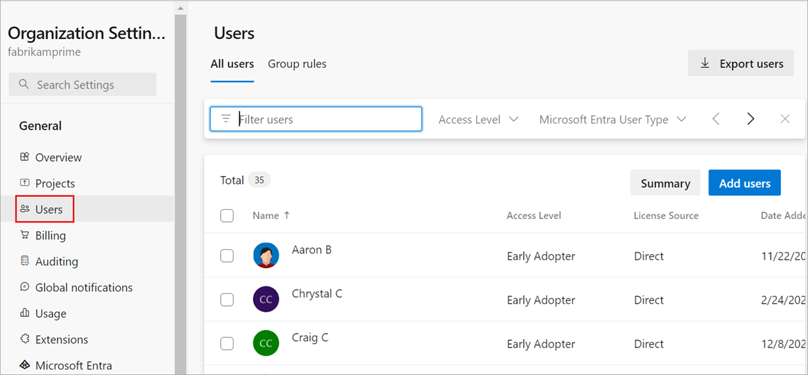
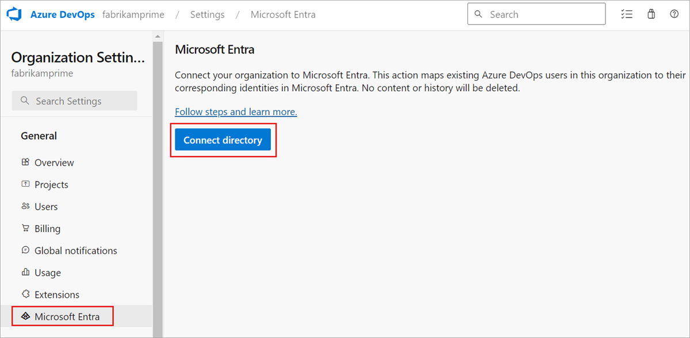
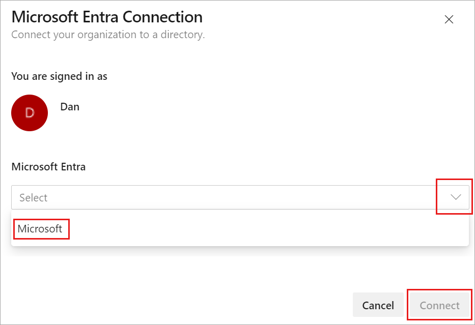
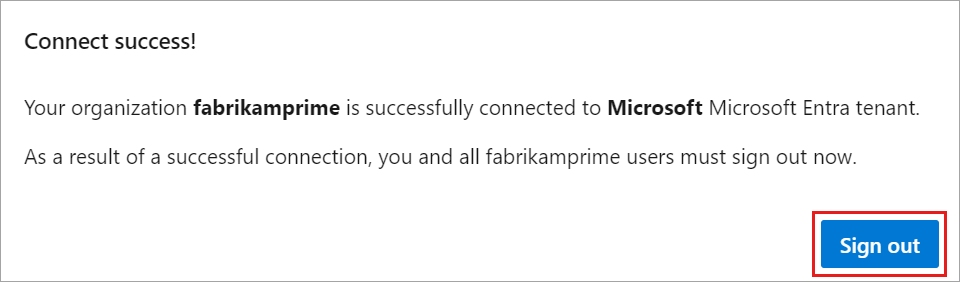
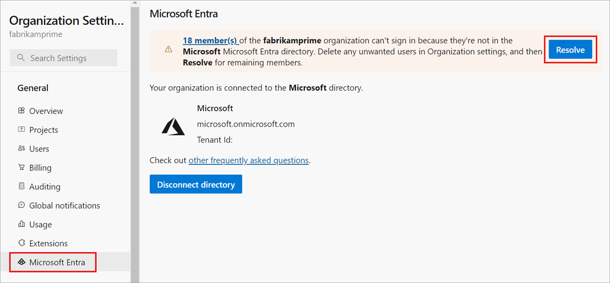
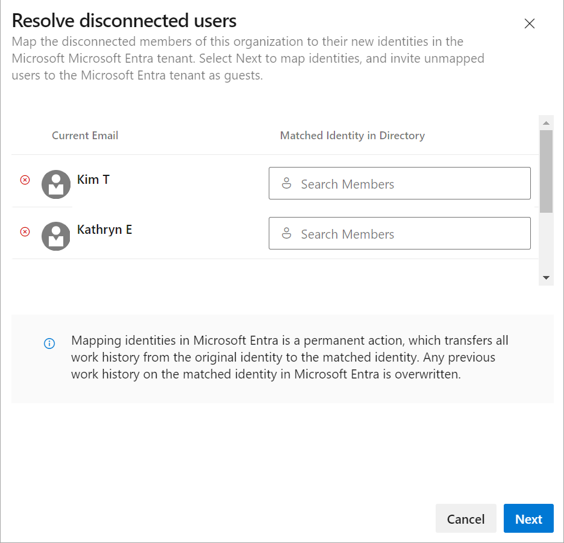
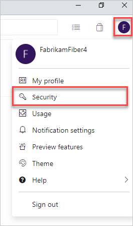
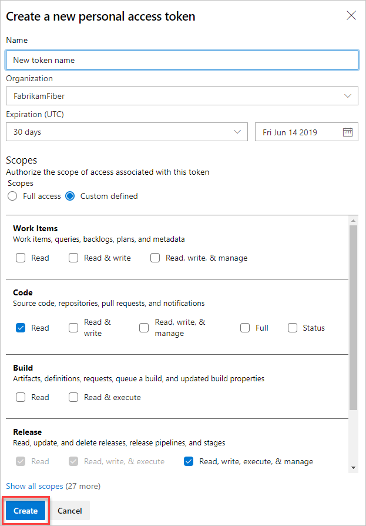

# Connect your organization to Azure Active Directory

[!INCLUDE [version-vsts-only](../../includes/version-vsts-only.md)]

Learn how to connect your Azure DevOps organization to [Azure Active Directory (Azure AD)](/azure/active-directory/fundamentals/active-directory-whatis). You can sign in with the same username and password that you use with Microsoft services. Add members to your Azure DevOps organization who are already a part of your work organization. You can also enforce policies for accessing your team's critical resources and key assets. 

For more information about using Azure AD with Azure DevOps, see the [conceptual overview](access-with-azure-ad.md).

## Prerequisites

- You have 100 or fewer users in your organization. If your organization has more than 100 users, [contact Support](https://azure.microsoft.com/support/devops/) for help connecting to Azure AD. 
- Ensure you're a Project Collection Administrator or [Owner of the organization](../security/lookup-organization-owner-admin.md) to make the connection.
- Ensure that you exist in Azure AD as a *member*. For more information, see [how you can convert an Azure AD *guest* into a *member*](/azure/devops/organizations/accounts/faq-azure-access#q--how-can-i-convert-an-azure-ad-guest-into-a-member-).
- Inform users of the upcoming change.
   There's no downtime during this change, but users are affected. Let them know before you begin that there's a short series of steps they need to complete. As your company transitions from Microsoft account (MSA) to Azure AD identities, your users' benefits continue with their new identity, as long as their emails match.
- Delete unwanted users from your organization. For example, you can remove a user who left the company and is no longer an employee.
- Prepare your mapping list for inviting users to Azure AD.

    1. Sign in to your organization (```https://dev.azure.com/{yourorganization}```).
    2. Select  **Organization settings**.
        
        

    3. Select **Users**.
        
        

    4. Compare your Azure DevOps email list with your Azure AD email list. Create an Azure AD email address entry for every user who's in the Azure DevOps organization and not in the Azure AD. Afterward, you can [invite users as guests](add-external-user.md) who don't have Azure AD email addresses.
    
> [!NOTE]
> Ensure you're using Azure AD Public. Connecting Azure DevOps Services organizations to Azure AD Government and accessing Azure DevOps Services with user accounts from Azure AD Government isn't supported.

## Connect your organization to Azure AD

1. Sign in to your organization (```https://dev.azure.com/{yourorganization}```).

2. Select  **Organization settings**.

    
3. Select **Azure Active Directory**, and then select **Connect directory**.

   

4. Select a directory from the dropdown menu, and then select **Connect**.

   
   If you can't find your directory, contact your Azure AD administrator and request that they add you as a member to the Azure AD.

5. Select **Sign out**.

   

    Your organization is now connected to your Azure AD.

6. Confirm that the process is complete. Sign out, and then open your browser in a private session and sign in to your organization with your Azure AD or work credentials.

7. Sign back in to Azure DevOps and map any disconnected members to their Azure AD identities. Or, you can invite them as guests into the Azure AD. For more information, see the [FAQs](/azure/devops/organizations/accounts/faq-azure-access#faq-connect).

   

   

## Inform users of the completed change

When you inform your users of the completed change, include the following tasks for each user in the organization to complete:

- Clear the cache for the [Git Credential Manager](https://github.com/Microsoft/Git-Credential-Manager-for-Windows/blob/master/Docs/Faq.md#q-why-is-gitexe-failing-to-authenticate-after-linkingunlinking-your-visual-studio-team-services-organization-from-azure-active-directory) if you use Visual Studio or the Git command-line tool. Delete the *%LocalAppData%\GitCredentialManager\tenant.cache* file on each client machine. 
- [Regenerate new personal access tokens](use-personal-access-tokens-to-authenticate.md). Complete the following steps:

    a. In Azure DevOps, open your **User profile**, and then select **Security** from the resulting dropdown menu.

     

    b. Select **Personal access tokens**, and then select **New Token**.
    
     

    c. Complete the form, and then select **Create**.

     

    d. When the token is created, copy it, as it can't be viewed again.

- Request that SSH keys be manually cleared by [Support](https://azure.microsoft.com/support/devops/), and then recreate SSH keys. Complete the following steps.

    a. In Azure DevOps, open your **User profile**, and then select **Security** from the resulting dropdown menu.

     

    b. Select **SSH public keys**, and then select **Add**.

     

    c. Enter a description and key data, and then select **Save**.

     

    d. When the token's created, copy it, as it can't be viewed again.

- [Rename your Microsoft account](https://support.microsoft.com/help/11545/microsoft-account-rename-your-personal-account) to a different email that doesn't conflict with your Azure AD identity. Doing so ensures that you won't be prompted to choose between accounts.
- Adjust your Visual Studio subscription if the UPN used inside your Azure DevOps Services organization has changed. You can have it reassigned to your new UPN, or set that UPN as the alternate account inside the subscription. For more information, see [how to add an alternate account to your subscription](/visualstudio/subscriptions/vs-alternate-identity#add-an-alternate-account-to-your-subscription).

## Related articles

* [Get a list of organizations backed by Azure AD](get-list-of-organizations-connected-to-azure-active-directory.md)
* [Restrict organization creation with tenant policy](azure-ad-tenant-policy-restrict-org-creation.md)
* [Disconnect from Azure AD](disconnect-organization-from-azure-ad.md)
* [Change Azure AD connection](change-azure-ad-connection.md)
* [Frequently asked questions (FAQs) about connecting, disconnecting, or changing your Azure AD](/azure/devops/organizations/accounts/faq-azure-access#connect-to-disconnect-from-or-change-azure-ad-connection)
