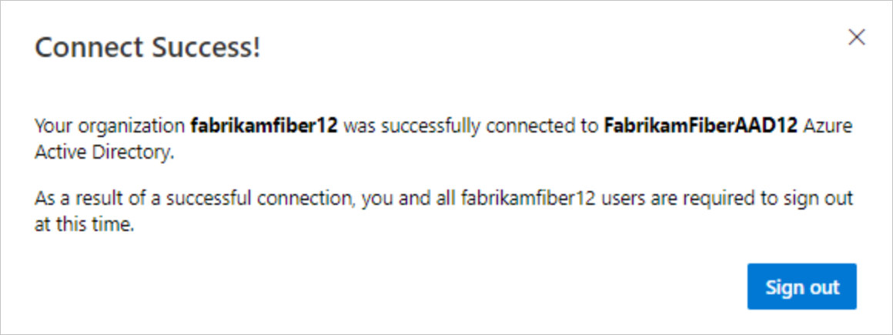
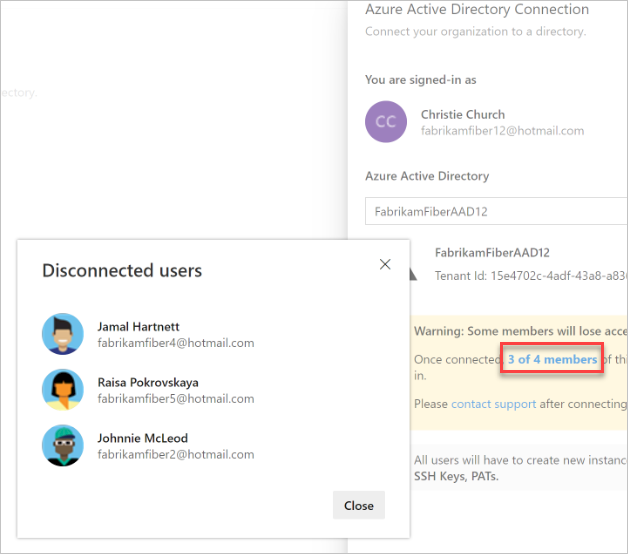

# Tutorial: Connect your organization to Azure Active Directory

[!INCLUDE [version-vsts-only](../../_shared/version-vsts-only.md)]

If your organization was created with a Microsoft account, you can connect that account to your [Azure Active Directory (Azure AD)](https://azure.microsoft.com/documentation/articles/active-directory-whatis/). Then, you can sign in to Azure DevOps with the same username and password that you use with the Microsoft services.

In this tutorial, you learn how to do the following tasks:
> [!div class="checklist"]
> * Connect your organization to your Azure Active Directory.
> * Close the temporary Microsoft account (MSA), if you created one.
> * Update the Azure subscription that your organization uses for billing.

For more information, see the [conceptual overview](access-with-azure-ad.md) about using Azure AD with Azure DevOps.

## Prerequisites

1. Inform users of the upcoming change.
   There's no downtime during this change, but users are affected by it. Let them know before you begin that there's a short series of steps they must complete. As your company transitions from Microsoft account (MSA) to Azure AD identities, your users' benefits continue with their new identity, as long as their emails match.
2. The user who makes the connection must confirm the following statements are true.
    * User exists in Azure AD as a member. If the user is an Azure AD guest, rather than member, follow this article: [Convert Azure AD UserType from Guest to Member using Azure AD PowerShell](https://blogs.msdn.microsoft.com/dstfs/2015/12/23/issues-with-azure-active-directory-guest-users-in-aad-backed-visual-studio-team-services-accounts/).
    * User is a *project collection administrator* or [*owner* of the organization](../security/lookup-organization-owner-admin.md)
    * User isn't using the Microsoft account identity that matches the Azure AD identity. For example, if the Microsoft account that users are currently using is *jamalhartnett@fabrikam.com*, the Azure AD identity they'll use after connecting is also *jamalhartnett@fabrikam.com*. Use a single identity that spans both applications, rather than two separate identities using the same email. For example, an MSA that's in Azure AD. If the email addresses are the same, [create a new MSA](#create-new-msa). If the addresses aren't the same, continue on to connect your organization to your Azure AD.

## Ensure all Azure DevOps users are in Azure AD

Make sure all Azure DevOps users are in Azure AD by completing the following steps.  

Note that any user that isn't in your Azure AD is a "historic" user and can't sign in. However, the user's history is retained. [Create a support](https://azure.microsoft.com/en-us/support/devops/) ticket to gain access to user history.

1. Sign in to your organization (```https://dev.azure.com/{yourorganization}```).
2. Select  **Organization settings**.
  
3. Select **Users**.
  
4. Compare your Azure DevOps email list with your Azure Active Directory email list.

   * If any users exist on the **Users** page but are missing from Azure AD, [add them as B2B guests](/azure/active-directory/active-directory-b2b-iw-add-users).

    

    These guests can be external to your organization (*User@othercompany.com*) or existing MSA users (*user@outlook.com* or *user@gmail.com*).

   * If you don't have permissions to invite users, in **User Settings**, select **Yes**.

    

    If you have recently modified settings or assigned the *guest inviter* role to a user, it might take 15-60 minutes for the changes to take effect.

   * If no paid license exists in your Azure AD, every invited user gets the rights that the Azure AD free account offers.

## Connect your organization to your Azure AD

> [!IMPORTANT]
> If you want to connect your organization to a different Azure Active Directory, disconnect from the original directory BEFORE you delete that directory. Once a new directory is established, connect your organizations to the new directory so users can regain access. Learn more about [disconnecting your organization from Azure AD](disconnect-organization-from-azure-ad.md).

1. Sign in to your organization (```https://dev.azure.com/{yourorganization}```).

2. Select  **Organization settings**.

    
3. Select **Azure Active Directory**, and then select **Connect directory**.

   

4. Select a directory tenant from the dropdown menu, and then select **Connect**.

   

5. Select **Sign out**.

   

Your organization is now connected to your Azure AD.

* Confirm that the process is complete. Sign out, and then open your browser in a private session and sign in to your organization with your Azure AD or work credentials.
* If you created a temporary user to complete the migration, change the owner of the organization back to the initial user. Then, [delete the temporary Microsoft account](#close-the-temporary-msa-if-you-created-one), which is no longer needed.

## Inform users of the completed change

Visual Studio subscription administrators assign subscriptions to users' corporate email so that they'll receive the subscription welcome email and notifications. If the identity and subscription email messages match, users can access the benefits of that subscription.

When you inform your users of the completed change, include the tasks that each user in the organization must complete, as follows:

1. If you use Visual Studio or the Git command-line tool, you might need to clear the cache for the [Git Credential Manager](https://github.com/Microsoft/Git-Credential-Manager-for-Windows/blob/master/Docs/Faq.md#q-why-is-gitexe-failing-to-authenticate-after-linkingunlinking-your-visual-studio-team-services-organization-from-azure-active-directory).  
    Deleting the *%LocalAppData%\GitCredentialManager\tenant.cache* file on each client machine resolves the issue.

2. You don't need to regenerate tokens if your emails match. You do need to [regenerate new tokens](use-personal-access-tokens-to-authenticate.md) for the Azure AD users who need to be mapped. Complete the following steps.

    a. On your Azure DevOps page, at the upper right, select your profile image, and then select **Security**.

    b. On the SSH public keys page, select **Add**. Enter a description, and then, at the bottom of the page, select **Create token**.

    c. When the token is created, make a note of it or copy it to the clipboard. It can't be viewed again.

3. If you use SSH tokens, [add new keys for the Azure AD user](../../repos/git/use-ssh-keys-to-authenticate.md).
4. If you don't want to be prompted to choose between accounts, [rename your Microsoft account](https://support.microsoft.com/help/11545/microsoft-account-rename-your-personal-account) to a different email that doesn't conflict with your Azure AD identity. Or, if you no longer need it, [close your Microsoft account](connect-organization-to-azure-ad.md#optional-close-the-temporary-msa-if-you-created-one).

5. If you used a Microsoft account to sign up for a [Visual Studio with MSDN subscription](https://visualstudio.microsoft.com/vs/pricing/), you can add to the subscription a work or school account that's managed by Azure AD. The subscription must have Azure DevOps as a benefit. To learn how to link work or school accounts to Visual Studio with MSDN subscriptions, see [Managing subscriptions](/visualstudio/subscriptions/manage-vs-subscriptions).

## Update the Azure subscription that your organization uses for billing

After you connect your organization to Azure AD, you need to update the Azure subscription that you've been using to pay for Azure DevOps before the end of the month.

If your subscription is associated with a different directory, you can't buy or change the purchases you've already made. Your existing paid resources continue to work and charges renew each month. But, when you try to make changes in the Visual Studio Marketplace, Azure DevOps tab, you'll see something similar to the following message:


Set up billing by using one of the following options:

* [Associate the subscription with the directory](/azure/active-directory/active-directory-how-subscriptions-associated-directory) that you're now using to sign in to Azure DevOps. If you're unable to change the directory in the Azure portal, you can [transfer the subscription to your work Azure AD identity](/azure/billing/billing-subscription-transfer).

* If you have a different Azure subscription to use for billing, you can [change the Azure subscription Azure DevOps uses for billing](../billing/change-azure-subscription.md).
  > [!IMPORTANT]
  > Follow the article instructions carefully, because this option can disrupt billing for your organization if it isn't set up correctly.

## Optional

### Create new MSA

If your email address is not changing and is part of your Azure AD tenant, you do not need to create a new MSA.

Users' email addresses must be the same before and after the connection. For example, if users currently sign in to their Microsoft account (MSA) with the email address *jamalhartnett@fabrikam.com*, they sign in with the same email address as their Azure AD identity. We'll update this article when we have a solution for scenarios where email addresses must be changed.

<a name="optional-close-the-temporary-msa-if-you-created-one"></a>

### Close the temporary MSA

Close the temporary MSA if you created one and added it to both the Azure AD tenant and Azure DevOps organization.

1. In Azure DevOps, go to the **Settings** page, and then [change the organization owner](change-organization-ownership-vs.md) back to yourself.
2. On the **Users** page, remove the temporary new user.
3. Go to the Azure portal, and remove the new user from the Azure AD.
4. [Close the temporary MSA](https://support.microsoft.com/help/12412/microsoft-account-how-to-close-account) that you created previously.

   [More questions about connecting?](faq-azure-access.md#faq-connect)

## Next steps

> [!div class="nextstepaction"]
> [Enforce conditional access policies](/azure/active-directory/active-directory-conditional-access-azure-portal-get-started)

## Related articles

* [Manage users and access](add-organization-users.md)
* [Manage access with Azure AD groups](manage-azure-active-directory-groups-vsts.md)

## Frequently asked questions (FAQ)

|**Question**  |**Solution**  |
|---------|--------- |
|**Will my users keep their existing Visual Studio subscriptions?**     | Visual Studio subscription administrators ordinarily assign subscriptions to users' corporate email addresses, so that users can receive welcome email and notifications. If the identity and subscription email addresses match, users can access the benefits of the subscription. As you transition from Microsoft to Azure AD identities, users' benefits still work with their new Azure AD identity. But, the email addresses must match. If the email addresses don't match, your subscription administrator must [reassign the subscription](../billing/csp/buy-vs-app-center.md). Otherwise, users must [add an alternate identity to their Visual Studio subscription](/visualstudio/subscriptions/vs-alternate-identity).        |
|**What if I'm required to sign in when I use the identity picker?**    |  Clear your browser cache, and delete any cookies for the session. Close your browser, and then reopen.       |
|**What if my work items are indicating that the users aren't valid?**    | Clear your browser cache, and delete any cookies for the session. Close your browser, and then reopen.       |
|**What if my email account isn't found in Azure AD?**   | Talk to the administrator of your company's Azure Active Directory to get your email account (fabrikamfiber12@hotmail.com) added to that directory. Or, they can give you a new Azure AD account - if this occurs, you must [contact support](https://azure.microsoft.com/en-us/support/devops/) for mapping.       |
|**What if I get a warning about members who will lose access to the organization?** |  You can still connect to Azure AD, but [contact support](https://azure.microsoft.com/en-us/support/devops/) afterward to resolve this issue. You can also select the bolded text to see which users are affected.      |
