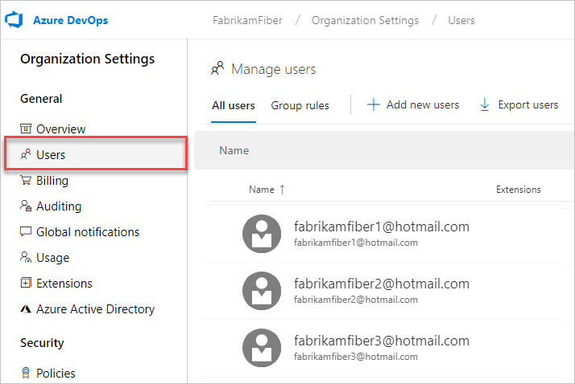

# Tutorial: Connect your organization to Azure Active Directory

[!INCLUDE [version-vsts-only](../../_shared/version-vsts-only.md)]

If your organization was created with a Microsoft account, you can connect that account to your [Azure Active Directory (Azure AD)](https://azure.microsoft.com/documentation/articles/active-directory-whatis/).

You can then sign in to Azure DevOps Services with the same username and password that you use with the Microsoft services.

You can also [enforce conditional access policies](/azure/active-directory/active-directory-conditional-access-azure-portal-get-started) for accessing
your team's critical resources and key assets.

In this tutorial, you learn how to do the following:
> [!div class="checklist"]
> * Connect your organization to your Azure Active Directory.
> * Close the temporary Microsoft account (MSA), if you created one.
> * Update the Azure subscription that your organization uses for billing.

For more information, see the [conceptual overview](access-with-azure-ad.md) about using Azure AD with Azure DevOps.

> [!VIDEO https://www.youtube.com/embed/-LkYGi9orhc] 

>[!Note]
>Azure DevOps Services was previously called Visual Studio Team Services (VSTS).

We offer a path to connect to an Azure Active Directory where the users' email addresses are the same before and after the connection. For example, if users currently sign in to their Microsoft account (MSA) with the email address *jamalhartnett@fabrikam.com*, they'll sign in with the same email address as their Azure AD identity.

We will update this guidance when we have a solution for scenarios where email addresses must be changed.

## Prerequisites

Before you begin, do the following:

1. Inform users of the upcoming change. 
   Although there is no downtime during this change, users will be affected by it. It's best to let them know before you begin that there will be a short series of steps for them to complete. As your company transitions from Microsoft account (MSA) to Azure AD identities, your users' benefits will continue to work with their new identity, provided that their emails match.

2. Ensure that the following is true about each user who performs the connection:

    * The user exists in Azure AD as a member.
    * The user is a *project collection administrator* or [*owner* of the organization](../security/lookup-organization-owner-admin.md).
    * The user is not using the Microsoft account identity that matches the Azure AD identity. For example, if the Microsoft account that users are currently using is *jamalhartnett@fabrikam.com*, the Azure AD identity they'll use after connecting is also *jamalhartnett@fabrikam.com*. You must use a single identity that spans both applications (MSA that's in Azure AD), rather than two separate identities using the same email. If the email addresses are the same, do the following. If the addresses are not the same, continue on to connect your organization to your Azure AD.

         a. [Create a new MSA](https://signup.live.com/) (for example, *Fabrikam@outlook.com*). This account is only temporary and can be [deleted later](#optional-close-the-temporary-msa-if-you-created-one).  
         b. Sign in to your organization as a *project collection administrator*, and [add the new user](add-organization-users-from-user-hub.md) as a member of the organization.  
         c. Sign in to the [Azure portal](https://portal.azure.com/), and add the new user as a B2B guest of Azure AD.  An email invitation is sent to the new user.  
         d. Go to your email invitations from Azure and select **Call-To-Action** in each message.     
         e. Select **Next/Continue** on a few pages to fully register the new user.  
         f. Sign in to your organization as the new user.  
         g. Go to **Settings** as a *project collection administrator* and, after you've signed in as the new user, change the owner of the organization to the new user.  
         h. As the new user, complete the remaining steps to connect your organization to Azure AD.  

3. Ensure that all Azure DevOps users are in Azure AD by completing the following set of steps:  
  

(Any user that is not in your Azure AD is a "historic" user and cannot sign in. However, the user's history is retained.)

[!INCLUDE [temp](../../_shared/new-navigation.md)] 

# [New navigation](#tab/new-nav)

1. Sign in to your organization (```https://dev.azure.com/{yourorganization}```).
2. Select  **Organization settings**.
  
3. Select **Users**.
  
4. Compare the list of email addresses in Azure DevOps Services with the list of email addresses in your Azure Active Directory.

   * If any users exist on the Azure DevOps Services **Users** page but are missing from Azure AD, [add them as B2B guests](/azure/active-directory/active-directory-b2b-iw-add-users).

    

    These guests can be external to your organization (*User@othercompany.com*) or existing MSA users (*user@outlook.com* or *user@gmail.com*).

   * If you are notified that you do not have permissions to invite users, under **User Settings**, verify that your user organization is authorized to invite external users.

    

    If you have recently modified these settings or assigned the *guest inviter* role to a user, there might be a 15 to 60-minute delay before the changes take effect.

   * If no paid license exists in your Azure AD, every invited user gets the rights that the Azure AD free account offers.

# [Previous navigation](#tab/previous-nav)

1. Sign in to your organization and go to **Organization settings**.
  
2. Go to **Users**.
  
3. Compare the list of email addresses in Azure DevOps Services with the list of email addresses in your Azure Active Directory.

   * If any users exist on the Azure DevOps Services **Users** page but are missing from Azure AD, [add them as B2B guests](/azure/active-directory/active-directory-b2b-iw-add-users).

    

    These guests can be external to your organization (*User@othercompany.com*) or existing MSA users (*user@outlook.com* or *user@gmail.com*).

   * If you are notified that you do not have permissions to invite users, under **User Settings**, verify that your user organization is authorized to invite external users.

    

    If you have recently modified these settings or assigned the *guest inviter* role to a user, there might be a 15 to 60-minute delay before the changes take effect.

   If no paid license exists in your Azure AD, every invited user gets the rights that the Azure AD free account offers.

---

## Connect your organization to your Azure AD

1. Sign in to the [Azure portal](https://portal.azure.com/) with the Microsoft account that you chose in the previous section.

    Make sure you are connected to the correct directory. Select the directory at the upper right corner of the page.

    

2. Select **All services** and then **Azure DevOps Services organizations**.

   

3. Select your organization.  
    If you don't see your organization, ensure that you're using the directory that's displayed in the Azure portal at the upper right. Also, confirm that you're signed in with a Microsoft account that is the owner of the organization.

   

4. Select **Connect AAD**.

   

5. Select **Yes** to connect.

   

6. Your organization is now connected to your Azure AD.

7. To confirm that the process has been completed, open your browser in a private session and sign in to your organization with your Azure AD or work credentials.

   

8. If you created a temporary user to complete the migration, change the owner of the organization back to the initial user, and delete the temporary Microsoft account, which is no longer needed.

## Inform users of the completed change

Visual Studio subscription administrators assign subscriptions to users' corporate email so that they'll receive the subscription welcome email and notifications. If the identity and subscription email messages match, users can access the benefits of that subscription. As your organization transitions from Microsoft accounts to Azure AD identities, your users' benefits continue to work with their new Azure AD identity, provided that the email addresses match.

When you inform your users of the completed change, include the tasks that each user in the organization must complete, as follows:

1. If you use the Git command-line tool, you might need to clear the cache for the [Git Credential Manager](https://github.com/Microsoft/Git-Credential-Manager-for-Windows/blob/master/Docs/Faq.md#q-why-is-gitexe-failing-to-authenticate-after-linkingunlinking-your-visual-studio-team-services-organization-from-azure-active-directory).  
    Deleting the *%LocalAppData%\GitCredentialManager\tenant.cache* file on each client machine will resolve the issue.

2. If you use the alternate authentication tokens that are used by tools or scripts, [regenerate new tokens](use-personal-access-tokens-to-authenticate.md) for the Azure AD users. Complete the following:

    a. On your Azure DevOps Services page, at the upper right, select your profile image, and then select **Security**.

    b. On the SSH public keys page, select **Add**. Enter a description and then, at the bottom of the page, select **Create token**.

    c. When the token is created, make a note of it or copy it to the clipboard. It cannot be viewed again. 

3. If you use SSH tokens, [add new keys for the Azure AD user](../../repos/git/use-ssh-keys-to-authenticate.md).
4. If you don't want to be prompted to choose between accounts, [rename your Microsoft account](https://support.microsoft.com/help/11545/microsoft-account-rename-your-personal-account) to a different email that doesn't conflict with your Azure AD identity. Or, if you no longer need it, simply [close your Microsoft account](connect-organization-to-azure-ad.md#optional-close-the-temporary-msa-if-you-created-one).

5. If you used a Microsoft account to sign up for a [Visual Studio with MSDN subscription](https://visualstudio.microsoft.com/vs/pricing/) that includes Azure DevOps Services as a benefit, you can add to the subscription a work or school account that's managed by Azure AD. To learn how to link work or school accounts to Visual Studio with MSDN subscriptions, see [Managing subscriptions](/visualstudio/subscriptions/manage-vs-subscriptions).

## Optional steps

<a name="optional-close-the-temporary-msa-if-you-created-one"></a>

### Close the temporary MSA (if you created one)

1. In Azure DevOps Services, go to the **Settings** page, and then [change the organization owner](change-organization-ownership-vs.md) back to yourself.
2. On the **Users** page, remove the temporary new user.
3. Go to the Azure portal, and remove the new user from the Azure AD.
4. [Close the temporary MSA](https://support.microsoft.com/help/12412/microsoft-account-how-to-close-account) that you created previously.

   [More questions about connecting?](faq-azure-access.md#faq-connect)

### Update the Azure subscription that your organization uses for billing

After you connect your organization to Azure AD, you might need to update the Azure subscription that you've been using to pay for Azure DevOps Services.

If the subscription that you’ve been using to pay for Azure DevOps Services is associated with a directory other than the one you connect to, you won’t be able to make purchases or change the purchases you’ve already made. Your existing paid resources continue to work, and charges renew each month, but when you try to make changes in the Visual Studio Marketplace you’ll see a message like the following:


You can set up Azure DevOps Services billing correctly by using one of the following options:

* [Associate the subscription with the directory](/azure/active-directory/active-directory-how-subscriptions-associated-directory) that you’re now using to sign in to Azure DevOps Services. If you’re unable to change the directory in the Azure portal, you can [transfer the subscription to your work Azure AD identity](/azure/billing/billing-subscription-transfer).

* If you have a different Azure subscription to use for billing Azure DevOps Services, you can [change the Azure subscription Azure DevOps Services uses for billing](../billing/change-azure-subscription.md). 
  > [!IMPORTANT]
  > Follow the article instructions carefully, because this option can disrupt billing for your organization if it isn’t set up correctly.

## FAQ

### Q: Will my users retain their existing Visual Studio subscriptions?

A: Visual Studio subscription administrators ordinarily assign subscriptions to users' corporate email addresses, so that users can receive welcome email and notifications. If the identity and subscription email addresses match, users can access the benefits of the subscription. 

As your organization transitions from Microsoft to Azure AD identities, your users' benefits continue to work with their new Azure AD identity, provided that the email addresses match. If the email address that the users' subscription is assigned to differs from their Azure AD identity email address, your subscription administrator must [reassign the subscription](../billing/csp/buy-vs-app-center.md). Otherwise, users must [add an alternate identity to their Visual Studio subscription](/visualstudio/subscriptions/vs-alternate-identity).

### Q: What if sign-in is required when I use the identity picker?

A: Clear your browser cache, and delete any cookies for the session.

### Q: What if my work items are indicating that the users aren't valid?

A: Clear your browser cache, and delete any cookies for the session.

## Next steps

> [!div class="nextstepaction"]
> [Manage users and access](add-organization-users-from-user-hub.md)
> or [Manage access with Azure AD groups](manage-azure-active-directory-groups-vsts.md)

