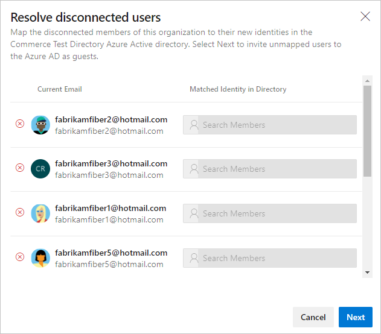

# Connect your organization to Azure Active Directory

[!INCLUDE [version-vsts-only](../../_shared/version-vsts-only.md)]

Connect your Azure DevOps organization to [Azure Active Directory (Azure AD)](https://azure.microsoft.com/documentation/articles/active-directory-whatis/) so you can sign in with the same username and password that you use with Microsoft services. You can easily find and add members to your Azure DevOps organization who are already a part of your work organization. You can also enforce policies for accessing your team's critical resources and key assets. 

For more information about using Azure AD with Azure DevOps, see the [conceptual overview](access-with-azure-ad.md).

## Prerequisites

- Ensure you're a Project Collection Administrator or [owner of the organization](../security/lookup-organization-owner-admin.md) to perform the connection.
- Ensure that you exist in Azure AD as a *member*. For more information, see [how you can convert an Azure AD *guest* into a *member*](faq-add-delete-users.md#q-how-can-i-convert-an-azure-ad-guest-into-a-member).
- Inform users of the upcoming change.
   There's no downtime during this change, but users are affected. Let them know before you begin that there's a short series of steps to complete. As your company transitions from Microsoft account (MSA) to Azure AD identities, your users' benefits continue with their new identity, as long as their emails match.
- Delete unwanted users from your organization. For example, you can remove a user who left the company and is no longer an employee.
- Prepare your mapping list for inviting users to Azure AD.

    1. Sign in to your organization (```https://dev.azure.com/{yourorganization}```).
    2. Select  **Organization settings**.
        
        

    3. Select **Users**.
        
        

    4. Compare your Azure DevOps email list with your Azure AD email list. Create an Azure AD email address entry for every user who is in the Azure DevOps organization and NOT in the Azure AD. For any user that you don't create an Azure AD email address, be prepared to invite these users as guests to the Azure AD in future steps.
	
> [!NOTE]
> Ensure you're using Azure AD Public. Support for Azure AD Government is currently limited.

## Connect your organization to Azure AD

1. Sign in to your organization (```https://dev.azure.com/{yourorganization}```).

2. Select  **Organization settings**.

    
3. Select **Azure Active Directory**, and then select **Connect directory**.

   

4. Select a directory from the dropdown menu, and then select **Connect**.

   
   If you can't find your directory, contact your Azure AD administrator and request that they add you as a member to the Azure AD.

5. Select **Sign out**.

   

    Your organization is now connected to your Azure AD.

6. Confirm that the process is complete. Sign out, and then open your browser in a private session and sign in to your organization with your Azure AD or work credentials.

7. If you have disconnected members, sign back in to Azure DevOps and map them to their Azure AD identities or invite them as guests into the Azure AD. See the [FAQ](faq-azure-access.md#connect-disconnect-or-change-azure-ad) for further information.

   

   

## Inform users of the completed change

When you inform your users of the completed change, include the following tasks for each user in the organization to complete:

- Clear the cache for the [Git Credential Manager](https://github.com/Microsoft/Git-Credential-Manager-for-Windows/blob/master/Docs/Faq.md#q-why-is-gitexe-failing-to-authenticate-after-linkingunlinking-your-visual-studio-team-services-organization-from-azure-active-directory) if you use Visual Studio or the Git command-line tool. Delete the *%LocalAppData%\GitCredentialManager\tenant.cache* file on each client machine. 
- [Regenerate new personal access tokens](use-personal-access-tokens-to-authenticate.md). Complete the following steps:

    a. In Azure DevOps, select your profile icon, and then select **Security** from the resulting dropdown menu.

     

    b. Select **Personal access tokens**, and then select **New Token**.
    
     

    c. Complete the form, and then select **Create**.

     

    d. When the token is created, copy it, as it can't be viewed again.

- Request that SSH keys be manually cleared by [Support](https://azure.microsoft.com/support/devops/), and then recreate SSH keys. Complete the following steps.

    a. In Azure DevOps, select your profile icon, and then select **Security** from the resulting dropdown menu.

     

    b. Select **SSH public keys**, and then select **Add**.

     

    c. Enter a description and key data, and then select **Save**.

     

    d. When the token is created, copy it, as it can't be viewed again.

- [Rename your Microsoft account](https://support.microsoft.com/help/11545/microsoft-account-rename-your-personal-account) to a different email that doesn't conflict with your Azure AD identity if you don't want to be prompted to choose between accounts.
- [Manage your Visual Studio with MSDN subscription](/visualstudio/subscriptions/manage-vs-subscriptions), if you used a Microsoft account to sign up for Azure DevOps. Link work or school accounts to this subscription.

## Manage multiple organizations backed by Azure AD

## Get list of organizations

You can download a complete list of organizations backed by an Azure Active Directory tenant. 
The following details are included:
- organization IDs
- organization names
- organization URLs
- organization owners

For any of the organizations that are backed by your directory, complete the following steps.

1. Sign in to your organization (```https://dev.azure.com/{yourorganization}```).

2. Select  **Organization settings**.

    

3. Select **Azure Active Directory**, and then **Download**.

   :::image type="content" source="_img/_shared/select-azure-ad-download.png" alt-text="Select Azure Active Directory, and then the Download button":::

## Related articles

* [Disconnect from Azure AD](disconnect-organization-from-azure-ad.md)
* [Change Azure AD connection](change-azure-ad-connection.md)
* [Enforce Conditional Access policies](manage-conditional-access.md)
* [Manage access with Azure AD groups](manage-azure-active-directory-groups-vsts.md)


