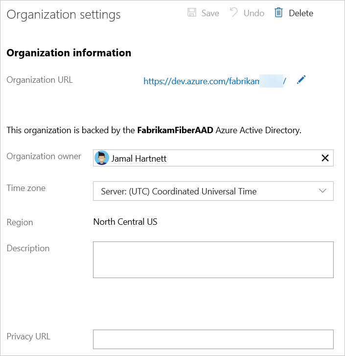

# Create an organization or project collection

[!INCLUDE [version-vsts-tfs-all-versions](../../_shared/version-vsts-tfs-all-versions.md)]

::: moniker range="= azure-devops"

In this quickstart, you learn how to create an organization. An organization is used to connect groups of related projects, helping to scale up an enterprise. You can use a personal Microsoft account or a work or school account. Use your work or school account to *automatically connect* your organization to your Azure Active Directory (Azure AD).

::: moniker-end

::: moniker range="<= azure-devops-2019"

## Create a project collection

A project collection is a container of projects. By grouping projects together, you can manage projects more efficiently and assign the same resources to them. 

For more information about how to create a project collection, see [create a project collection](https://docs.microsoft.com/azure/devops/server/admin/manage-project-collections?view=azure-devops#create-a-project-collection).

::: moniker-end

::: moniker range="= azure-devops"

## Prerequisites

1. Read and understand how to [Plan your organizational structure](../../user-guide/plan-your-azure-devops-org-structure.md).
2. Complete the following steps if you want to use only Microsoft accounts with your organization.

     Without Azure AD, you're solely responsible for controlling organization access. And all users must sign in with their Microsoft account. 
     [What are other differences?](faq-create-organization.md#SignInOrganizationDifferences)

     - If you don't have a Microsoft account, you can create one when you sign up for Azure DevOps.

     - Use your Microsoft account if you don't need to authenticate users for an organization with [Azure AD](https://azure.microsoft.com/documentation/articles/active-directory-whatis/). All users must sign in to your organization with a Microsoft account.

3. Complete the following steps if you want to authenticate users and control organization access through your Azure AD.

      - You need a work or school account that's managed by your Azure AD. If you use Azure or Office 365, you might have one already. If you don't, learn how to [sign up for Azure as an organization](https://azure.microsoft.com/documentation/articles/sign-up-organization/).
      - To use existing on-premises identities, see [use Azure AD Connect for integrating on-premises directories with Azure AD](https://azure.microsoft.com/documentation/articles/active-directory-aadconnect/).
      - All users must be members in that directory to access your organization. To add users from other organizations, use [Azure AD B2B collaboration capabilities](/azure/active-directory/active-directory-b2b-what-is-azure-ad-b2b).

## Create organization

1. Go to [Azure DevOps](https://go.microsoft.com/fwlink/?LinkId=307137), and use either a Microsoft or Azure AD account to sign in. Choose **Next**.

	  

	  [Got browser problems?](faq-create-organization.md#browser-problems)

	  If you previously signed up for Azure DevOps, select **New organization**.

      

2. Enter the name of your organization and select the location to host your projects from the dropdown menu. Choose **Continue**.

   

   

3. Select **Organization settings** and **Overview**. Confirm or change your organization settings.

   

   

   If you're using an **Azure AD account**, confirm the directory that you're connected to. If you belong to multiple directories, ensure that you want to connect this directory to your organization. Changing the directory now is easier than [changing the directory later](faq-create-organization.md#ChangeDirectory).

To sign in to your organization at any time, go to (https://dev.azure.com/{yourorganization}).

> [!NOTE]
> If you activated your Visual Studio subscription with a Microsoft account, and your subscription includes Azure DevOps as a benefit, learn [how to add your work or school account](../../billing/link-msdn-subscription-to-organizational-account-vs.md) to your subscription so that you can use your subscriber benefits in Azure DevOps.

::: moniker-end

## Next steps

> [!div class="nextstepaction"]
> [Manage users and access](add-organization-users.md)
> or
> [!div class="nextstepaction"]
> [Create project](../projects/create-project.md)

## Related articles

* [Create your backlog](../../boards/backlogs/create-your-backlog.md)
* [Manage your process](../../organizations/settings/work/manage-process.md)
* [Customize your process](../../organizations/settings/work/customize-process.md)
* Add code to Git or Team Foundation Version Control:
  * Git: Use [Eclipse](../../java/download-eclipse-plug-in.md), [Xcode](../../repos/git/share-your-code-in-git-xcode.md), [Android Studio](/../../java/download-android-studio-plug-in), [IntelliJ](/../../java/download-intellij-plug-in), [Visual Studio](../../repos/git/share-your-code-in-git-vs-2017.md), or [Visual Studio Code](https://code.visualstudio.com/docs/editor/versioncontrol).
  * Team Foundation Version Control: Use [Eclipse](/../../java/download-eclipse-plug-in), [Xcode](../../repos/tfvc/share-your-code-in-tfvc-xcode.md), [Visual Studio](../../repos/tfvc/use-visual-studio-git.md), or [Visual Studio Code](https://code.visualstudio.com/docs/editor/versioncontrol).