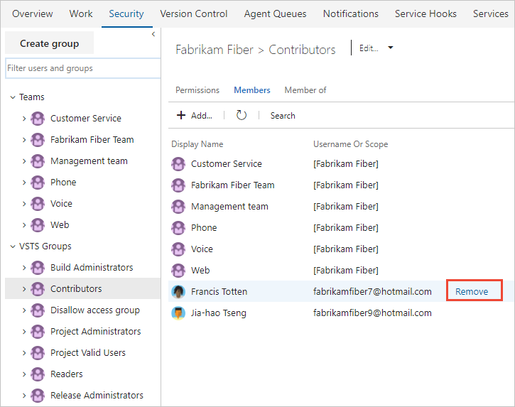

# Delete users from Visual Studio Team Services (VSTS)

**VSTS**

If a user no longer requires access to a team project or your VSTS account, you can remove their access to a team project or your account.

## Prerequisites

- You'll need [VSTS project collection administrator or account owner permissions](../../organizations/security/set-project-collection-level-permissions.md?toc=/vsts/organizations/accounts/toc.json&bc=/vsts/organizations/accounts/breadcrumb/toc.json).

## Remove users from your VSTS account

1. Sign in to your VSTS account (```https://{youraccount}.visualstudio.com```).

   [Why am I asked to choose between my "work or school account" and my "personal account"?](faq-add-delete-users.md#ChooseOrgAcctMSAcct)

2. Go to the **Users** page.

3. Open the context menu**...** for the user to remove and select **Remove from account**.

   
](_img/_shared/remove-from-organization-menu-selection.png)

4. Choose **Remove** in the confirmation dialog.

5. To make sure that you've removed the user completely, make sure they are not in any of your [security groups](../../organizations/security/add-users-team-project.md). 

   [Why don't users appear or disappear promptly in VSTS after I add or delete them in the Users hub?](faq-add-delete-users.md#users-delay)

6. If you deleted paid users who had Basic features, and you don't want to pay for these users, you must also [reduce these users in the Visual Studio Marketplace](../../billing/buy-basic-access-add-users.md),so you're not charged in your next Azure billing cycle.

   > To reduce or cancel these users for the next month, you must make updates before the last day of the current month.
   > Your bill won't show these changes until the next month because paid users are monthly purchases.

>[!Note]
>Azure AD-backed accounts: Once you remove a user from Azure AD, you will not be able to assign artifacts (work items, pull requests, etc.) to this user anymore. However, we will preserve the history of artifacts that has already been assigned to this user.
>MSA-backed accounts: Once you remove a user from your MSA-backed VSTS account, the user will remain within the tenant and can therefore be re-added at any time.

## Remove users from a team or team project

To remove users from a team project, remove them from the Teams groups they belong to or the Contributors group for the team project. See [Add users to a team project or specific team](../../organizations/security/add-users-team-project.md). From the Members page of a team group or security group, you can Remove a user.


## Related notes

 [Add administrators, set permissions at the project-level or project collection-level](../../organizations/security/set-project-collection-level-permissions.md). 
- [Change individual permissions, grant select access to specific functions](../../organizations/security/change-individual-permissions.md)
- [Grant or restrict access to select features and functions](../../organizations/security/restrict-access.md)
- [Troubleshoot adding and deleting account users in the VSTS user hub](faq-add-delete-users.md)
- [Troubleshoot adding members to team projects in Visual Studio Team Services (VSTS)](faq-add-team-members.md)
