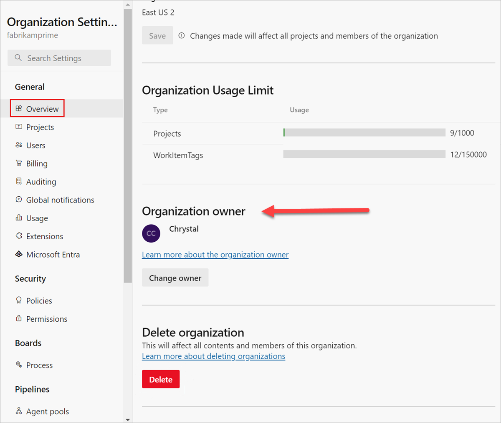
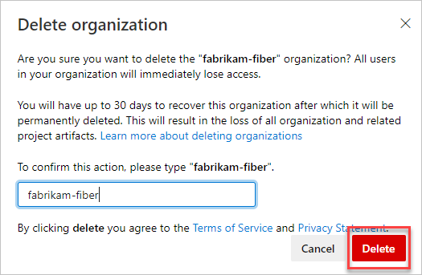

# Delete your organization

[!INCLUDE [version-eq-azure-devops](../../includes/version-eq-azure-devops.md)]

When you no longer need an organization, you can delete it from Azure DevOps. If you change your mind within 28 days, you can [recover your organization](./recover-your-organization.md).
After 28 days, your organization and all associated data are permanently deleted.

When you delete your organization, the following occur:

- Users immediately lose access to organization services and resources.
- Your organization URL becomes available for anyone to use, which might take up to one hour.
- Your organization is disabled and appears deleted in your profile for 28 days.
- If your organization is linked to an Azure subscription for billing, you must unlink it before deletion. You're still charged for any paid users and services used during the current billing cycle. Billing stops after the current cycle ends.

> [!CAUTION]
> In rare cases, our deletion process might take up to 70 days due to backend retries and the need to delete data from multiple sources.

## Prerequisites

- **Permissions:** Have [Project Collection Administrator permissions](../security/look-up-project-collection-administrators.md). Organization owners are automatically members of this group.
- **Access levels:** Have at least Basic access.
- **Subscription:** If your organization uses an Azure subscription for billing, [remove billing from your organization](../billing/change-azure-subscription.md#remove-your-billing-subscription) before deleting it in Azure DevOps.

## Delete organization

To delete an organization, do the following steps.

1. Sign in to your organization (```https://dev.azure.com/{yourorganization}```).

2. Select  **Organization settings**.

    

3. Select **Overview** > **Delete**.

   

4. In the resulting dialog box, enter the name of the organization, and then select **Delete**.

   

5. To review your organizations, go to your [Visual Studio profile](https://app.vsaex.visualstudio.com/profile/view), where you can see your deleted organization.

   [Need help?](faq-configure-customize-organization.yml#get-support)

Your organization is deleted.

## Related articles

- [Recover your deleted organization](recover-your-organization.md)
- [Resolve an orphaned organization](resolve-orphaned-organization.md)
- [Create a new organization](create-organization.md)
