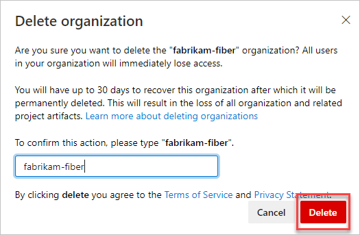

# Delete your Azure DevOps Services organization

[!INCLUDE [version-vsts-only](../../_shared/version-vsts-only.md)]

If you don't need your Azure DevOps Services organization, you can delete it. If you change your mind within 30 days, you can [recover your organization](recover-your-vsts-organization.md).
After 30 days, your organization and data are permanently deleted.

When you delete your Azure DevOps Services organization:

* All users lose access to organization services and resources immediately.

* Your organization URL becomes available for anyone to use. (It might take up to one hour before your organization URL becomes available again.)

* Your organization is disabled, and appears deleted in your profile for 30 days.

* If your organization is linked to an Azure subscription for billing purchases, you must unlink your organization before you delete your organization.

  You're still charged for any paid users and Azure DevOps Services that your organization uses during this billing cycle. Billing stops after the current cycle ends.

To delete your Azure DevOps Services organization, you need organization owner permissions. [How do I find the organization owner?](faq-delete-restore-vsts-organization.md#find-owner)

## Before you delete your Azure DevOps Services organization

If your Azure DevOps Services organization uses an Azure subscription to bill purchases, you must first unlink your organization from your Azure subscription before deleting your organization.

To disconnect Azure Active Directory from your organization, you need Azure DevOps Services organization owner permissions, and at least Azure subscription co-administrator permissions. For more information, see [How do I find the organization owner?](faq-delete-restore-vsts-organization.md#find-owner) and [Azure subscription administrators](https://azure.microsoft.com/documentation/articles/billing-add-change-azure-subscription-administrator/).

1. Sign in to the [Azure portal](https://portal.azure.com).
2. In the search box, enter *Azure DevOps Services*. In the list, select **Azure DevOps Services organizations**.
3. Select the organization you are deleting.
4. Choose **Disconnect AAD**. Your Azure DevOps Services organization is disconnected from your Azure subscription.

   

  [Need help?](faq-delete-restore-vsts-organization.md#get-support)

## Delete your organization

To delete your Azure DevOps Services organization, you need at least Basic access and Azure DevOps Services organization owner
permissions. [How do I find the organization owner?](faq-delete-restore-vsts-organization.md#find-owner)

# [New navigation](#tab/new-nav)

1. Sign in to your Azure DevOps Services organization (```https://dev.azure.com/{yourorganization}```).

2. Select  **Admin settings**.

    


3. Select **Overview** > **Delete**.

   

4. In the resulting dialog box, from the drop-down menu, choose your reason for deleting the organization. Then enter the name of your organization, and select **Delete**.

   

5. To review your organizations, go to your [Visual Studio profile](https://app.vsaex.visualstudio.com/profile/view), where you'll see your deleted organization.

   [Need help?](faq-delete-restore-vsts-organization.md#get-support)

# [Previous navigation](#tab/previous-nav)

1. Sign in to your Azure DevOps Services organization (```https://dev.azure.com/{yourorganization}```).

2. Choose the , and then **Organization settings**.

   

3. Select **Delete **.

   

4. To review your organizations, go to your [Visual Studio profile](https://app.vsaex.visualstudio.com/profile/view), where you'll see your deleted organization.

  [Need help?](faq-delete-restore-vsts-organization.md#get-support)

---
