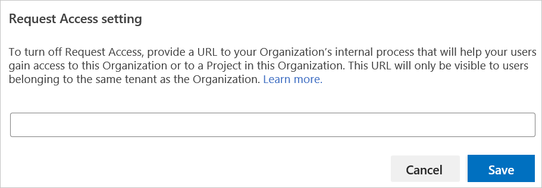

# Disable your organization's Request Access policy

[!INCLUDE [version-vsts-only](../../includes/version-vsts-only.md)]

Stop your users from requesting access to your organization or project within your organization, by disabling the Request Access policy.

When this policy is on, users can request access to a resource. A request results in an email notification to the administrators asking for review and access, as needed. 

## Prerequisites

You must be a Project Collection Administrator or organization Administrator to disable the Request Access policy.

## Disable Request Access policy

1. Sign in to your organization (```https://dev.azure.com/{yourorganization}```).

2. Choose  **Organization settings**.

   

3. In the Policies tab, find the Request Access policy and move the toggle to *off*.

   

4. Provide the URL to your internal process for gaining access. Users see this URL in the error report when they try to access the organization or a project within the organization that they don't have access to.

   

## Related articles

- [Need help?](faq-change-app-access.md#get-support)
- [Assign access levels and extensions by group membership](assign-access-levels-and-extensions-by-group-membership.md)
- [Manage Conditional Access](manage-conditional-access.md)
- [Change application access policies](change-application-access-policies.md).
