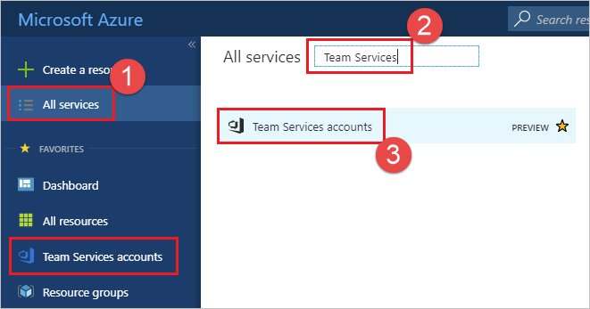

# Disconnect your VSTS organization from your directory

**VSTS**

To stop using your organization's directory and return to signing in with Microsoft accounts, 
you can disconnect your VSTS organization from your directory. 

For more information, see the [conceptual overview](access-with-azure-ad.md) for using Azure AD with VSTS.

You'll need:

*	[Microsoft accounts](https://signup.live.com/) 
for all users in your VSTS organization, 
including yourself as VSTS organization owner.

*	[VSTS organization ownership](faq-change-app-access.md#find-owner) for your Microsoft account. 

*	Global administrator permissions in your Azure AD 
for your Microsoft account as the VSTS organization owner. You'll need both 
because Azure AD users can't disconnect VSTS organizations from directories. 
You can add Microsoft accounts to a directory as external users. 
Learn about [managing Azure administrators](/azure/active-directory/users-groups-roles/directory-assign-admin-roles).

**What happens to current users?**  Users continue working seamlessly if they have Microsoft accounts 
that share the same sign-in addresses that they use now.
Otherwise, they won't have access until you add them to 
VSTS as new users. They can migrate everything except work history, 
can relink Visual Studio subscriptions, and have their access levels reassigned to their new identities.

0.	[Sign in to the Azure portal](https://portal.azure.com/) 
with your Microsoft account as the VSTS organization owner.

	[Why am I asked to choose between a work or school account and a personal account?](faq-azure-access.md#ChooseOrgAcctMSAcct)

0.	Browse to your VSTS organization by selecting **All services**, typing **Team Services** into the **Filter** box, and choosing **Team Services organizations**. If you have recently browsed to **Team Services organizations** you can select it from the recently accessed services on the left.

    

0. Select your organization.

    

0.	Choose **Disconnect**.

	

0. Choose **Yes** to confirm.

	

0.	Your VSTS organization is disconnected from your organization's directory.

	

	Only users with Microsoft accounts can sign in.
	**Before you disconnect your VSTS organization from your directory**, 
	make sure to **change the VSTS organization owner to a Microsoft account**, 
	and not to a school or work account. If you don't do this, 
	you can't sign in to your VSTS organization unless your work or school 
	account has the same email address as your Microsoft account.

	[More questions about disconnecting?](faq-azure-access.md#faq-disconnect)

