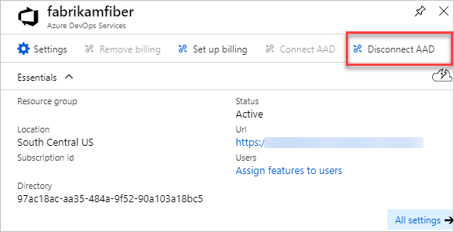
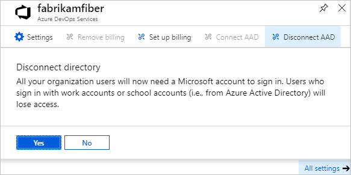
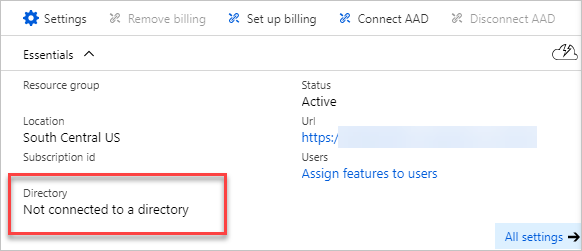

# Disconnect your Azure DevOps organization from your Azure Active Directory

[!INCLUDE [version-vsts-only](../../_shared/version-vsts-only.md)]

To stop using your organization's directory and return to signing in with Microsoft accounts, you can disconnect your organization from your directory.

For more information, see the [Conceptual overview](access-with-azure-ad.md) for using Azure Active Directory (Azure AD) with Azure DevOps.

## Prerequisites

* Before you disconnect your organization from your directory, make sure to **change the organization owner to a Microsoft account** and not to a school or work account. You can't sign in to your organization unless your work or school account has the same email address as your Microsoft account.

* [Microsoft accounts](`https://signup.live.com/`) for all users in your organization, including yourself as organization owner.

* [Organization ownership](faq-change-app-access.md#find-owner) for your Microsoft account. 

* Global administrator permissions in your Azure AD for your Microsoft account as the organization owner. You need both because Azure AD users can't disconnect organizations from directories. You can add Microsoft accounts to a directory as external users.

Learn about how to [Manage Azure administrators](https://azure.microsoft.com/documentation/articles/active-directory-assign-admin-roles/).

**What happens to current users?**  Users continue working seamlessly if they have Microsoft accounts that share the same sign-in addresses that they use now. Otherwise, users won't have access until you add them to Azure DevOps as new users. Users can migrate everything except work history. They can re-link Visual Studio subscriptions and have their access levels reassigned to their new identities.

## Disconnect organization from directory

1. [Sign in to the Azure portal](https://portal.azure.com/) with your Microsoft account as the organization owner.

   [Why am I asked to choose between a work or school account and a personal account?](faq-azure-access.md#ChooseOrgAcctMSAcct)

2. Select **All services**, and then **Azure DevOps Services organizations**.

   

3. Select your organization.

   

4. Select **Disconnect AAD**.

   

5. Select **Yes** to confirm.

   

6. Your organization is disconnected from your organization's directory.

   

   Only users with Microsoft accounts can sign in.

   For answers to questions about disconnecting, see the [FAQ](faq-azure-access.md#faq-disconnect).
