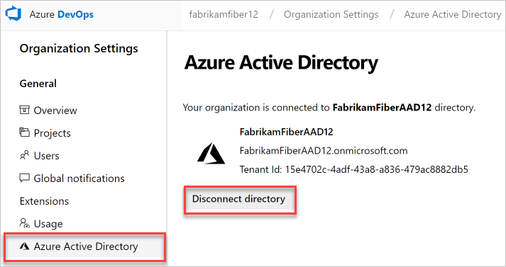
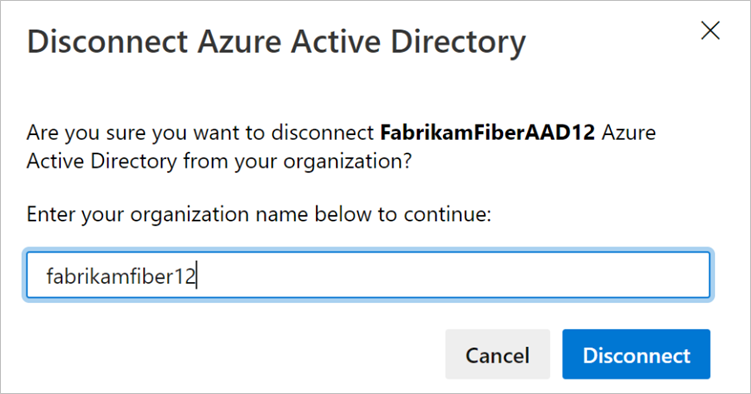
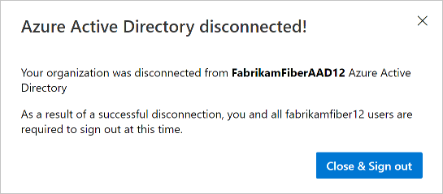

# Disconnect your organization from Azure Active Directory

[!INCLUDE [version-vsts-only](../../_shared/version-vsts-only.md)]

<a name="DisconnectDirectory"></a>

To stop using your organization's Azure Active Directory (Azure AD) and return to signing in with Microsoft accounts, disconnect your organization from your directory.

For more information, see the [Conceptual overview](access-with-azure-ad.md) for using Azure AD with Azure DevOps.

## Prerequisites

* Before you disconnect your organization from your directory, make sure to **change the organization owner to a Microsoft account** and not to a school or work account. You can't sign in to your organization unless your work or school account has the same email address as your Microsoft account.

* Add your Microsoft account to the Project Collection Administrator group in organization settings and confirm you have Global Administrator Permissions in your Azure AD for your Microsoft account. You need both because Azure AD users can't disconnect organizations from directories. You can add Microsoft accounts to a directory as external users.

Learn about how to [Manage Azure administrators](https://azure.microsoft.com/documentation/articles/active-directory-assign-admin-roles/).

**What happens to current users?**  Users can migrate everything except work history. They can reconnect Visual Studio subscriptions and have their access levels reassigned to their new identities.

> [!IMPORTANT]
> If you want to connect your organization to a different Azure Active Directory at any time, ensure that any connected organizations are disconnected from the original directory BEFORE you delete that directory. Once a new directory is established, connect your organizations to the new directory so users can regain access. Learn more about [connecting your organization to Azure AD](connect-organization-to-azure-ad.md).

## Disconnect organization from directory

1. Sign in to your organization (```https://dev.azure.com/{yourorganization}```).

2. Select  **Organization settings**.

    

3. Select **Azure Active Directory**, and then **Disconnect directory**.

   

4. Enter the name of your organization, and then select **Disconnect**.

   

5. Select **Close and Sign out**.

   

Your organization is disconnected from your organization's directory. Only users with Microsoft accounts can sign in.

For answers to frequently asked questions about disconnecting, see the [FAQ](faq-azure-access.md#faq-disconnect).

## Related articles

* [Connect your organization to Azure Active Directory](connect-organization-to-azure-ad.md)
* [Access with Azure AD](access-with-azure-ad.md)
