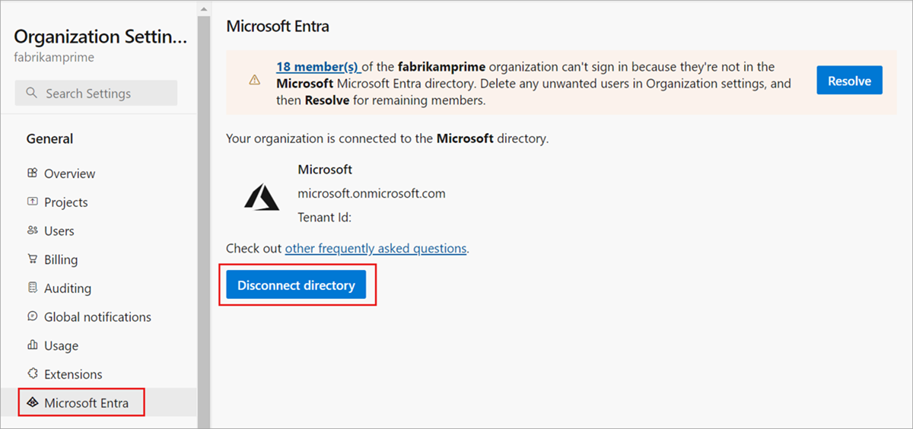
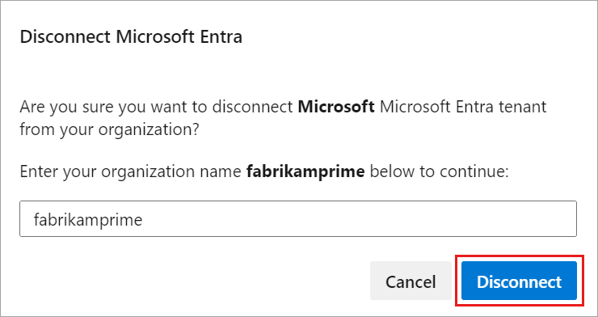
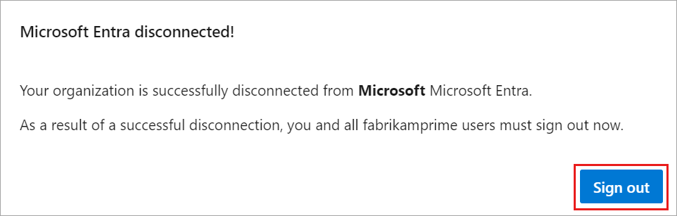

# Disconnect your organization from Microsoft Entra ID

[!INCLUDE [version-eq-azure-devops](../../includes/version-eq-azure-devops.md)]

<a name="DisconnectDirectory"></a>

To stop using your organization's Microsoft Entra ID and return to signing in with Microsoft accounts, you need to disconnect your organization from the directory. This process reverts the authentication method for your organization, allowing users to sign in using their Microsoft accounts instead of Microsoft Entra ID. You might disconnect if you no longer require the centralized management and security features provided by Microsoft Entra ID or if you need to simplify the sign-in process for your users. Follow the steps in this article to disconnect your organization from Microsoft Entra ID and switch back to using Microsoft accounts for authentication.

For more information about using Microsoft Entra ID with Azure DevOps, see the [conceptual overview](access-with-azure-ad.md).

## Prerequisites

| Category | Requirements |
|--------------|-------------|
|**Permissions**| - Member of the [Project Collection Administrators group](../security/look-up-project-collection-administrators.md). Organization owners are automatically members of this group.<br>- Change the organization owner to a Microsoft account instead of a school or work account. Ensure that your work or school account has the same email address as your Microsoft account; otherwise, you can't sign in to your organization.|
|**Access levels**| At least **Basic** access.|

**What happens to current users?**  Users can migrate everything except work history. They can reconnect Visual Studio subscriptions and have their access levels reassigned to their new identities.

> [!IMPORTANT]
> If you want to connect your organization to a different Microsoft Entra ID, first disconnect any connected organizations from the original directory before deleting it. Once the new directory is established, connect your organization to it so users can regain access. For more information, see [Connect your organization to Microsoft Entra ID](connect-organization-to-azure-ad.md) or [Change your organization connection to a different Microsoft Entra ID](change-azure-ad-connection.md).

## Disconnect organization from directory

1. Sign in to your organization (```https://dev.azure.com/{yourorganization}```).

2. Select  **Organization settings**.

    

3. Select **Microsoft Entra ID**, and then select **Disconnect directory**.

   

4. Enter the name of your organization, and then select **Disconnect**.

   

5. Select **Sign out**.

   

Your organization is disconnected from Microsoft Entra ID. Only users with Microsoft accounts can sign in.

## Related articles

* [Connect your organization to Microsoft Entra ID](connect-organization-to-azure-ad.md)
* [Learn about access with Microsoft Entra ID](access-with-azure-ad.md)
* [Get a list of organizations backed by Microsoft Entra ID](get-list-of-organizations-connected-to-microsoft-entra-id.md)
* [Restrict organization creation with tenant policy](azure-ad-tenant-policy-restrict-org-creation.md)
* [Frequently asked questions (FAQs) about connecting, disconnecting, or changing your Microsoft Entra ID](./faq-azure-access.yml)
