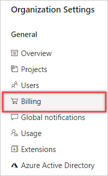
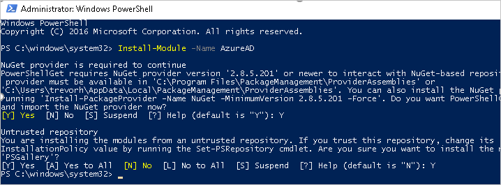

# Troubleshoot adding and deleting organization users

[!INCLUDE [version-vsts-only](../../_shared/version-vsts-only.md)]

## Permissions

### Q: Why can't I manage users?

A: To access and manage users, you must have Azure DevOps [project collection administrator or organization owner permissions](#find-owner).

<a name="find-owner"></a>

[!INCLUDE [find-project-collection-administrator](../../_shared/qa-find-project-collection-administrator.md)]

[!INCLUDE [find-organization-owner](../../_shared/qa-find-organization-owner.md)]

<a name="users-delay"></a>

[!INCLUDE [user-delay](../../_shared/qa-user-delay.md)]

## Visual Studio subscriptions

<a name="MSDNSubscriber"></a>

### Q: When do I select "Visual Studio/MSDN Subscriber"?

A: Assign this access level to users who have active, valid [Visual Studio subscriptions](#EligibleMSDNSubscriptions). Azure DevOps automatically recognizes and validates Visual Studio subscribers who have Azure DevOps as a benefit. You need the email address that's associated with the subscription.

For example, if a user selects **Visual Studio/MSDN Subscriber** but the user doesn't have a valid, active Visual Studio subscription, the user can work only [as a stakeholder](../../organizations/security/get-started-stakeholder.md).

<a name="EligibleMSDNSubscriptions"></a>

### Q: Which Visual Studio subscriptions can I use with Azure DevOps?

A:  See [Azure DevOps benefits for Visual Studio subscribers](/visualstudio/subscriptions/vs-vsts).

<a name="enterprise-professional"></a>

<a name="ValidateMSDNSubscription"></a>

#### Q: Why won't my Visual Studio subscription validate?

A: See [Why won't Azure DevOps recognize my Visual Studio subscription?](/visualstudio/subscriptions/vs-alternate-identity#faq)

<a name="why-access-changed"></a>

### Q: Why do Visual Studio subscriber access levels change after a subscriber signs in?

A: Azure DevOps recognizes Visual Studio subscribers. Azure DevOps automatically assigns a user access that's based on the user's subscription and not on the current access level that's assigned to the user.

<a name="subscription-expired"></a>

### Q: What happens if a user's subscription expires?

A: If no other access levels are available, users can [work as stakeholders](../../organizations/security/get-started-stakeholder.md). To restore access, a user must renew their subscription.

<a name="extension-transition"></a>

### Q: What happened to Visual Studio Online Professional?

A: On December 1, 2015, we replaced Visual Studio Online Professional with the [Visual Studio Professional monthly subscription](https://marketplace.visualstudio.com/items/ms.vs-professional-monthly).

Although a Visual Studio Online Professional purchase now appears on your monthly invoice as a Visual Studio Professional monthly subscription, you need to transition manually to get the new offering. The transition provides an upgrade by offering access to unlimited organizations (not just one organization) like Visual Studio Online Professional.

The rest stays the same. You get monthly access to the Visual Studio Professional IDE. Pricing remains the same at $45 per user, per month. Learn more about [Visual Studio subscriptions](https://visualstudio.microsoft.com/products/how-to-buy-vs).

If you're purchasing user access to Visual Studio Professional for a specific organization (possible only if you purchased before November 2015) and want to upgrade, do the following:

1. Before the last day of the calendar month, sign in to your organization (```https://dev.azure.com/{yourorganization}```).
2. Select  **Organization settings**.
  
   

3. Select **Billing**.

   
4. Reduce the number of paid Visual Studio Online Professional users to 0.

	This change takes effect on the first day of the next month. For the rest of the current calendar month, you aren't billed for any Visual Studio Online Professional users.

5. On the first day of the next calendar month, [go to Visual Studio Marketplace Subscriptions > Visual Studio Professional - monthly subscription](https://marketplace.visualstudio.com/items/ms.vs-professional-monthly), and buy Visual Studio Professional monthly subscriptions for the same users. Learn [how to buy Visual Studio subscriptions](/visualstudio/subscriptions/vscloud-overview).

## User access

### Q: What does "Last Access" mean in the All Users view?

The value in **Last Access** is the last date a user accessed any resources or services. Accessing Azure DevOps includes using *organizationname*.visualstudio.com directly and using resources or services indirectly. For example, you might use the [Azure Artifacts](https://https://azure.microsoft.com/services/devops/artifacts/) extension, or you might access the service by pushing code to Azure DevOps from a Git command line or IDE.

<a name="paid-basic-access-join-other-organizations"></a>

[!INCLUDE [can-paid-Basic-users-join-other-organizations](../../_shared/qa-can-paid-basic-users-join-other-organizations.md)]

<a name="feature-access"></a>

[!INCLUDE [no-access-existing-features](../../_shared/qa-no-access-existing-features.md)]

<a name="stopped-features"></a>

### Q: Why does a user lose access to some features?

A: This might happen for different reasons (although the user can continue to [work as a stakeholder](../../organizations/security/get-started-stakeholder.md)):

*	The user's Visual Studio subscription has expired. Meanwhile, the user can [work as a stakeholder](../../organizations/security/get-started-stakeholder.md), or you can give the user Basic access until the user renews their subscription. After the user signs in, Azure DevOps restores access automatically.

*	The Azure subscription used for billing is no longer active. This affects all purchases made with this subscription, including Visual Studio subscriptions. To fix this issue, visit the [Azure account portal](https://portal.azure.com).

*	The Azure subscription used for billing was unlinked from your organization. Learn more about [linking your organization](../../billing/set-up-billing-for-your-organization-vs.md).

*	Your organization has more users with Basic access than the number of users that you're paying for in Azure. Your organization includes five free users with Basic access. If you need to add more users with Basic access, you can [pay for these users](../../billing/buy-basic-access-add-users.md). 

	Otherwise, on the first day of the calendar month, users who haven't signed in to your organization for the longest time lose access first. If your organization has users who don't need access anymore, [remove them from your organization](delete-organization-users.md).

*	The user no longer has access to [features that are available only as extensions](https://visualstudio.microsoft.com/team-services/compare-features/). This might happen for different reasons:

	*	The user's access level no longer meets the extension's requirements. Most extensions require at least Basic access, not Stakeholder access. For more information, see the extension's description in the [Marketplace](https://marketplace.visualstudio.com).

	*	The extension was uninstalled. Users can reinstall the extension by visiting the extension page in the [Marketplace](https://marketplace.visualstudio.com).

	*	If the extension is a paid extension, the Azure subscription used for billing might be unlinked from your organization or might no longer be active. Learn more about [linking your organization](../../billing/set-up-billing-for-your-organization-vs.md) or visit the [Azure portal](https://account.windowsazure.com/subscriptions) to check payment details.

## Azure Active Directory and your organization

<a name="AddUserDirectory"></a>

### Q: Why do I have to add users to a directory?

A: Your organization authenticates users and controls access through Azure Active Directory (Azure AD). All users must be directory members to get access.

If you're a directory administrator, you can [add users to the directory](https://msdn.microsoft.com/library/azure/hh967632.aspx). If you're not an administrator, work with your directory administrator to add users. Learn more about [how to control access by using a directory](access-with-azure-ad.md).

<a name="ConnectedDirectory"></a>

[!INCLUDE [does-organization-use-azuread](../../_shared/qa-does-organization-use-azuread.md)]

<a name="DeleteFromDirectory"></a>

### Q: My organization controls access by using Azure Active Directory. Can I just delete users from the directory?

A: Yes, but deleting a user from the directory removes the user's access to all organizations and other assets associated with that directory. You must have Azure AD global administrator permissions to [delete a user from your Azure AD directory](delete-users-from-services-aad.md).

### Q: Why are "no identities found" when I try to add users from Azure AD to my Azure DevOps organization?

A: You're probably a *guest* in the Azure AD that backs your Azure DevOps organization, rather than a *member*. By default, Azure AD guests can't search the Azure AD in the manner required by Azure DevOps. Learn how to [convert an Azure AD guest into a member](#q-how-can-i-convert-an-azure-ad-guest-into-a-member).

### Q: How can I convert an Azure AD guest into a member?

A: Select from the following two options:

* Have the Azure AD administrator(s) remove you from the Azure AD and re-add you, making you an Azure AD *member* rather than a *guest* when they do. For more information, see [Can Azure AD B2B users be added as members instead of guests](https://docs.microsoft.com/en-us/azure/active-directory/b2b/user-properties#can-azure-ad-b2b-users-be-added-as-members-instead-of-guests).
* [Change the UserType of the Azure AD guest using Azure AD PowerShell](#convert-azure-ad-usertype-from-guest-to-member-using-azure-ad-powershell). This is an advanced process and [is not advised](https://nam06.safelinks.protection.outlook.com/?url=https%3A%2F%2Fdocs.microsoft.com%2Fen-us%2Fazure%2Factive-directory%2Fb2b%2Fuser-properties%23convert-usertype&data=02%7C01%7CChrystal.Comley%40microsoft.com%7Cf59a62633fb447b1aaaa08d6b3b86e00%7C72f988bf86f141af91ab2d7cd011db47%7C1%7C0%7C636894002034849797&sdata=flX3JmpUn8m5sqr%2Fxmc%2B9BPEGJEEUcUPcaXRwLub40s%3D&reserved=0), but it allows the user to query Azure AD from the Azure DevOps organization thereafter.

#### Convert Azure AD UserType from guest to member using Azure AD PowerShell

> [!WARNING]
> This is an advanced process and [is not advised](https://nam06.safelinks.protection.outlook.com/?url=https%3A%2F%2Fdocs.microsoft.com%2Fen-us%2Fazure%2Factive-directory%2Fb2b%2Fuser-properties%23convert-usertype&data=02%7C01%7CChrystal.Comley%40microsoft.com%7Cf59a62633fb447b1aaaa08d6b3b86e00%7C72f988bf86f141af91ab2d7cd011db47%7C1%7C0%7C636894002034849797&sdata=flX3JmpUn8m5sqr%2Fxmc%2B9BPEGJEEUcUPcaXRwLub40s%3D&reserved=0), but it allows the user to query Azure AD from the Azure DevOps organization thereafter.

**Prerequisites**

The user making the UserType change must have the following:

* A work/school account (WSA)/native user in Azure AD. You can't do this with a Microsoft Account.
* Global administrator permissions

> [!IMPORTANT]
> We recommend that you create a brand new (native) Azure AD user who is a global admin in the Azure AD, and then complete the following steps with that user. This new user should eliminate the possibility of connecting to the wrong Azure AD. You can delete the new user when you're done.

**Process**

1. Sign in to the [Azure portal](https://portal.azure.com) as global administrator for your organization's directory.
2. Go to the tenant that backs your Azure DevOps organization.
3. Check the UserType. Confirm that the user is a guest.

   

4. Open an Administrative Windows PowerShell prompt.
5. Execute `Install-Module -Name AzureAD`. The [Azure Active Directory PowerShell for Graph](https://docs.microsoft.com/en-us/powershell/azure/active-directory/install-adv2?view=azureadps-2.0) downloads from the PowerShell Gallery. You may see prompts about installing NuGet and untrusted repository, as pictured below. If you run into issues please review the system requirements and information at the [Azure Active Directory PowerShell for Graph](https://docs.microsoft.com/en-us/powershell/azure/active-directory/install-adv2?view=azureadps-2.0) page.

   

6. Once the installation completes, execute `Connect-AzureAD`. You're prompted to sign in to the Azure AD. Be sure to use an ID that meets the criteria above.
7. Execute `Get-AzureADuser -SearchString "<display_name>"`, where <display_name> is part of the entire display name for the user, as seen inside the Azure portal). The command returns four columns for the user found - ObjectId, DisplayName, UserPrincipalName, UserType - and the UserType should say *guest*.
8. Execute `Set-AzureADUser -ObjectID <string> -UserType Member`, where <string> is the value of ObjectId returned by the previous command. This should set the user to member status.
9. Execute `Get-AzureADuser -SearchString "<display_name>"` again to verify the UserType has changed. You can also verify this in the Azure Active Directory section of the Azure portal.
While not the norm, we have seen it take several hours or even days before this change is reflected inside Azure DevOps. If it doesn't fix your Azure DevOps issue immediately, give it some time and keep trying.

<a name="ChooseOrgAcctMSAcct"></a>

[!INCLUDE [choose-msa-azuread-account](../../_shared/qa-choose-msa-azuread-account.md)]

[!INCLUDE [choose-msa-azuread-account2](../../_shared/qa-choose-msa-azuread-account2.md)]

[!INCLUDE [why-cant-sign-in-msa-azuread-account](../../_shared/qa-why-cant-sign-in-msa-azuread-account.md)]

## More support

[!INCLUDE [get-team-services-support](../../_shared/qa-get-vsts-support.md)]
