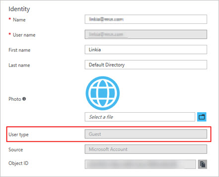

# Troubleshoot adding members to projects

[!INCLUDE [version-vsts-only](../../_shared/version-vsts-only.md)]

#### Q: Why can't I add any more members to my project?

A: Your organization is free for the first five users with Basic access. You can add unlimited Stakeholders and Visual Studio subscribers for no extra charge. After you assign all five free users with Basic access, you can continue adding Stakeholders and Visual Studio subscribers.

To add six or more users with Basic access, you need to [set up billing in Azure](../billing/set-up-billing-for-your-organization-vs.md). Then you can [pay for more users who need Basic access](../billing/buy-basic-access-add-users.md), return to your organization, [add these users, and assign them Basic access](add-organization-users.md). When billing is set up, you can pay monthly for the extra users' access. And you can cancel at any time.

If you need more Visual Studio subscriptions, learn [how to buy subscriptions](../billing/change-azure-subscription.md) from the [Visual Studio Marketplace](https://marketplace.visualstudio.com/subscriptions), Subscriptions tab.

#### Q: Why can't some users sign in?

A: This problem might happen because users must sign in with Microsoft accounts unless your organization controls access with Azure Active Directory (Azure AD). If your organization is connected to Azure AD, users must be directory members to get access. See [How do I find out if my organization uses Azure Active Directory (Azure AD)?](#ConnectedDirectory) 

If you're an Azure AD administrator, you can add users to the directory. If you're not, work with the directory administrator to add them. Learn [how to control organization access with Azure AD](access-with-azure-ad.md).

[!INCLUDE [no-access-existing-features](../../_shared/qa-no-access-existing-features.md)]

#### Q: Why did some users lose access to certain features?

A: Loss of access might happen for [different reasons](faq-add-delete-users.md#stopped-features).  

[!INCLUDE [does-organization-use-azuread](../../_shared/qa-does-organization-use-azuread.md)]

#### Q: How do I remove users from my organization?

A: Learn [how to delete users](delete-organization-users.md) across all projects in your organization. If you paid for more users but don't need their organization access anymore, you must reduce your paid users to avoid charges.

#### Q: Why can't I find members from my connected Azure AD, even though I'm the Azure AD global admin?

A: You're probably a guest in the Azure AD instance that backs Azure DevOps. By default, Azure AD guests can't search in Azure AD. That's why you aren't finding users in your connected Azure AD to add to your organization.

First, check to see if you're an Azure AD guest:

1. Go to the **Settings** section of your organization. Look at the **Azure Active Directory** section at the bottom. Make a note of the tenant that backs your organization.
2. Sign in to the new Azure portal, portal.azure.com. Check your user profile in the tenant from step 1. Check the **User type** value shown as follows: 

    

If you're an Azure AD guest, do one of the following:

* Have another Azure DevOps admin, who isn't an Azure AD guest, manage the users in Azure DevOps for you. Members of the Project Collection Administrators group inside Azure DevOps can administer users.
* Have the Azure AD admin remove you from the connected Azure AD and re-add you. The admin needs to make you an Azure AD member rather than a guest. See **Can Azure AD B2B users be added as members instead of guests?**
* Change the **User Type** of the Azure AD guest by using Azure AD PowerShell. This is an advanced topic, and we don't advise it. But it works and allows the user to query Azure AD from Azure DevOps  thereafter.

1. [Download and install Azure AD PowerShell module](/powershell/module/azuread/?view=azureadps-2.0).
2. Open PowerShell and run the following cmdlets.

    a. Connect to Azure AD:

        C:\Users\rajr> Connect-AzureAD

    b. Find the **objectId** of the user:
    
        C:\Users\rajr> Get-AzureADUser

    c. Check the **usertype** attribute for this user to see if they're a guest or member:
    
        C:\Users\rajr> Get-AzureADUser -objectId cd7d47bf-1c6e-4839-b765-13edcd164e66

    d. Change the **usertype** from **member** to **guest**:

        C:\Users\rajr> Set-AzureADUser -objectId cd7d47bf-1c6e-4839-b765-13edcd164e66 -UserType Member

[!INCLUDE [user-delay](../../_shared/qa-user-delay.md)]

[!INCLUDE [choose-msa-azuread-account](../../_shared/qa-choose-msa-azuread-account.md)]

[!INCLUDE [choose-msa-azuread-account2](../../_shared/qa-choose-msa-azuread-account2.md)]

[!INCLUDE [why-cant-sign-in-msa-azuread-account](../../_shared/qa-why-cant-sign-in-msa-azuread-account.md)]

[!INCLUDE [find-project-collection-administrator](../../_shared/qa-find-project-collection-administrator.md)]

[!INCLUDE [find-organization-owner](../../_shared/qa-find-organization-owner.md)]

[!INCLUDE [get-team-services-support](../../_shared/qa-get-vsts-support.md)]
