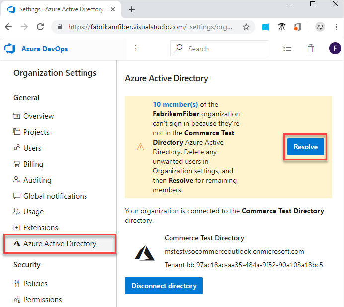
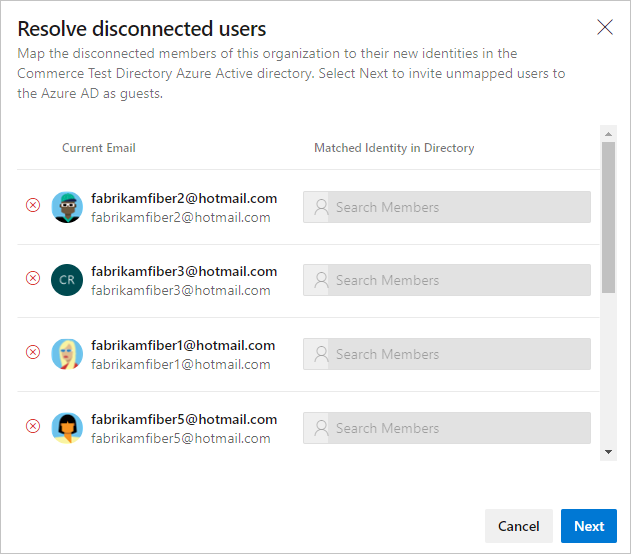
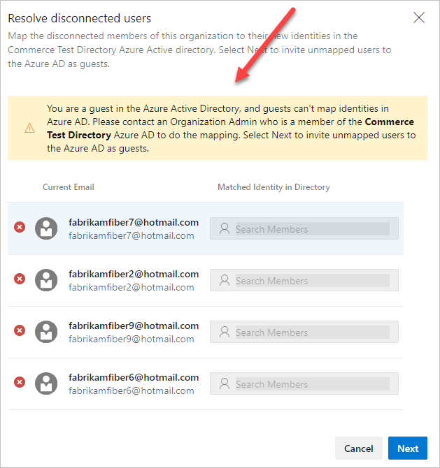
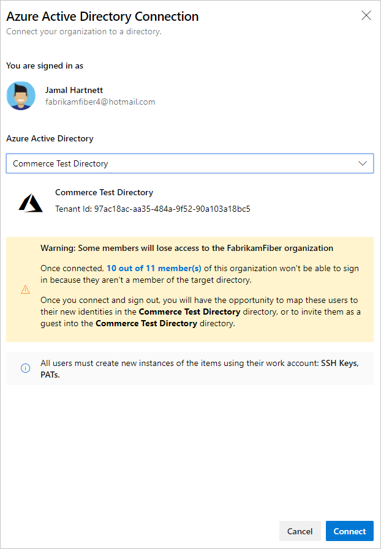
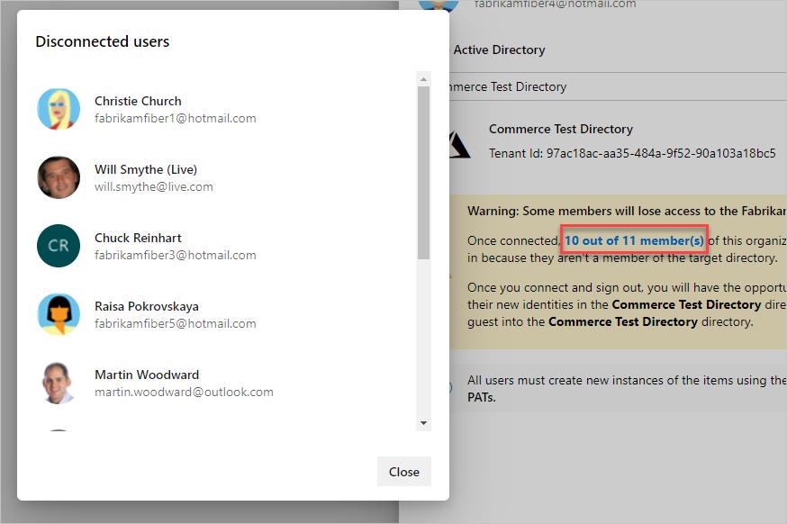

# Troubleshoot permissions and access with Azure Active Directory

[!INCLUDE [version-vsts-only](../../_shared/version-vsts-only.md)]

## General

### Q: I made changes to Azure Active Directory (Azure AD), but they didn't seem to take effect

Changes made in Azure AD can take up to 24 hours to be visible in Azure DevOps.

### Q: Can I use Office 365 and Azure AD with Azure DevOps?

Yes.

- Don't have an organization yet? [Create an organization in Azure DevOps](https://aka.ms/SignupAzureDevOps).
- Already have an organization? [Connect your organization to Azure AD](connect-organization-to-azure-ad.md).

[!INCLUDE [choose-msa-azuread-account](../../_shared/qa-choose-msa-azuread-account.md)]

[!INCLUDE [choose-msa-azuread-account2](../../_shared/qa-choose-msa-azuread-account2.md)]

### Q: My organization uses Microsoft accounts only. Can I switch to Azure AD?

A. Yes, but before you switch, make sure that Azure AD meets your needs for sharing work items, code, resources, and other assets with your team and partners.

Learn more about the differences in how you
[control access with Microsoft accounts or with Azure AD, and how to switch when you're ready](access-with-azure-ad.md).

[!INCLUDE [find-organization-owner](../../_shared/qa-find-organization-owner.md)]

[!INCLUDE [why-no-owned-organizations](../../_shared/qa-why-no-owned-organizations.md)]

[!INCLUDE [why-cant-sign-in-msa-azuread-account](../../_shared/qa-why-cant-sign-in-msa-azuread-account.md)]

## Understand Azure AD groups

### Q: Why can't I assign Azure DevOps permissions directly to an Azure AD group?

Because these groups are created and managed in Azure, you can't assign Azure DevOps permissions directly or secure version control paths to these groups. You'll get an error if you try to assign permissions directly.

You can add an Azure AD group to the Azure DevOps group that has the permissions you want. Or,
you can assign these permissions to the group instead. Azure AD group members inherit permissions from the group where you add them.

### Q: Can I manage Azure AD groups in Azure DevOps?

No, because these groups are created and managed in Azure. Azure DevOps doesn't store or sync member status for Azure AD groups. To manage Azure AD groups, use the [Azure portal](https://portal.azure.com), Microsoft Identity Manager (MIM),
or the group management tools that your organization supports.

### Q: How do I tell the difference between an Azure DevOps group and an Azure AD group?

On the group's identity card, check the group's source.

### Q: Why doesn't Users show all Azure AD group members?

These users have to sign in to your organization before they appear in Users.

### Q: How do I assign organization access to Azure AD group members?

When these group members sign in to your organization for the first time, Azure DevOps assigns an access level to them automatically. If they have
[Visual Studio subscriptions](faq-add-delete-users.md#EligibleMSDNSubscriptions),
Azure DevOps assigns the respective access level to them. Otherwise, Azure DevOps assigns them the next "best available"
[access level](https://visualstudio.microsoft.com/pricing/visual-studio-online-feature-matrix-vs), in this order: Basic, Stakeholder.
 
If you don't have enough access levels for all Azure AD group members, those members who sign in get a Stakeholder access.

### Q: Why doesn't the Security tab show all members when I select an Azure AD group?

The Security tab shows Azure AD group members only after they sign in to your organization, and have an access level assigned to them.

To see all Azure AD group members, use the [Azure portal](https://portal.azure.com), MIM, or the group management tools that your organization supports.

### Q: Why doesn't the team members widget show all Azure AD group members?

The team members widget shows only users who previously signed in to your organization.

### Q: Why doesn't the team capacity pane show all Azure AD group members?

The team capacity pane shows only users who previously signed in to your organization.
To set capacity, manually add users to your team.

### Q: Why doesn't the team room show offline users?

The team room shows Azure AD group members, but only when they're online.

### Q: Why doesn't Azure DevOps reclaim access levels from users who aren't Azure AD group members anymore?

Azure DevOps doesn't automatically reclaim access levels from these users. To manually remove their access, go to **Users**.

### Q: Can I assign work items to Azure AD group members who haven't signed in?

You can assign work items to any Azure AD member who has permissions for your organization. This also adds that member to your organization. When you add users this way, they'll automatically appear in Users, with the best available
access level. They'll also appear in the security settings.

### Q: Can I use Azure AD groups to query work items by using the "In Group" clause?

No, querying on Azure AD groups is unsupported.

### Q: Can I use Azure AD groups to set up field rules in my work item templates?

No, but you might be interested in our [process customization plans](https://blogs.msdn.com/b/visualstudioalm/archive/2015/07/27/visual-studio-online-process-customization-update.aspx).

[!INCLUDE [why-cant-sign-in-msa-azuread-account](../../_shared/qa-why-cant-sign-in-msa-azuread-account.md)]

## Add users to directory

[Add organization users to your Azure Active Directory](add-users-to-azure-ad.md).

### Q: Can I switch current users from Microsoft accounts to work accounts in Azure DevOps?

No. Although you can add new work accounts to your organization, they're treated as new users. If you want to access all your work, including its history, you must use the same sign-in addresses that you used before your organization was connected to your Azure AD.
You can do this by adding your Microsoft account as a member to your Azure AD.

### Q: Why can't I add users from other directories to my Azure AD?

You must be a member or have read access in those directories. Otherwise, you can add them
[using B2B collaboration through your Azure AD administrator](https://azure.microsoft.com/documentation/articles/active-directory-b2b-collaboration-overview/). You can also add them by using their Microsoft accounts, or by creating new work accounts for them in your directory.

### Q: How do I use my work or school account with my Visual Studio with MSDN subscription?

If you used a Microsoft account to activate a [Visual Studio with MSDN subscription](https://visualstudio.microsoft.com/vs/pricing/) that includes Azure DevOps as a benefit, you can add a work or school account. The account must be managed by Azure AD. Learn [how to link work or school accounts to Visual Studio with MSDN subscriptions](../../billing/link-msdn-subscription-to-organizational-account-vs.md).

### Q: Can I control access to my organization for external users in the connected directory?

Yes, but only for external users who are [added as guests through Office 365](https://support.office.com/article/Share-sites-or-documents-with-people-outside-your-organization-80E49744-E30F-44DB-8D51-16661B1D4232)
or [added using B2B collaboration by your Azure AD administrator](https://azure.microsoft.com/documentation/articles/active-directory-b2b-collaboration-overview/). These external users are managed outside the connected directory. To learn more, contact your Azure AD administrator. The following setting doesn't affect [users who are added directly to your organization's directory](https://azure.microsoft.com/documentation/articles/active-directory-create-users/).

Before you start, make sure you have at least Basic access, not Stakeholder.

**Complete the following steps to control organization access for external users added through Office 365 or Azure AD B2B collaboration.**

1. Go to **Organization settings**.

   

2. Select **Policy** and choose to allow or deny organization access for external users added as guests.

   

## Remove users or groups

### Q: How do I remove an Azure AD group from Azure DevOps?

Go to your project collection or project. In the bar at the top, select the gear icon, and then select **Security**.

Find the Azure AD group, and delete it from your organization.

### Q: Why am I asked to remove a user from an Azure AD group when I delete that user from my organization?

Users can belong to your organization, both as individuals and as members of Azure AD groups that were added to Azure DevOps groups. These users can still access your organization while they're members of these Azure AD groups.

To block all access for these users, remove them from Azure AD groups in your organization, or remove these groups from your organization. Although we'd like to make it possible to block access completely or make exceptions for such users, Azure DevOps doesn't currently have this capability.

### Q: If an Azure AD user is removed, will all their related PATs be revoked as well?

When users are disabled or removed from your directory, they can no longer access your organization by any mechanism including via PATs, SSH, or any other alternate credentials.

## Connect, disconnect, or change Azure AD

- [Connect your organization to Azure AD](connect-organization-to-aad.md)
- [Disconnect your organization from your directory](disconnect-organization-from-aad.md)
- [Change the directory that's connected to Azure DevOps](change-azure-ad-connection.md)

### Q: Can I connect my organization to an Azure AD created from Office 365?

Yes. If you can't find your Azure AD created from Office 365, see
[Why don't I see the directory that I want to connect?](#why-not-my-directory).

### Q: Why don't I see the directory that I want to connect to? What should I do?

This might happen due to any of the following circumstances:

* You don't have [organization Owner permissions](faq-change-app-access.md#find-owner) to manage directory connections.

* Talk to your Azure AD organization administrator and ask them to make you a member of the organization. It's possible that you're not  part of the organization.

### Q: Why is my organization already connected to a directory? Can I change that directory?

Your organization was connected to a directory when the organization owner created the organization, or sometime after that. When you create an organization with a work or school account, your organization is automatically connected to the directory that manages that work or school account. You can [disconnect your organization](disconnect-organization-from-aad.md) from this directory, and [reconnect to another directory](connect-organization-to-azure-ad.md). You might have to migrate some users.

### Q: My alternate credentials don't work anymore. What do I do?

This happens after you connect your organization to a directory. 
[Set up your credentials](http://support.microsoft.com/kb/2991274) again for the organization that you connected.

### Q: Some users are disconnected, but they have matching identities in Azure AD. What should I do?

* In your Azure DevOps **Organization settings**, select **Azure Active Directory**, and then select **Resolve**. 

   

* Match the identities. Select **Next** when you're done.

   

### Q: I got an error message when I was resolving disconnections. What should I do?

* Try again.
* You might be a guest in Azure AD. Request that an organization administrator, who is a member of Azure AD,  do the mapping. Or, request that an admin of the Azure AD convert you to a member.

   

* If the error message includes a user in your domain, but you don't see them active in your directory, the user likely left your company. Go to the organization user settings to remove the user from your organization.

### Q: When I was trying to invite a new user to my Azure AD, I got a 403 forbidden exception. What do I do?

You may be a guest in Azure AD and don’t have the right permission to invite users. Go to **External collaboration settings** in Azure AD and move the "Guests can invite" toggle to **Yes**. Refresh Azure AD and try again.

### Q: Will my users keep their existing Visual Studio subscriptions?

Visual Studio subscription administrators ordinarily assign subscriptions to users' corporate email addresses, so that users can receive welcome email and notifications. If the identity and subscription email addresses match, users can access the benefits of the subscription. As you transition from Microsoft to Azure AD identities, users' benefits still work with their new Azure AD identity. But, the email addresses must match. If the email addresses don't match, your subscription administrator must [reassign the subscription](../billing/csp/buy-vs-app-center.md). Otherwise, users must [add an alternate identity to their Visual Studio subscription](/visualstudio/subscriptions/vs-alternate-identity).

### Q: What if I'm required to sign in when I use the people picker?

Clear your browser cache and delete any cookies for the session. Close your browser, and then reopen.

### Q: What if my email account isn't found in Azure AD?

* In your Azure DevOps **Organization settings**, select **Azure Active Directory**, and then select **Resolve**. 

   

* Match the identities. Select **Next** when you're done.

   

### Q: What if my work items are indicating that the users aren't valid?

Clear your browser cache and delete any cookies for the session. Close your browser, and then reopen.

### Q: What if I get a warning about members who will lose access to the organization?

You can still connect to Azure AD, but try to resolve the mapping issue after you've connected. If you still need help, [contact support](https://azure.microsoft.com/support/devops/).

Select the bolded text to see which users are affected.

### Q: What if I have over 100 users and want to connect to Azure AD?

If you have more than 100 users, [contact support](https://azure.microsoft.com/support/devops/).

### Q: I have more than 100 members in my Azure DevOps organization, how can I connect to an Azure AD?

Currently, the in-app feature doesn't support connections for organizations with over 100 members. Please [contact support](https://azure.microsoft.com/support/devops/).

[!INCLUDE [get-team-services-support](../../_shared/qa-get-vsts-support.md)]
