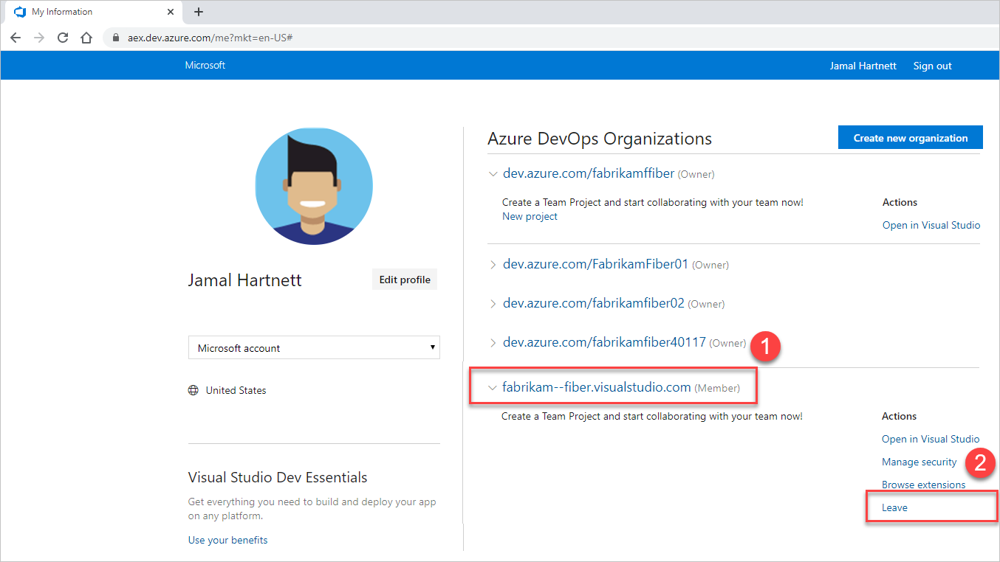
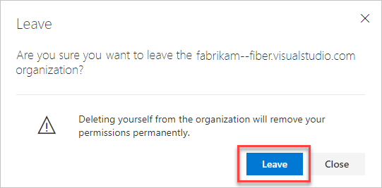
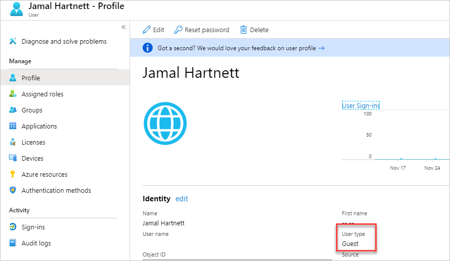

# User and permissions management FAQs

[!INCLUDE [temp](../../includes/version-all.md)]

In this article, learn the answers to the following frequently asked questions (FAQs) about user and permissions management in Azure DevOps. FAQs are grouped by the following subjects:
- [General permissions](#general-permissions)
- [Visual Studio subscriptions](#visual-studio-subscriptions)
- [User access](#user-access)
- [Change app access policies](#change-app-access-policies)
- [Leave your organization](#leave-organization)
- [Group-based licensing](#group-based-licensing)
- [Add members to projects](#add-members-to-projects)

<a name="general-permissions"></a>

## General permissions

### Q: What happens if I forget my password?

A: You can [recover your Microsoft account password](https://account.live.com/ResetPassword.aspx) or [recover your work or school account password](https://passwordreset.microsoftonline.com) if your organization turned on this feature. Otherwise, contact your Azure Active Directory administrator to recover your work or school account.

### Q: Why can't I manage users?

A: You must be a Project Collection Administrator or [organization Owner](../security/lookup-organization-owner-admin.md) to manage users at the organization level. To get added, see [Set permissions at the project- or collection-level](/azure/devops/organizations/security/set-project-collection-level-permissions)

<a name="find-owner"></a>

### Q: How do I find the organization Owner?

If you have at least Basic access, you can find the current owner in your organization settings.

1. Go to your **Organization settings**.

   

2. Find the current owner.

   

### Q: How do I find a Project Collection Administrator?

A: If you have at least Basic access, you can find your [Project Collection Administrator](/azure/devops/organizations/security/set-project-collection-level-permissions) in your organization's security settings.

::: moniker range=">= azure-devops-2019"

For more information, see [Show members of the Project Collection Administrators group](/azure/devops/organizations/security/lookup-organization-owner-admin#show-members-of-the-project-collection-administrators-group).

::: moniker-end

::: moniker range="<= tfs-2018"  

For more information, see [Show members of the Project Administrators group](/azure/devops/organizations/security/lookup-organization-owner-admin#show-members-of-the-project-administrators-group).

::: moniker-end

<a name="visual-studio-subscriptions"></a>

## Visual Studio subscriptions

<a name="MSDNSubscriber"></a>

### Q: When do I select "Visual Studio/MSDN Subscriber"?

A: Assign this access level to users who have active, valid [Visual Studio subscriptions](#EligibleMSDNSubscriptions). Azure DevOps automatically recognizes and validates Visual Studio subscribers who have Azure DevOps as a benefit. You need the email address that's associated with the subscription.

If the user doesn't have a valid, active Visual Studio subscription, they can work only [as a Stakeholder](../../organizations/security/get-started-stakeholder.md).

<a name="EligibleMSDNSubscriptions"></a>

### Q: Which Visual Studio subscriptions can I use with Azure DevOps?

A:  See [Azure DevOps benefits for Visual Studio subscribers](/visualstudio/subscriptions/vs-vsts).

<a name="enterprise-professional"></a>

<a name="ValidateMSDNSubscription"></a>

### Q: Why won't my Visual Studio subscription validate?

A: See [Why won't Azure DevOps recognize my Visual Studio subscription?](/visualstudio/subscriptions/vs-alternate-identity#faq)

<a name="why-access-changed"></a>

### Q: Why do Visual Studio subscriber access levels change after a subscriber signs in?

A: Azure DevOps recognizes Visual Studio subscribers. Users automatically have access, based on their subscription, not on the current access level assigned to the user.

<a name="subscription-expired"></a>

### Q: What happens if a user's subscription expires?

A: If no other access levels are available, users can [work as Stakeholders](../../organizations/security/get-started-stakeholder.md). To restore access, a user must renew their subscription.

<a name="user-access"></a>

## User access

### Q: What does "Last Access" mean in the All Users view?

The value in **Last Access** is the last date a user accessed any resources or services. Accessing Azure DevOps includes using *organizationname*.visualstudio.com directly and using resources or services indirectly. For example, you might use the [Azure Artifacts](https://azure.microsoft.com/services/devops/artifacts/) extension, or you can push code to Azure DevOps from a Git command line or IDE.

<a name="paid-basic-access-join-other-organizations"></a>

### Q: Can a user who has paid for Basic access join other organizations?

A: No, a user can join only the organization for which the user has paid for Basic access. But a user can join any organization where free users with Basic access are still available. The user can also join as a user with Stakeholder access for free.

<a name="feature-access"></a>

### Q: Why can't users access some features?

A: Make sure that users have the correct [access level](https://visualstudio.microsoft.com/team-services/compare-features/) assigned to them.  

* Learn [how to manage users and access levels for Azure DevOps](/azure/devops/organizations/accounts/add-organization-users).

* Learn [how to change access levels for Team Foundation Server](/azure/devops/organizations/security/change-access-levels).

Some features are available only as [extensions](https://visualstudio.microsoft.com/team-services/compare-features/). You need to install these extensions. Most extensions require you to have at least Basic access, not Stakeholder access. Check the extension's description in the [Visual Studio Marketplace](https://marketplace.visualstudio.com/azuredevops), Azure DevOps tab.

For example, to search your code, you can install the free [Code Search extension](https://marketplace.visualstudio.com/items?itemName=ms.vss-code-search), but you need at least Basic access to use the extension.

To help your team improve app quality, you can install the free [Test & Feedback extension](https://marketplace.visualstudio.com/items?itemName=ms.vss-exploratorytesting-web), but you get different capabilities based on your access level and whether you work offline or connected to Azure DevOps Services or Team Foundation Server (TFS).

Some [Visual Studio subscribers](https://marketplace.visualstudio.com/items?itemName=ms.vss-testmanager-web) can use this feature for free, but Basic users need to upgrade to Basic + Test Plans access before they can create test plans.

* Learn [how to get extensions for Azure DevOps](/azure/devops/marketplace/install-extension).
* Learn [how to get extensions for TFS](/azure/devops/marketplace/get-tfs-extensions).
* Learn [how to buy access to TFS Test](/azure/devops/organizations/billing/buy-access-tfs-test-hub).

<a name="stopped-features"></a>

### Q: Why does a user lose access to some features?

A: A user can lose access for the following reasons (although the user can continue to [work as a Stakeholder](../../organizations/security/get-started-stakeholder.md)):

*   The user's Visual Studio subscription has expired. Meanwhile, the user can [work as a Stakeholder](../../organizations/security/get-started-stakeholder.md), or you can give the user Basic access until the user renews their subscription. After the user signs in, Azure DevOps restores access automatically.

*   The Azure subscription used for billing is no longer active. All purchases made with this subscription are affected, including Visual Studio subscriptions. To fix this issue, visit the [Azure account portal](https://portal.azure.com).

*   The Azure subscription used for billing was removed from your organization. Learn more about [linking your organization](../../billing/set-up-billing-for-your-organization-vs.md).

*   Your organization has more users with Basic access than the number of users that you're paying for in Azure. Your organization includes five free users with Basic access. If you need to add more users with Basic access, you can [pay for these users](../../billing/buy-basic-access-add-users.md). 

   Otherwise, on the first day of the calendar month, users who haven't signed in to your organization for the longest time lose access first. If your organization has users who don't need access anymore, [remove them from your organization](delete-organization-users.md).

<a name="change-app-access-policies"></a>

## Change app access policies for your organization

<a name="Oauth"></a>

### Q: How do personal access tokens differ from alternate authentication credentials?

A:  Personal access tokens are a more convenient and secure replacement for alternate authentication credentials. You can limit a token's use to a specific lifetime, to an organization, and to [scopes](../../integrate/index.md) of activities that the token authorizes. Learn more about [personal access tokens](use-personal-access-tokens-to-authenticate.md).

### Q: If I deny access to one authentication method in one organization, does that affect all the organizations that I own?

A:  No, you can still use that method in all the other organizations that you own. [Personal access tokens](use-personal-access-tokens-to-authenticate.md) apply to specific organizations or to all organizations, based on your selection when you created the token.

### Q:  If I deny access to an authentication method, then allow access again, will the apps that need access continue to work?

A:  Yes, those apps continue to work.

<a name="leave-organization"></a>

## Leave your organization

### Q: How do I remove myself from an organization when the owner isn't available to remove me?

A: To remove yourself from an organization, do the following steps:

1. Go to [aex.dev.azure.com](https://aex.dev.azure.com).
2. Select the organization, and then choose **Leave**.

    

3. Confirm that you want to **Leave** the organization.

    

<a name="group-based-licensing"></a>

## Group-based licensing

### Q: Will my users lose their access level and project membership if I remove a group rule?

A: Users in the group **TestGroup** lose access to group resources if the users haven't been explicitly assigned to the resources or assigned via a different group rule.

> [!div class="mx-imgBorder"]
> 

### Q: Will my Azure DevOps or Azure AD group be deleted if I remove its group rule?

A: No. Your groups won't be deleted.

### Q: What does the option "Remove <group> from all project level groups" do?

A: This option removes the Azure DevOps or Azure AD group from any project-level default groups, such as **Project Readers** or **Project Contributors**.

### Q: What determines the final access level if a user is in more than one group?

A: Group rule types are ranked in the following order: Subscriber > Basic + Test Plans > Basic > Stakeholder.
Users always get the best access level between all the group rules, including VS subscription.

See the following examples, showing how the subscriber detection factors into group rules.

**Example 1**: group rule gives me more access

If I have a VS Pro subscription and I'm in a group rule that gives me Basic + Test Plans – what happens?

Expected: I get Basic + Test Plans because what the group rule gives me is greater than my subscription.

**Example 2**: group rule gives me the same access

I have a Visual Studio Test Pro subscription and I'm in a group rule that gives me Basic + Test Plans – what happens?

Expected: I get detected as a Visual Studio Test Pro subscriber, because the access is the same as the group rule, and I'm already paying for the Visual Studio Test Pro, so I wouldn't want to pay again.

<a name="add-members-to-projects"></a>

## Add members to projects

<a name="cant-add-users"></a>

### Q: Why can't I add any more members to my project?

A: Your organization is free for the first five users with Basic access. You can add unlimited Stakeholders and Visual Studio subscribers for no extra charge. After you assign all five free users with Basic access, you can continue adding Stakeholders and Visual Studio subscribers.

To add six or more users with Basic access, you need to [set up billing in Azure](../billing/set-up-billing-for-your-organization-vs.md). Then, you can [pay for more users who need Basic access](../billing/buy-basic-access-add-users.md), return to your organization, [add these users, and assign them Basic access](add-organization-users.md). When billing is set up, you pay monthly for the extra users' access. And can cancel at any time.

If you need more Visual Studio subscriptions, learn [how to buy subscriptions](../billing/change-azure-subscription.md).

<a name="WhyCantSignIn"></a>

### Q: Why can't some users sign in?

A: This problem might happen because users must sign in with Microsoft accounts unless your organization controls access with Azure Active Directory (Azure AD). If your organization is connected to Azure AD, users must be directory members to get access.

If you're an Azure AD Administrator, you can add users to the directory. If you're not an Azure AD Administrator, work with the directory administrator to add them. Learn [about controlling organization access with Azure AD](access-with-azure-ad.md).

### Q: Why did some users lose access to certain features?

A: Loss of access might happen for [different reasons](faq-user-and-permissions-management.md#stopped-features).  

<a name="RemovePeople"></a>

### Q: How do I remove users from my organization?

A: Learn [how to delete users](delete-organization-users.md) across all projects in your organization. If you paid for more users but don't need their organization access anymore, you must reduce your paid users to avoid charges.

### Q: Why can't I find members from my connected Azure AD, even though I'm the Azure AD global admin?

A: You're probably a guest in the Azure AD instance that backs Azure DevOps. By default, Azure AD guests can't search in Azure AD. That's why you aren't finding users in your connected Azure AD to add to your organization.

First, check to see if you're an Azure AD guest:

1. Go to the **Settings** section of your organization. Look at the **Azure Active Directory** section at the bottom. Make a note of the tenant that backs your organization.
2. Sign in to the new Azure portal, portal.azure.com. Check your user profile in the tenant from step 1. Check the **User type** value shown as follows: 

    

If you're an Azure AD guest, do one of the following steps:

* Have another Azure DevOps admin, who isn't an Azure AD guest, manage the users in Azure DevOps for you. Members of the Project Collection Administrators group inside Azure DevOps can administer users.
* Have the Azure AD admin remove you from the connected Azure AD and readd you. The admin needs to make you an Azure AD member rather than a guest. See [Can Azure AD B2B users be added as members instead of guests?](https://docs.microsoft.com/azure/active-directory/b2b/user-properties#can-azure-ad-b2b-users-be-added-as-members-instead-of-guests)
* Change the **User Type** of the Azure AD guest by using Azure AD PowerShell. We don't advise using the following process, but it works and allows the user to query Azure AD from Azure DevOps  thereafter.

1. [Download and install Azure AD PowerShell module](/powershell/module/azuread/?view=azureadps-2.0).
    ```
    PS Install-Module -Name AzureAD
    ```
2. Open PowerShell and run the following cmdlets.

    a. Connect to Azure AD:

    ```
    PS Connect-AzureAD
    ```

    b. Find the **objectId** of the user:

    ```
    PS Get-AzureADuser -SearchString "YourUPN"
    ```

    c. Check the **usertype** attribute for this user to see if they're a guest or member:

    ```
    PS Get-AzureADUser -objectId This is the result of the previous command
    ```

    d. Change the **usertype** from **member** to **guest**:

    ```
    PS Set-AzureADUser -objectId c<replacethe object ID for the result of the command to search> -UserType Member
    ```

<a name="users-delay"></a>

### Q: Why don't users appear or disappear promptly in Azure DevOps after I add or delete them in the Users hub?

A: If you experience delays finding new users or having deleted users promptly removed from Azure DevOps (for example, in drop-down lists and groups) after you add or delete users, [file a problem report on Developer Community](https://go.microsoft.com/fwlink/?LinkId=820594) so we can investigate.

<a name="ChooseOrgAcctMSAcct"></a>

[!INCLUDE [choose-msa-azuread-account](../../includes/qa-choose-msa-azuread-account.md)]

[!INCLUDE [choose-msa-azuread-account2](../../includes/qa-choose-msa-azuread-account2.md)]

[!INCLUDE [why-cant-sign-in-msa-azuread-account](../../includes/qa-why-cant-sign-in-msa-azuread-account.md)]

<a name="get-support"></a>

[!INCLUDE [get-team-services-support](../../includes/qa-get-vsts-support.md)]

## Related articles

- [Access with Azure AD FAQs](faq-azure-access.md)
- [Configure and customize organization FAQs](faq-configure-customize-organization.md)
- [Set up Visual Studio FAQs](faq-set-up-vs.md)
