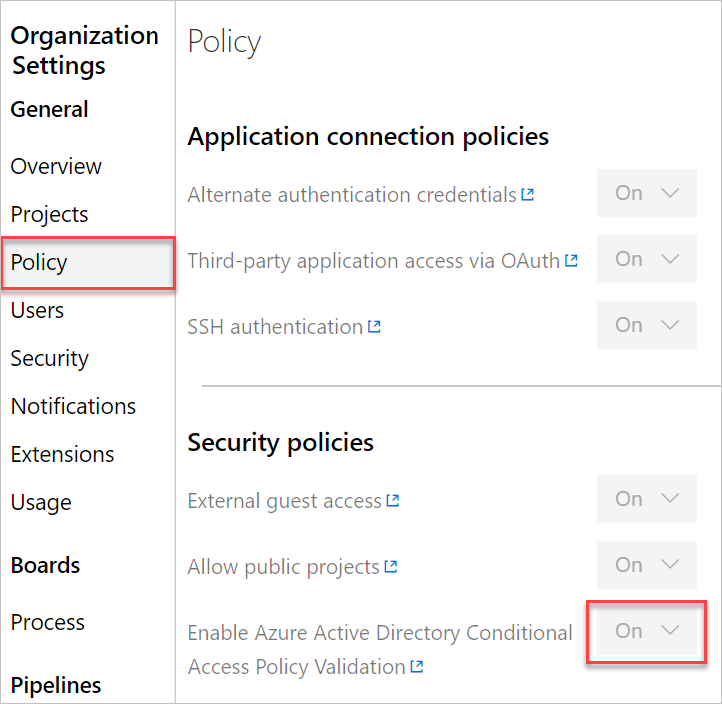

# Manage Conditional Access to Azure DevOps

[!INCLUDE [version-vsts-only](../../_shared/version-vsts-only.md)]

Conditional Access offers simple ways to help secure resources for organizations in Azure DevOps that are backed by an Azure Active Directory (Azure AD) tenant. Conditional Access policies (CAPs) like multi-factor authentication help protect against the risk of compromised credentials and help keep your organization's data safe. In addition to requiring credentials, you can have a policy that only devices that are connected to a corporate network can gain access. More generally, there are a few requirements and actions that you can implement for devices in a device management system. This system is security software that's used by IT departments to manage devices running various operating systems from various locations and networks.

You can require conditions, such as security group membership, location and network identity, a specific OS, an enabled device in a management system, and so on.

Depending on which conditions the user satisfies, you can require multi-factor authentication, require further checks, or block access.

Azure DevOps enforces the policy for usage of personal access tokens (PATs), alternate authentication, OAuth, and SSH keys. See the following details of how and what we enforce.

   * For Web flows, CAP is honored 100%
   * For third party client flow, like using a PAT with git.exe, we only support IP fencing policies - more specifically we don't support MFA policies. See the following examples:
        * Policy 1 - Block all access from outside of IP range X, Y, and Z
            * If a user is accessing Azure DevOps via the web, the user is allowed from IP X,Y,Z or blocked if outside that list
            * If a user is accessing Azure DevOps via alt-auth, the user is allowed from IP X,Y,Z or blocked if outside that list
        * Policy 2 - Require MFA when outside of IP range X, Y, and Z
            * If a user is accessing Azure DevOps via the web, the user is allowed from IP X,Y,Z or prompted for MFA if outside that list
            * If a user is accessing Azure DevOps via alt-auth, the user is allowed from IP X,Y,Z blocked if outside that list

> [!NOTE]
> Some third-party extensions may require additional configuration changes.

For more information, see the REST API reference article, section [API & TFS version mapping](https://docs.microsoft.com/en-us/rest/api/azure/devops/?view=azure-devops-server-rest-5.0).

## Enable Conditional Access for Azure DevOps

To enforce Conditional Access policy on your organization, you must enable the policy in Azure DevOps, as it is set to *off* by default. This setting only applies to alternate credentials, and doesn't apply if CAPs are set in Azure AD, regardless of the settings in Azure DevOps.

1. Sign in to your organization (```https://dev.azure.com/{yourorganization}```).

	[Why am I asked to choose between my work or school account and my personal account?](faq-create-organization.md#ChooseOrgAcctMSAcct)

2. Select  **Organization settings**.

   

3. Select **Policy** and from the **dropdown** next to Enable Azure Active Directory Conditional Access Policy Validation select **On**.

   

## Related articles

* [What is Conditional Access in Azure Active Directory?](/azure/active-directory/active-directory-conditional-access).
* [Detailed instructions and requirements for Conditional Access](/azure/active-directory/active-directory-conditional-access-azuread-connected-apps).


