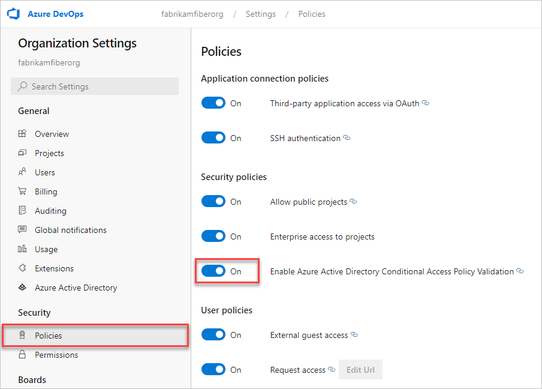

# Manage Conditional Access to Azure DevOps

[!INCLUDE [version-vsts-only](../../includes/version-vsts-only.md)]

[!INCLUDE [alt-creds-deprecation-notice](../../includes/alt-creds-deprecation-notice.md)]

Secure resources for organizations in Azure DevOps that are backed by an Azure Active Directory (Azure AD) tenant, with Conditional Access. Conditional Access policies (CAPs), like multi-factor authentication, help protect against the risk of compromised credentials and keep your organization data safe. There's also a policy where only devices connected to a corporate network can gain access. Implement requirements and actions for devices in a device management system. A device management system is security software that's used by IT departments to manage devices running various operating systems (OSs), from various locations and networks.

You can require the following conditions, for example:
- Security group membership
- Location and network identity
- Specific OS
- Enabled device in a management system

Depending on which conditions the user satisfies, you can require multi-factor authentication, further checks, or block access.

Azure DevOps enforces the policy for usage of personal access tokens (PATs), alternate authentication, OAuth, and SSH keys. See the following details of how and what we enforce.

   * For Web flows, CAP is honored 100%
   * For third-party client flow, like using a PAT with git.exe, we only support IP fencing policies - we don't support MFA policies. See the following examples:
        * Policy 1 - Block all access from outside of IP range X, Y, and Z.
            * If accessing Azure DevOps via the web, the user is allowed from IP X,Y, and Z. If outside of that list, the user is blocked.
            * If accessing Azure DevOps via alt-auth, the user is allowed from IP X,Y, and Z. If outside of that list, the user is blocked.
        * Policy 2 - Require MFA when outside of IP range X, Y, and Z.
            * If accessing Azure DevOps via the web, the user is allowed from IP X,Y,and Z. The user is prompted for MFA if outside of that list.
            * If accessing Azure DevOps via alt-auth, the user is allowed from IP X,Y, and Z. If outside of that list, the user is blocked.

> [!NOTE]
> Some third-party extensions may require additional configuration changes.

For more information, see the REST API reference article, section [API & TFS version mapping](https://docs.microsoft.com/rest/api/azure/devops/?view=azure-devops-server-rest-5.0).

## Enable Conditional Access for Azure DevOps

To enforce Conditional Access on your organization, enable the policy in Azure DevOps. This policy is set to *off* by default and only applies to alternate credentials. This policy doesn't apply for CAPs set in Azure AD, no matter the settings in Azure DevOps.

> [!NOTE]   
> To enable the new user interface for the New user hub, see [Enable preview features](../../project/navigation/preview-features.md).

#### [Preview page](#tab/preview-page) 

1. Sign in to your organization (```https://dev.azure.com/{yourorganization}```).

2. Select  **Organization settings**.

   

3. Select **Policies** and from the **dropdown** next to "Enable Azure Active Directory Conditional Access Policy Validation" select **On**.

   

#### [Current page](#tab/current-page)


1. Sign in to your organization (```https://dev.azure.com/{yourorganization}```).

	[Why am I asked to choose between my work or school account and my personal account?](faq-create-organization.md#ChooseOrgAcctMSAcct)

2. Select  **Organization settings**.

   

3. Select **Policy** and from the **dropdown** next to Enable Azure Active Directory Conditional Access Policy Validation select **On**.

   

* * *

## Related articles

* [What is Conditional Access in Azure Active Directory?](/azure/active-directory/active-directory-conditional-access).
* [Detailed instructions and requirements for Conditional Access](/azure/active-directory/active-directory-conditional-access-azuread-connected-apps).


