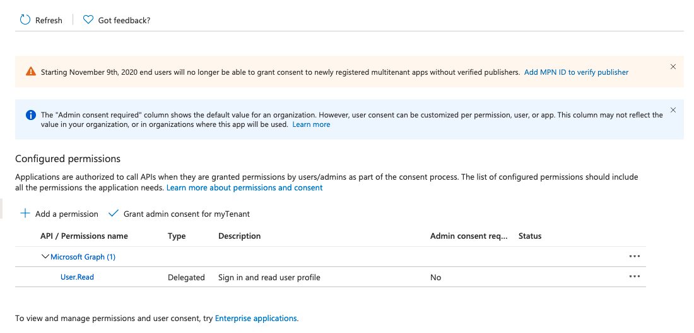
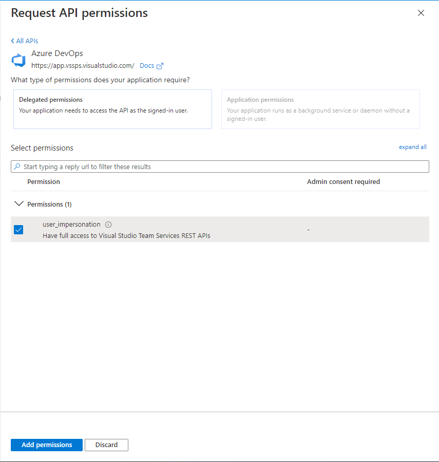
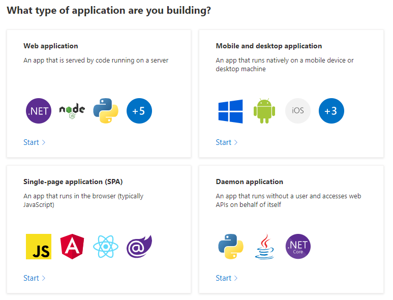
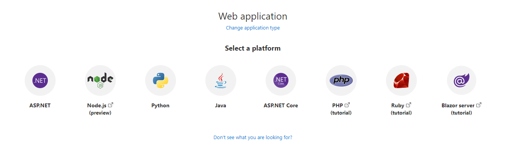
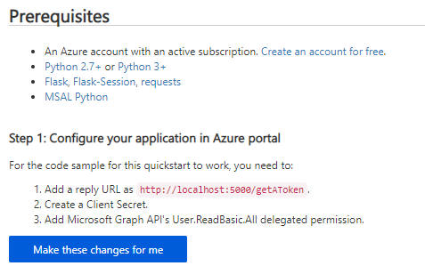
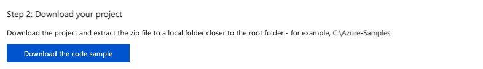
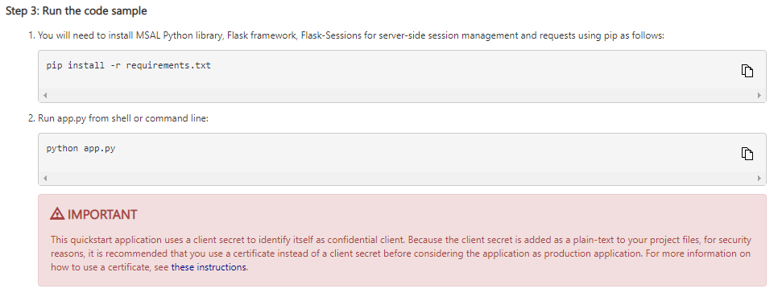

# Manage personal access tokens via API
![INCLUDE version-vsts-only]

## Introduction: PAT Lifecycle Management API
When dealing with a large collection of [personal access tokens](use-personal-access-tokens-to-authenticate.md) (PATs), it may become cumbersome to manage the maintenance of these tokens via the UI alone. 

With the personal access token management API, it is far easier for users to manage the PATs associated with their organizations via automated processes. This rich set of APIs enable our users with the ability to better manage the PATs they own, offering them functionality, such as creating new personal access tokens with a desired scope and duration, renew existing personal access tokens, or expire existing personal access tokens.

To see the full list of available endpoints, [view the API reference here](link TODO).


## API Authentication
To use this API, users must provide an [Azure Active Directory (AAD) access token](https://docs.microsoft.com/azure/active-directory/develop/access-tokens) instead of a PAT token.

Users can acquire an access token using any authentication method outside of “on-behalf-of application” flows, such as client credential flow.  Valid authentication methods include [device code](https://docs.microsoft.com/azure/active-directory/develop/msal-authentication-flows#device-code), [on-behalf-of user](https://docs.microsoft.com/azure/active-directory/develop/msal-authentication-flows#on-behalf-of), [username/password](https://docs.microsoft.com/azure/active-directory/develop/msal-authentication-flows#usernamepassword), and the [authorization code flow](https://docs.microsoft.com/azure/active-directory/develop/msal-authentication-flows#authorization-code).  If multi-factor authentication is enabled in the user's AAD tenant, they must use the authorization code flow, which can be accomplished with the Microsoft Authentication Library (MSAL).  A complete list of MSAL authentication flows can be found under [Microsoft Authentication Library "Authentication flows" documentation](https://docs.microsoft.com/azure/active-directory/develop/msal-authentication-flows#client-credentials).

    [!IMPORTANT]
    To use the MSAL library to automatically acquire and refresh access tokens, users must:
    1. [Have an AAD tenant with an active Azure subscription](https://docs.microsoft.com/azure/active-directory/develop/quickstart-create-new-tenant) 
    2. [Register an application in their AAD tenant](https://docs.microsoft.com/azure/active-directory/develop/quickstart-register-app) 
    3. [Add Azure DevOps permissions to the application](https://docs.microsoft.com/azure/active-directory/develop/quickstart-configure-app-access-web-apis) 


### Getting Started with a Quickstart Application
Users can automatically generate a sample application with the necessary MSAL code, as well as a client secret required at login, using the "Quickstart" option on the registered application's page in Azure Portal.  The test application follows the authorization code flow.
Note that the test application will demonstrate the authorization code flow with a Microsoft Graph API endpoint; users will need to update the application's configuration to point to the endpoint for this API.

To use application Quickstart, follow the documentation under "Quickstarts" for your application type on the [Azure Active Directory Develop documentation homepage](https://docs.microsoft.com/azure/active-directory/develop/).


#### Example: Getting Started with a Python Flask Quickstart Application
1. Once you've registered your application in an AAD tenant with an active Azure subscription, in the Azure Portal, navigate to your registered application under “Azure Active Directory” -> “App Registrations”
   
   

2. Select your application and navigate to “API Permissions” 
   
   

3. Select “Add a permission” and select “Azure DevOps” -> check “user_impersonation” -> select “Add permissions” 
   
   

4. Select “Quickstart” from the left navigation panel
   
5. Select your application type: for Python Flask, select “Web application” 

    

6. Select your application platform 
   
    

7. Make sure you've met the necessary prerequisites, then allow Azure Portal to make the necessary changes to configure your application.  The “reply URL” will be the redirect URL that was set at application creation + “/getAToken” 
   
    

8. Download the Quickstart application and extract the files

    

9.  Install the application requirements and run the application to ensure you have all necessary dependencies.  Note that the application is initially configured to hit an endpoint in the Microsoft Graph API; users can change this to the PAT Lifecycle API by following the additional configuration instructions below. 
    
    


### Configuring a Quickstart Application
Once the user has downloaded and installed the Quickstart application, most of the configuration for it will already be completed using a test API endpoint from Microsoft Graph.  In order to use a PAT Lifecycle Management API endpoint instead of the Graph API endpoint, users should modify the configuration file generated with their application.

This example from a Quickstart Python Flask web application (in the file 'app_config.py') shows how the ENDPOINT configuration variable can be changed to point to the desired API endpoint.  In order to use the PAT Lifecycle Management API, users must also update the SCOPE configuration variable to **"499b84ac-1321-427f-aa17-267ca6975798/.default"** referring to the Azure DevOps resource and all of its scopes.

Finally, users should follow instructions to secure their client secret, which is initially inserted in plain-text into the application configuration file.  Users should remove the plain-text variable from the configuration file and use an environment variable or Azure KeyVault to secure their application's secret.  Alternatively, users can choose to use a certificate instead of a client secret; this is the recommended option if the application will eventually be used in production.  The instructions for using a certificate can be found in the final step of the Quickstart application set up.

    [!CAUTION] Never leave a plain-text client secret in production application code.


#### Example: Configuring a Python Flask Quickstart Application for the PAT Lifecycle Management API
1. Once you've downloaded your Quickstart application, installed its dependencies, and tested that it runs in your environment, open the 'app_config.py' file in your editor of choice.  The file should resemble the following code snippet; for clarity, comments referencing the default Microsoft Graph API configuration have been removed: 

    ```
    import os

    CLIENT_ID = "YOUR_CLIENT_ID_HERE" 
    # Application (client) ID of app registration

    CLIENT_SECRET = "YOUR_CLIENT_SECRET_HERE" 
    # Placeholder - for use ONLY during testing.
    # In a production app, we recommend you use a more secure method of storing your secret,
    # like Azure Key Vault. Or, use an environment variable as described in Flask's documentation:
    # https://flask.palletsprojects.com/en/1.1.x/config/#configuring-from-environment-variables
    # CLIENT_SECRET = os.getenv("CLIENT_SECRET")
    # if not CLIENT_SECRET:
    #     raise ValueError("Need to define CLIENT_SECRET environment variable")

    AUTHORITY = "https://login.microsoftonline.com/YOUR_AAD_TENANT_ID_HERE"  # For multi-tenant app
    # AUTHORITY = "https://login.microsoftonline.com/Enter_the_Tenant_Name_Here"

    REDIRECT_PATH = "/getAToken"  
    # Used for forming an absolute URL to your redirect URI.
    # The absolute URL must match the redirect URI you set
    # in the app's registration in the Azure portal.

    ENDPOINT = 'https://graph.microsoft.com/v1.0/users'  

    SCOPE = ["User.ReadBasic.All"]

    SESSION_TYPE = "filesystem"  
    # Specifies the token cache should be stored in server-side session
    ```

2. Configure the client secret as desired (either by using an environment variable, Azure KeyVault, or by switching to a certificate)
   
3. Change the ENDPOINT variable to the desired Azure DevOps collection URL and API endpoint, e.g. for a collection named "testCollection":  

    ```
    # Fill in the url to the user's ADO collection + the PAT
    # Lifecycle API endpoint here

    ENDPOINT = 'https://dev.azure.com/testCollection/_apis/Tokens/Pats?api-version=6.1-preview'
    ```

4. Change the SCOPE variable to reference the Azure DevOps API resource; the character string is the resource ID for the Azure DevOps API, and the “.default” scope refers to all scopes for that resource ID. 

    ```
    SCOPE = ["499b84ac-1321-427f-aa17-267ca6975798/.default"]
    ```

5. Verify that the final 'app_config.py' file matches the following, with your CLIENT_ID, tenant ID, and desired collection URL.  You should also ensure that the CLIENT_SECRET has been moved to an environment variable, Azure KeyVault, or swapped with a certificate for your registered application:

    ```
    import os

    CLIENT_ID = "YOUR_CLIENT_ID_HERE" 
    # Application (client) ID of app registration

    # Note that the CLIENT_SECRET has been removed and moved to an environment variable or Azure KeyVault

    AUTHORITY = "https://login.microsoftonline.com/YOUR_AAD_TENANT_ID_HERE"  # For multi-tenant app
    # AUTHORITY = "https://login.microsoftonline.com/Enter_the_Tenant_Name_Here"

    REDIRECT_PATH = "/getAToken"  
    # Used for forming an absolute URL to your redirect URI.
    # The absolute URL must match the redirect URI you set
    # in the app's registration in the Azure portal.

    ENDPOINT = 'https://dev.azure.com/testCollection/_apis/Tokens/Pats?api-version=6.1-preview' 
    # Used to onfigure user's collection URL and the desired API endpoint

    SCOPE = ["499b84ac-1321-427f-aa17-267ca6975798/.default"]
    # Means "All scopes for the Azure DevOps API resource"

    SESSION_TYPE = "filesystem"  
    # Specifies the token cache should be stored in server-side session
    ```

        ![TIP]
        If your application is configured for a specific tenant (rather than the multi-tenant configuration), use the alternate value for the AUTHORITY variable, adding the specific tenant name in "Enter_the_Tenant_Name_Here".

6. Rerun the application to test that you can GET all PAT tokens for the requesting user.  Once you've verified this, feel free to modify the contents of 'app.py' and the 'ms-identity-python-webapp-master\templates' directory to support sending requests to the rest of the PAT Lifecycle API endpoints.  For an example of a Python Flask Quickstart application that has been modified to support requests to all PAT Lifecycle API endpoints, see this sample repo on GitHub: TODO


### Refreshing an Access Token
Once the application is configured and pointing to the correct API endpoint, and the user has acquired an access token, the token can be used for authentication for up to an hour.  The MSAL code provided in the Quickstart will automatically refresh the token once it expires, preventing the user from needing to log in again and acquire a new authorization code.  However, users may need to log in again after 90 days once their refresh token expires.


### Sample Application
Users can view a sample Python Flask web application configured from a Quickstart application for the PAT Lifecycle Management API on GitHub here: TODO link to public sample repo

[!div class="nextstepaction"]
[Learn about the PAT Lifecycle Management API Endpoints](TODO: link to REST API docs)