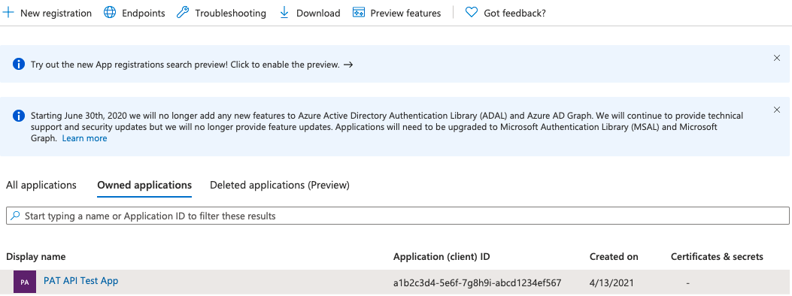

# Manage personal access tokens (PATs) using REST API

[!INCLUDE [version-eq-azure-devops](../../includes/version-eq-azure-devops.md)]

When you're dealing with a large set of [personal access tokens (PATs)](use-personal-access-tokens.md) you own, it might become complex to manage the maintenance of these tokens using the UI alone.

With the PAT Lifecycle Management API, you can easily manage the PATs associated with your organizations using automated processes. This [rich set of APIs](/rest/api/azure/devops/tokens) lets you manage your PATs, allowing you to create new PATs and renew or expire existing PATs.

In this article, we show you how to configure an application that [authenticates with a Microsoft Entra token](../../integrate/get-started/authentication/entra-oauth.md) and makes calls with the PAT Lifecycle API.

## Prerequisites

* [Have a Microsoft Entra tenant with an active Azure subscription.](/azure/active-directory/develop/quickstart-create-new-tenant)
* * **Permissions:** Depending on your tenant's security policies, your application might need permissions to access resources in the organization. Request a tenant administrator to grant permission to the app to use it within your tenant.

> [!IMPORTANT]
> You can't use service principals or managed identities to create or revoke PATs.

<a name='authenticate-with-azure-active-directory-azure-ad-tokens'></a>

## Authenticate with Microsoft Entra tokens

Unlike other Azure DevOps Services APIs, users must provide an [Microsoft Entra access token](../../integrate/get-started/authentication/entra-oauth.md) to use this API. Given this API’s ability to create and revoke PATs, we want to ensure that such powerful functionality is available only to [safer Microsoft Entra tokens](../../integrate/get-started/authentication/entra.md). 

### Prerequisites
To acquire and refresh Microsoft Entra access tokens, you must do the following:

* [Have a Microsoft Entra tenant with an active Azure subscription](/azure/active-directory/develop/quickstart-create-new-tenant)
* [Register an application in their Microsoft Entra tenant](/azure/active-directory/develop/quickstart-register-app)
* [Add Azure DevOps permissions to the application](/azure/active-directory/develop/quickstart-configure-app-access-web-apis)

> [!IMPORTANT]
> "On-behalf-of application" solutions (such as the “client credential” flow) and any authentication flow that does not issue a Microsoft Entra access token is not valid for use with this API.  If multi-factor authentication is enabled in your Microsoft Entra tenant, you must definitely use the ["authorization code” flow](/azure/active-directory/develop/v2-oauth2-auth-code-flow).

Once you have an application with a working authentication flow for handling Microsoft Entra tokens, you can use these tokens to make calls to the PAT Lifecycle Management API.

To call the API directly, provide a Microsoft Entra access token as a `Bearer` token in `Authorization` header of your request.
For more information and a full list of the available requests, see the [PAT API reference.](/rest/api/azure/devops/tokens)

In the following section, we show how to create an app that authenticates a user with a Microsoft Entra access token. The app uses the [Microsoft Authentication Library (MSAL)](https://learn.microsoft.com/en-us/entra/identity-platform/msal-overview) and calls our PAT Lifecycle Management API.

### Clone our Python Flask web app

We provided you with a [sample Python Flask web application for this API that you can download on GitHub](https://github.com/microsoft/azure-devops-auth-samples/tree/master/PersonalAccessTokenAPIAppSample) and configure to use with your Microsoft Entra tenant and Azure DevOps organization. The sample application uses the [MSAL authorization code flow](/entra/identity-platform/msal-authentication-flows#authorization-code) to acquire a Microsoft Entra access token.  

> [!IMPORTANT]
> We recommend getting started with the sample Python Flask web application on GitHub, but if you prefer to use a different language or application type, use the [Quickstart option](#generate-a-quickstart-azure-portal-application) to recreate an equivalent test application.

Once you clone the sample app, follow the instructions in the repo’s README. The README explains how to register an application in your Microsoft Entra tenant, configure the sample to use your Microsoft Entra tenant, and run your cloned app.

### Generate a Quickstart Azure portal application

Instead, you can generate a sample app with the generated MSAL code using the **Quickstart** option on the application's page in [Azure portal](https://portal.azure.com/). The Quickstart test application follows the authorization code flow, but does so with a Microsoft Graph API endpoint. Users need to update the application's configuration to point to the endpoint for the PAT Lifecycle Management API.

To follow this approach, follow the **Quickstarts** instructions for the application type of your choice on the [Microsoft Entra ID Develop docs homepage](/azure/active-directory/develop/). We walk through the following example with a [Python Flask Quickstart app](#example-get-started-with-a-python-flask-quickstart-application).

1. Once you register your application in a Microsoft Entra tenant with an active Azure subscription, navigate to your registered application under **Microsoft Entra ID** -> **App Registrations** in the [Azure portal](https://portal.azure.com/).
   
   

2. Select your application and navigate to **API Permissions**.

   

3. Select **Add a permission** and select **Azure DevOps** -> select the appropriate scopes you need. In this case, the PAT Lifecycle Management APIs only support **user_impersonation**, but other APIs may request different more [granular scopes](../../integrate/get-started/authentication/oauth?view=azure-devops#scopes) that you can find on [each API's individual reference page](/rest/api/azure/devops/). Once all the scopes are selected, click **Add permissions**.

   

4. Select **Quickstart**.

5. Select your application type: for Python Flask, select **Web application**.

6. Select your application platform. For this tutorial, select **Python**.

7. Make sure you meet the necessary prerequisites, then allow Azure portal to make the necessary changes to configure your application. The **reply URL** is the redirect URL that was set at application creation + “/getAToken”.
   
    

8. Download the Quickstart application and extract the files.

    

9.  Install the application requirements and run the application to ensure you have all necessary dependencies. The application is initially configured to hit an endpoint in the Microsoft Graph API. Learn how to change this endpoint to the PAT Lifecycle Management API base endpoint by following the configuration instructions in the following section. 
    
    

#### Configure a Quickstart application
Once the user downloads and installs the Quickstart application, it gets configured to use a test API endpoint from Microsoft Graph. Modify the generated configuration file to have it call the PAT Lifecycle Management API instead.

> [!TIP]
> We use collection and organization interchangeably in these docs. If a configuration variable needs a collection name, please replace it with your organization name.

Do the following tasks:

1. Update the **ENDPOINT** configuration variable to `https://vssps.dev.azure.com/{YOUR_COLLECTION_NAME_HERE}/_apis/Tokens/Pats?api-version=6.1-preview` for the PAT Lifecycle Management APIs
2. Update the **SCOPE** configuration variable to **"499b84ac-1321-427f-aa17-267ca6975798/.default"** to refer to the Azure DevOps resource and all of its scopes.

The following example shows you how we did this configuration for the Quickstart Python Flask application we generated through the Azure portal in the previous section.

Make sure you follow instructions to secure your client secret, which is initially inserted in plain-text into the application configuration file. As a best practice, remove the plain-text variable from the configuration file and use an environment variable or Azure KeyVault to secure their application's secret. 

Instead, you can choose to use a certificate instead of a client secret. Using certificates is the recommended option if the application gets used in production. The instructions for using a certificate can be found in the final step of the Quickstart application setup.

> [!CAUTION] 
> Never leave a plain-text client secret in production application code.

1. Once you download your Quickstart application, install its dependencies, and test that it runs in your environment, open the `app_config.py` file in your editor of choice. The file should resemble the following code snippet; for clarity, comments referencing the default Microsoft Graph API configuration were removed: 

    ```python
    import os

    CLIENT_ID = "YOUR_CLIENT_ID_HERE" 
    # Application (client) ID of app registration

    CLIENT_SECRET = "YOUR_CLIENT_SECRET_HERE" 
    # Placeholder - for use ONLY during testing.
    # In a production app, we recommend you use a more secure method of storing your secret,
    # like Azure Key Vault. Or, use an environment variable as described in Flask's documentation:
    # https://flask.palletsprojects.com/en/1.1.x/config/#configuring-from-environment-variables
    # CLIENT_SECRET = os.getenv("CLIENT_SECRET")
    # if not CLIENT_SECRET:
    #     raise ValueError("Need to define CLIENT_SECRET environment variable")

    AUTHORITY = "https://login.microsoftonline.com/YOUR_AAD_TENANT_ID_HERE"  # For multi-tenant app
    # AUTHORITY = "https://login.microsoftonline.com/Enter_the_Tenant_Name_Here"

    REDIRECT_PATH = "/getAToken"  
    # Used for forming an absolute URL to your redirect URI.
    # The absolute URL must match the redirect URI you set
    # in the app's registration in the Azure portal.

    ENDPOINT = 'https://graph.microsoft.com/v1.0/users'  

    SCOPE = ["User.ReadBasic.All"]

    SESSION_TYPE = "filesystem"  
    # Specifies the token cache should be stored in server-side session
    ```

2. Update the client ID or client secret to your application with your app registration’s client ID and client secret. When in production, make sure to secure the client secret by using an environment variable, Azure KeyVault, or by switching to a certificate.

    ```python
    CLIENT_ID = "YOUR_CLIENT_ID_HERE" 
    # Application (client) ID of app registration

    CLIENT_SECRET = "YOUR_CLIENT_SECRET_HERE" 
    # Placeholder - for use ONLY during testing.
    # In a production app, we recommend you use a more secure method of storing your secret.
    ```

3. Change the `ENDPOINT` variable to your Azure DevOps collection URL and API endpoint. For example, for a collection named "testCollection," the value would be:  

    ```python
    # Fill in the url to the user's ADO collection + the PAT lifecycle management API endpoint here

    ENDPOINT = 'https://vssps.dev.azure.com/{YOUR_COLLECTION_NAME_HERE}/_apis/Tokens/Pats?api-version=6.1-preview'
    ```

    For a collection named "testCollection," this endpoint would be:
    ```python
    ENDPOINT = 'https://vssps.dev.azure.com/testCollection/_apis/Tokens/Pats?api-version=6.1-preview'
    ```

4. Change the `SCOPE` variable to reference the Azure DevOps API resource; the character string is the resource ID for the Azure DevOps API, and the `.default` scope refers to all scopes for that resource ID. 

    ```python
    SCOPE = ["499b84ac-1321-427f-aa17-267ca6975798/.default"]
    ```

5. If your application is configured for a specific tenant (rather than the multitenant configuration), use the alternate value for the `AUTHORITY` variable, adding the specific tenant name in "Enter_the_Tenant_Name_Here."

    ```python
    # For single-tenant app:
    AUTHORITY = "https://login.microsoftonline.com/YOUR_AAD_TENANT_ID_HERE"

    # For multi-tenant app:
    AUTHORITY = "https://login.microsoftonline.com/Enter_the_Tenant_Name_Here"
    ```

6. Verify that the final `app_config.py` file matches the following, with your CLIENT_ID, tenant ID, and collection URL. For security reasons, ensure that the CLIENT_SECRET was moved to an environment variable, Azure KeyVault, or swapped with a certificate for your registered application:

    ```python
    import os

    CLIENT_ID = "YOUR_CLIENT_ID_HERE" 
    # Application (client) ID of app registration

    # Note that the CLIENT_SECRET has been removed and moved to an environment variable or Azure KeyVault

    AUTHORITY = "https://login.microsoftonline.com/YOUR_AAD_TENANT_ID_HERE"  # For multi-tenant app
    # AUTHORITY = "https://login.microsoftonline.com/Enter_the_Tenant_Name_Here"

    REDIRECT_PATH = "/getAToken"  
    # Used for forming an absolute URL to your redirect URI.
    # The absolute URL must match the redirect URI you set in the app's registration in the Azure portal.

    ENDPOINT = 'https://vssps.dev.azure.com/testCollection/_apis/Tokens/Pats?api-version=6.1-preview' 
    # Used to configure user's collection URL and the desired API endpoint

    SCOPE = ["499b84ac-1321-427f-aa17-267ca6975798/.default"]
    # Means "All scopes for the Azure DevOps API resource"

    SESSION_TYPE = "filesystem"  
    # Specifies the token cache should be stored in server-side session
    ```

7. Rerun the application to test that you can GET all PAT tokens for the requesting user. Once verified, you can modify the contents of `'app.py'` and the `'ms-identity-python-webapp-master\templates'` directory to support sending requests to the rest of the PAT lifecycle management API endpoints. For an example of a Python Flask Quickstart application that was modified to support requests to all PAT lifecycle management API endpoints, [see this sample repo on GitHub](https://github.com/microsoft/azure-devops-auth-samples/tree/master/PersonalAccessTokenAPIAppSample).

<a name='automatically-refresh-an-azure-ad-access-token'></a>

## Automatically refresh a Microsoft Entra access token

Once the application is configured correctly and the user acquired an access token, the token can be used for up to an hour. The MSAL code provided in both previous examples automatically refreshes the token once it expires. Refreshing the token prevents the user from needing to sign in again and acquire a new authorization code. However, users might need to sign in again after 90 days once their refresh token expires.

## Explore PAT Lifecycle Management APIs

In the previous GitHub sample application and Quickstart applications, the application is preconfigured to make requests with the Microsoft Entra tokens you acquired. 
For more information, see the [API Reference docs](/rest/api/azure/devops/tokens/pats).

##  Frequently asked questions (FAQs)

<a name='q-why-do-i-need-to-authenticate-with-an-azure-ad-token-why-is-a-pat-not-enough'></a>

### Q: Why do I need to authenticate with a Microsoft Entra token? Why is a PAT not enough?
**A:** With this PAT Lifecycle Management API, we opened the ability to create new PATs and revoke existing PATs. In the wrong hands, malicious actors could use this API to create multiple entry points into your organization’s Azure DevOps resources. By enforcing Microsoft Entra authentication, we hope to have this powerful API be more secure against this unauthorized usage. 

<a name='q-do-i-need-to-have-an-azure-ad-tenant-with-an-active-azure-subscription-to-use-this-api'></a>

### Q: Do I need to have a Microsoft Entra tenant with an active Azure subscription to use this API?
**A:**  Unfortunately, this API is only available to users that are part of a Microsoft Entra tenant with an active Azure subscription.

### Q: Can I get an example of this sample application for another language/framework/application type?
**A:** We love that you want to use the API in your language of choice! If you have a request for an example, head over to our [Dev Community](https://developercommunity.visualstudio.com/search?space=21) to see if someone else has an example to share. If you have a sample application that you’d like to share to the larger Azure DevOps audience, [let us know](mailto:ado-identity@github.com) and we can look into circulating it on these docs more widely!

### Q: What is the difference between this token API and the token admin API?
**A:** This [token API](/rest/api/azure/devops/tokens/pats) and the [token admin API](/rest/api/azure/devops/tokenadmin/), while similar, serve different use cases and audiences: 
* This token API is largely for users who want to manage the PATs that they own in an automated pipeline. This API allows. It gives you the ability to create new tokens and update existing ones.
* The token admin API is meant for organization admins. Admins can use this API to retrieve and revoke OAuth authorizations, including personal access tokens (PATs) and self-describing session tokens, of users in their organizations. 

### Q: How can I regenerate/rotate PATs through the API? I saw that option in the UI, but I don’t see a similar method in the API.
**A:** Great question! The 'Regenerate' functionality available in the UI actually accomplishes a few actions, which are fully replicable through the API. 

To rotate your PAT, do the following steps:
1. Understand the metadata of the PAT using a **GET** call, 
2. Create a new PAT with the old PAT’s metadata using a **POST** call, 
3. Revoke the old PAT using a **DELETE** call

### Q: I see a "Need admin approval" pop-up when I try to proceed with using this app. How can I use this app without admin approval?
**A:** It seems that your tenant has security policies, which require your application to be granted permissions to access resources in the organization. At this moment, the only way to proceed with using this app in this tenant is to ask an admin to grant permission to the app before you can use it.

### Q: Why am I seeing an error like "Service principals aren't allowed to perform this action" when I try to call the PAT Lifecycle Management API using a Service Principal or Managed Identity?
**A:** Service Principals and Managed Identities aren't permitted. Given this API’s ability to create and revoke PATs, we want to ensure that such powerful functionality is given to allowed users only. 

## Next steps

> [!div class="nextstepaction"]
> [Learn about the PAT lifecycle management API endpoints](/rest/api/azure/devops/tokens/pats)
