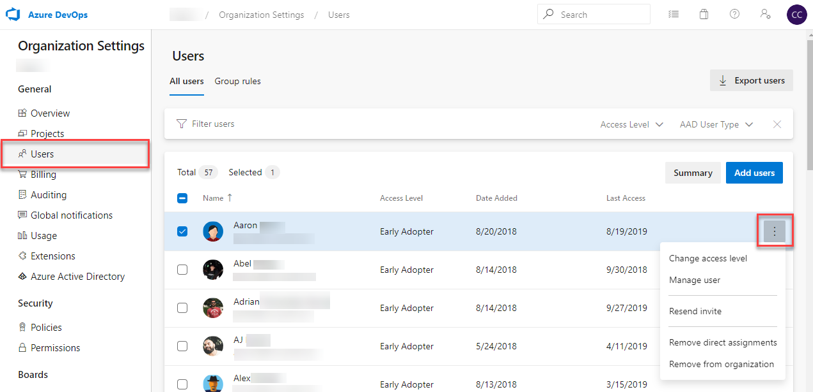

# Manage users and their access in Azure DevOps

[!INCLUDE [version-vsts-only](../../_shared/version-vsts-only.md)]

Learn how to add users to your organization and specify the level of features they can use, such as Basic or Stakeholder.

The following types of users can join your organization for free:

* Five users who get [Basic features](https://azure.microsoft.com/services/devops/compare-features/), such as version control and tools for Agile, Java, and build and release management.
* Unlimited users who get [Stakeholder features](https://visualstudio.microsoft.com/team-services/compare-features/), such as working with your backlog, work items, and queries.
* Unlimited [Visual Studio subscribers](https://visualstudio.microsoft.com/team-services/compare-features/) who also get Basic features. In some cases, these users get additional features with specific extensions, such as [Test Manager](https://marketplace.visualstudio.com/items?itemName=ms.vss-testmanager-web).

Need [more users with Basic features or Visual Studio subscriptions](../billing/buy-basic-access-add-users.md)?

> [!NOTE]
> You can add people to projects instead of to your organization. Users are automatically assigned [Basic features](https://visualstudio.microsoft.com/team-services/compare-features/) if your organization has seats available, or [Stakeholder features](https://visualstudio.microsoft.com/team-services/compare-features/) if not. Learn [how to add members to projects](add-team-members.md).
>
> When people don't need access to your organization anymore, [delete them](delete-organization-users.md) from your organization.

To learn more, read [about access levels](../security/access-levels.md).

## Prerequisites

You must have [project collection administrator or organization owner permissions](../../organizations/security/set-project-collection-level-permissions.md?toc=/azure/devops/organizations/accounts/toc.json&bc=/azure/devops/organizations/accounts/breadcrumb/toc.json).

## Manage users

The Users view shows key information per user in a table. In this view, you can do the following:

* See and modify assigned service extensions and access levels.
* Multi-select users and bulk edit their extensions and access.
* Filter by searching for partial user names, access level, or extension names.
* See the last access date for each user. This can help you choose users to remove access from or lower access to stay within your license limits.

1. Sign in to your organization (```https://dev.azure.com/{yourorganization}```).

	[Why am I asked to choose between my work or school account and my personal account?](faq-create-organization.md#ChooseOrgAcctMSAcct)

2. Select  **Organization settings**.

   

3. Select **Users** > **Add new users**.

   

4. Select a user or group of users. Then, select the **...** icon at the end of the **Name** column to open the context menu.

    In the context menu, select one of the following options:

    * **Add to projects**
    * **Remove from projects**
    * **Assign extensions**
    * **Revoke extensions** (if there are extensions)
    * **Change access levels**
    * **Remove direct assignments**
    * **Remove from organization** (deletes user)

    

5. **Save** your changes.

### How is *access* different from *permissions*?

Access levels control which features are available to users. Permissions control a user's access to organization resources. To learn more, see [Default permissions and access](../../organizations/security/permissions-access.md).

## Related articles

* [Change number of paid extension users](../billing/change-number-paid-extension-users.md)
* [Connect to a project](../../organizations/projects/connect-to-projects.md)
* [Change individual permissions or grant select access to specific functions](../../organizations/security/change-individual-permissions.md)
* [Grant or restrict access to select features and functions](../../organizations/security/restrict-access.md)
* [Delete users from Azure DevOps](delete-organization-users.md)
