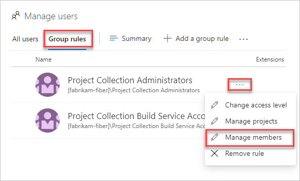

# Migrate to group-based resource management in VSTS

**VSTS**

All current users in your VSTS organization are considered to have resources via "explicit assignment" instead of implicit group assignment. If you would like to start using group-based licensing to manage licenses in your organization, you will need a migration plan to seamlessly replace existing solutions with group-based licensing.

The most important thing to keep in mind is that you should avoid a situation where migrating to group-based licensing will result in users temporarily losing their currently assigned licenses. Any process that may result in removal of licenses should be avoided to eliminate the risk of users losing access to services and their data.

## Add a group rule

1. Sign in to your VSTS organization (```https://{yourorganization}.visualstudio.com```).
2. Go to the **Users** page and choose **Group rules**.

   

3. Make sure all required users are members of the groups by highlighting a group rule and clicking **Manage members**.

   

   > [!NOTE]
   > Leave any existing automation you may have (for example, PowerShell) for managing access levels or extensions for users, running as is - your goal should be to reflect the same resources which the automation is applying to those users.

4. Choose **Add a group rule** and then highlight an Azure AD group and assign the required access level, project group memberships, and extension(s).

When the same access level or extension is assigned to the user both directly and through a group, only one access level or extension is consumed by the user. Therefore, no additional licenses are required to perform the migration.

## Verify group rule

1. Verify that the resources have been applied to each group by highlighting a group on the Group rules tab, and then choose **Summary**.

2. Verify individual user resources by highlighting a user on the Users page, and then choose **Summary**.

3. Verify that no assignments have failed by checking to see if there are assignment errors on the Groups tab of the Users page.

Your group rule is in effect. We recommend that you re-evaluate rules regularly on the Group rules tab of the Users page to clarify any group membership changes in Azure AD, which could affect your organization.
