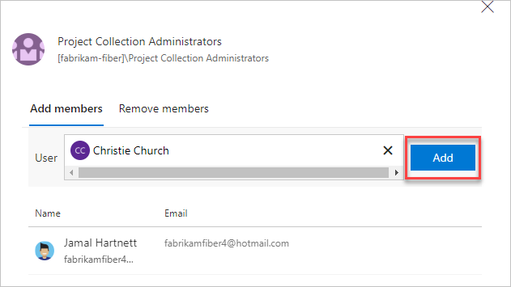

# Migrate to group-based resource management in Azure DevOps Services

[!INCLUDE [version-vsts-only](../../_shared/version-vsts-only.md)]

All current users in your organization are considered to have resources via "explicit assignment" instead of implicit group assignment. To use group-based licensing to manage licenses in your organization, you need a migration plan to seamlessly replace existing solutions with group-based licensing.

The most important thing is to avoid a situation where migration to group-based licensing results in users temporarily losing their currently assigned licenses. To eliminate the risk of users losing access to services and their data, avoid any process that might result in the removal of licenses.

## Add a group rule

[!INCLUDE [temp](../../_shared/new-navigation.md)] 

# [New navigation](#tab/new-nav)

1. Sign in to your organization (```https://dev.azure.com/{yourorganization}```).

2. Select  **Organization settings**.

    

3. Select **Users** > **Group rules**.

   

4. Make sure all required users are members of the groups. Highlight a group rule and from the command bar, select **Manage members**.

   

   > [!NOTE]
   > Leave existing automation for managing access levels or extensions for users running as-is (for example, PowerShell). The goal is to reflect the same resources that the automation is applying to those users.

5. Add members and select **Add**.

   

# [Previous navigation](#tab/previous-nav)

1. Sign in to your organization (`https://dev.azure.com/{yourorganization}`).

2. Open Organization settings.

   

3. Select **Users** > **Group rules**.

   

4. Make sure all required users are members of the groups. Highlight a group rule and select **Manage members**.

   

   > [!NOTE]
   > Leave existing automation for managing access levels or extensions for users running as-is (for example, PowerShell). The goal is to reflect the same resources that the automation is applying to those users.

5. Add members and select **Add**.

   

---

When the same access level or extension is assigned to the user both directly and through a group, the user consumes only one access level or extension. No additional licenses are required to perform the migration.

## Verify a group rule

- Verify that the resources are applied to each group. On the **Group rules** tab, highlight a group and select **Summary**.

- Verify individual user resources. On the **Users** page, highlight a user and select **Summary**.

- Verify that no assignments have failed. On the **Users** page, on the **Groups** tab, check for assignment errors.

Your group rule is in effect. We recommend that you reevaluate rules regularly on the **Group** rules tab of the **Users** page. Clarify whether any group membership changes in Azure AD might affect your organization.
