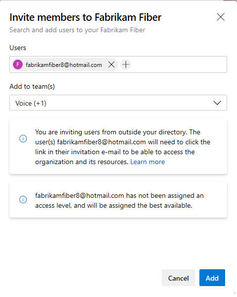

# Manage your organizations

[!INCLUDE [version-vsts-tfs-all-versions](../../includes/version-vsts-only.md)]

With an organization, you gain access to the platform in which you can do the following tasks:

* Collaborate with others to develop applications by using our cloud service
* Plan and track your work and code defects and issues
* Set up continuous integration and deployment
* Integrate with other services by using service hooks
* Obtain additional features and extensions
* Create one or more projects to segment work.

> [!NOTE]
> This article applies to the Azure DevOps cloud service. If you manage an on-premises Azure DevOps Server, refer to [Administrative tasks quick reference](/azure/devops/server/admin/admin-quick-ref) for details on managing the server.

## Create your organization

Before you get started, read [Plan your organizational structure in Azure DevOps](../../user-guide/plan-your-azure-devops-org-structure.md). Then, you can [create your organization](create-organization.md) and invite others so they can access your organization.

> [!NOTE]
> All organizations must be manually created via the web portal. We don't support automated creation of organizations. We do support automated organization configuration, project creation, and resource provisioning via REST API.

Choose Git or Team Foundation Version Control (TFVC) as your version control.
With version control, you can create your project for code and other assets,
like builds, tests, and work items. If you're starting with Visual Studio
as your development environment, you can create your organization when you
[set up Visual Studio](set-up-vs.md).

Your organization includes five free users
with Basic access, plus unlimited Visual Studio
subscribers and Stakeholders at no extra charge.
Your organization also includes free monthly amounts
of additional services such as build and deployment.

## Connect to your organization

Once you've created your organization, [connect to your projects](../../organizations/projects/connect-to-projects.md) with tools like Xcode, Eclipse, or Visual Studio, and then add code to your project.

Some clients, like Xcode, Git, and NuGet, require basic credentials
(a username and password) for you to access Azure DevOps.
To connect these clients to Azure DevOps, create personal access tokens (PATs) to authenticate your identity.
Use a credential manager to create, store, and secure your tokens. This way, you don't have to reenter them every time you make updates. Or, if you don't want to use a credential manager, you can
[create PATs manually](use-personal-access-tokens-to-authenticate.md).

<a id="add-users" />

## Add and manage user access to your organization

You manage who can access your organization by adding them as users of your organization. You manage which features and tasks users can make through access levels and permissions.

Also, if you manage your users with Azure Active Directory (Azure AD), you can connect your organization to Azure AD and manage access through Azure AD.

### *Access*, *access level*, and *permissions*

Three key definitions to understand when managing your user base are as follows:

* **Access** indicates a user can sign into your organization, and at a minimum view information about your organization.
* **Access levels** grant or restrict access to select web portal features. Access levels enable administrators to provide their user base access to the features they need and only pay for those features.
* **Permissions**, granted through security groups, provide and restrict users from completing specific tasks.

For an overview of default assignments, see [Default permissions and access for Azure DevOps](../security/permissions-access.md).

### Direct versus group rule assignments

You can add and assign an access level to users one-by-one, which is referred to as **Direct** assignment. You can also set up one or more **Group rules** and add and assign access levels to groups of users. This action is referred to as a **Group Rule** assignment.

<a id="add-users-direct" />

## Add users and assign access: Direct assignment

If you don't use Azure AD, as described in the next section, to manage your user base, then you can add them through the following ways to collaborate on your project.

* Add users to your organization from the **Organization settings > Users** page. Only organization owners or members of the Project Collection Administration group can add users at this level.

    Specify the access level and the project(s) the user is added to. For more information, see [Add users to your organization or project](add-organization-users.md).

* Add users to one or more teams from the **Project > Summary** page or to a specific team from the **Project settings > Teams > Team** page. Members of the Project Collection Administration or Project Administration groups, or a team administrator can add users to teams.

    > [!div class="mx-imgBorder"]  
    > 
  
    Unless users are granted an access level directly or through a group rule, they're assigned the best available access level. If there are no more free Basic slots available, then the user is added as a Stakeholder. The access level can be changed later through the **Organization settings > Users** page.

For more information, see the following articles:

* [Add users to your organization](add-organization-users.md)
* [Add users to a team](../security/add-users-team-project.md#add-users-to-a-team)
* [Add users to a project](../security/add-users-team-project.md#add-users-to-a-project)

<a id="access-azure-ad" />

## Add users through Azure Active Directory

You can manage your user base with Azure Active Directory (Azure AD). With Azure AD, you can control access the same way that you do with Microsoft services like Microsoft 365 and Microsoft Azure.

If you already use Azure AD, you can [use your directory to authenticate access to Azure DevOps Services](access-with-azure-ad.md). Recommended practice for managing large user bases is to use Azure AD, however it's optional.  

The process of adding users to projects when you're managing them through Azure AD is as follows:

1. [Connect your organization to Azure AD](connect-organization-to-azure-ad.md). If you need to set up Azure AD, do that now.  
2. Go to [Azure Active Directory](https://azure.microsoft.com/services/active-directory/) and sign in with your organization account.  
3. [Add organization users to your Azure AD](/azure/active-directory/fundamentals/add-users-azure-active-directory).  
4. [Add an Azure AD group to an Azure DevOps group](manage-azure-active-directory-groups.md).  
5. [Create bulk assignments of access levels for users](add-organization-users.md), or [define group rules and assign access levels](assign-access-levels-by-group-membership.md).

You can also add users through the steps outlined in the previous section about [direct assignment](#add-users).

Using Azure AD, you can segment access by adding select Azure AD groups to Contributors groups in select projects.

<a id="add-users-notes" />

## Add users through group rules

A best practice to use when managing users is to manage them through security groups. You can use the default security groups Azure DevOps provides, create custom security groups, or reference Azure AD groups. You can use any of these  groups to add and manage user access levels using group rules. To learn more, see [Add a group rule to assign access levels and extensions](assign-access-levels-by-group-membership.md).

## Add users implementation notes

The following notes address details specific to adding users at different levels&mdash;such as to a team, project, or organization.

* All users added at the organization or collection level can be assigned to work items of all projects. However, if the user doesn't have access to the project, then they can't view or edit the work item.
* All users invited or added as a member at the project level can be assigned to work items of the project.

## Set up billing

If you need more than the free users and services included with your organization,
[set up billing for your organization](../billing/set-up-billing-for-your-organization-vs.md).
You can then pay for more users with Basic access, buy more services, and purchase extensions for your organization.

## Additional administrative tasks

<table valign="top">
<tbody valign="top">
<tr>
<td width="33%">
<h4>Manage access</h4>
<ul>
<li><a href="add-external-user.md">Add external users</a></li>
<li><a href="/visualstudio/subscriptions/vs-alternate-identity?toc=%2Fazure%2Fdevops%2Forganizations%2Ftoc.json&bc=%2Fazure%2Fdevops%2Forganizations%2Fbreadcrumb%2Ftoc.json" >Link work accounts to Visual Studio subscriptions</a></li>
<li><a href="delete-organization-users.md">Remove users</a></li>
<li><a href="change-application-access-policies.md">Change app access policies</a></li>
<li><a href="use-personal-access-tokens-to-authenticate.md">Authenticate with PATs</a></li>
<li><a href="admin-revoke-user-pats.md">Revoke user PATs</a>
</ul>
<h4>Manage Azure AD access</h4>
<ul>
<li><a href="add-external-user.md">Remove Azure DevOps users</a></li>
<li><a href="disconnect-organization-from-azure-ad.md" >Disconnect from Azure AD</a></li>
<li><a href="change-azure-ad-connection.md">Change your Azure AD tenant connection</a></li>
<li><a href="azure-ad-tenant-policy-restrict-org-creation.md">Restrict organization creation with tenant policy</a></li>
</ul>
<h4>Manage group-based licensing</h4>
<ul>
<li><a href="assign-access-levels-by-group-membership.md">Add a group rule to assign access levels and extensions</a></li>
</ul>
</td>
<td width="33%">
<h4>Organization settings</h4>
<ul>
<li><a href="change-organization-ownership.md" >Change organization Owner</a></li>
<li><a href="rename-organization.md">Rename organization</a></li>
<li><a href="delete-your-organization.md">Delete an organization</a></li>
<li><a href="recover-your-organization.md">Recover a deleted organization</a></li>
<li><a href="change-organization-location.md">Change location (region)</a></li>
<li><a href="add-privacy-policy-url.md">Add privacy policy URL</a>
<li><a href="change-time-zone.md">Change time zone</a></li>
</ul>
<h4>Manage extensions</h4>
<ul>
<li><a href="../../marketplace/install-extension.md" >Install extensions</a></li>
<li><a href="/azure/devops/marketplace/request-extensions">Approve requests for extensions</a></li>
<li><a href="../../marketplace/uninstall-disable-extensions.md">Uninstall or disable extensions</a></li>
</td>
<td width="33%">
<h4>Manage permissions</h4>
<ul>
<li><a href="../security/set-project-collection-level-permissions.md" >Add project or organization-level administrators </a></li>
<li><a href="../settings/add-team-administrator.md">Add a team admin</a></li>
<li><a href="../security/change-individual-permissions.md">Change individual permissions</a></li>
<li><a href="../security/restrict-access.md">Grant or restrict permissions</a></li>
<li><a href="../projects/resources-granted-to-project-members.md">Resources granted to project members</a></li>
</ul>
</td>
</tr>
</tbody>
</table>

## Related articles

* [About access levels](../security/access-levels.md)
* [Default permissions and access](../security/permissions-access.md)
* [Set permissions at the project- or collection-level](../security/set-project-collection-level-permissions.md)
* [Add a user as a team administrator](../settings/add-team-administrator.md)
* [About using Azure AD to authenticate access to Azure DevOps Services](access-with-azure-ad.md)
* [Troubleshoot permissions and access with Azure AD](faq-azure-access.yml)
