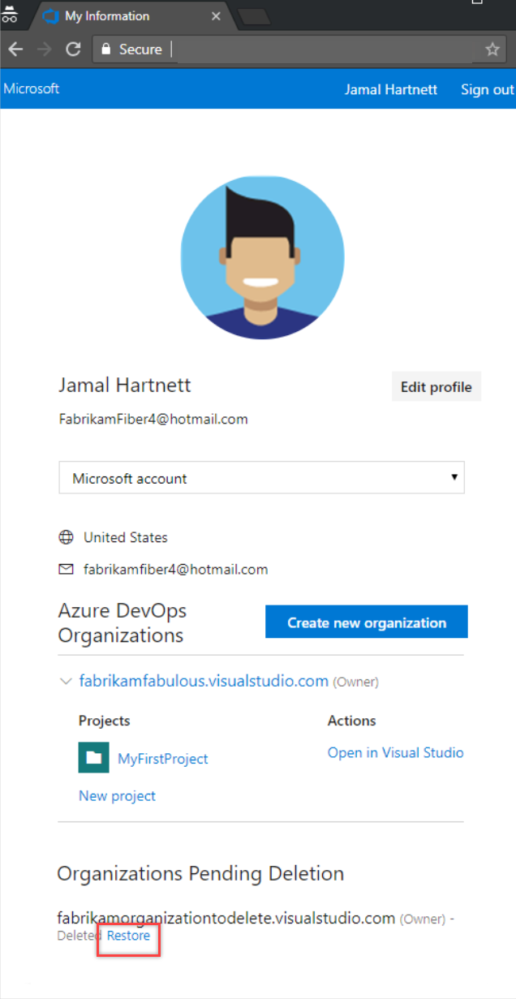

# Recover a deleted organization

[!INCLUDE [version-eq-azure-devops](../../includes/version-eq-azure-devops.md)]

After you delete an organization, it's disabled but available for 28 days. If you change your mind during this time, you can recover the organization. After 28 days, the organization and data are permanently deleted.

## Prerequisites

* An organization deleted within the last 28 days.
* Organization owner permissions. [How do I find the organization owner?](../security/look-up-organization-owner.md). For more information about specific scenarios, see the following instructions:
  * [When you don't have an Azure DevOps Administrator](resolve-orphaned-organization.md#when-you-dont-have-an-azure-devops-administrator)
  * [Resolve orphaned organization when your Azure DevOps Administrator *is* a member of the target organization](resolve-orphaned-organization.md#when-your-azure-devops-administrator-is-a-member-of-the-target-organization)
  * [Resolve orphaned organization when your Azure DevOps Administrator *isn't* a member of the target organization](resolve-orphaned-organization.md#when-your-azure-devops-administrator-isnt-a-member-of-the-target-organization)

> [!NOTE]
>  If there's no owner for the deleted organization and you're an active Project Collection Administrator (PCA) and a member of the deleted organization, you still can't access **Organization settings** to assign a new owner. If this is your scenario, [contact Support](https://developercommunity.visualstudio.com/AzureDevOps).

## Recover organization

1. Sign in to your [Visual Studio profile](https://app.vsaex.visualstudio.com/profile/view).

   [Why am I asked to choose between my work or school account and my personal account?](faq-user-and-permissions-management.yml#ChooseOrgAcctMSAcct)

2. On your profile page, go to the lower *Organizations Pending Deletion* section, and then select **Restore**.

   

3. In the resulting popup, select **Restore** to confirm.

   * If your organization URL is still available, you can restore it.

      

   * If your organization URL isn't available, provide a new URL, and then select **Restore**.

4. After you restore your organization, do the following tasks:

   * If billing was previously set up for your organization, [relink your organization](../billing/set-up-billing-for-your-organization-vs.md) to an Azure subscription.
   * If your organization was connected to Azure Active Directory for authenticating user access, you don't have to reconnect it.

## Related articles

* [Delete your organization from Azure DevOps](delete-your-organization.md)
* [Create a new organization](create-organization.md)
* [Change organization owner](change-organization-ownership.md)
* [Change organization data region](change-organization-location.md)
* [FAQs for configuring and customizing your organization](faq-configure-customize-organization.yml)
