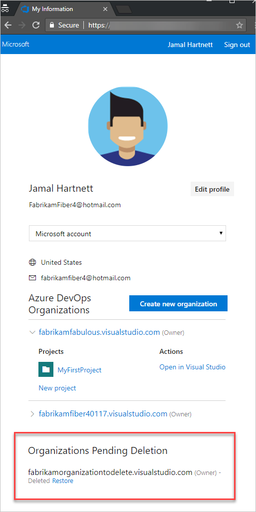
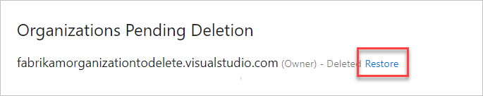

# Restore your organization in Azure DevOps

[!INCLUDE [version-vsts-only](../../_shared/version-vsts-only.md)]

After you delete your organization, it's disabled but available for 30 days. If you change your mind during this time, you can recover your organization. After 30 days, your organization and data are permanently deleted.

## Prerequisites

* An organization deleted within the last 30 days.
* Organization owner permissions to restore your organization. [How do I find the organization owner?](faq-delete-restore-organization.md#find-owner)

1. Sign in to your [Visual Studio profile](https://app.vsaex.visualstudio.com/profile/view).

   [Why am I asked to choose between my work or school account and my personal account?](faq-delete-restore-organization.md#ChooseOrgAcctMSAcct)

2. On your profile page, go to the *Organizations Pending Deletion* section at the bottom. You see a link to restore your organization.

   

3. Select **Restore**.

   * If your organization URL is still available, you can restore it.

      

   * If your organization URL isn't available, provide a new URL and then select **Restore**.

      

4. After you restore your organization, do the following:

   * If billing was set up for your organization, you have to set it up again. [Relink your organization](../billing/set-up-billing-for-your-organization-vs.md) to an Azure subscription.

   * If your organization was connected to Azure Active Directory for authenticating user access, you don't have to reconnect it.

   [Need help?](faq-delete-restore-organization.md#get-support)

