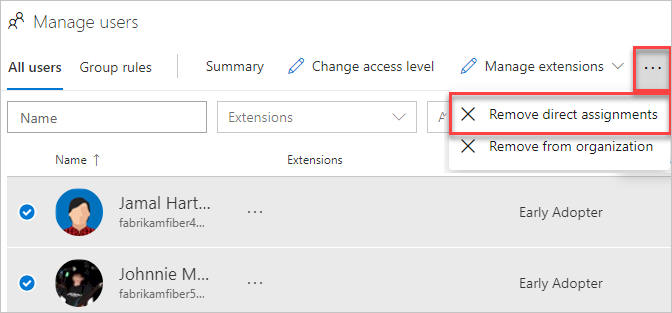
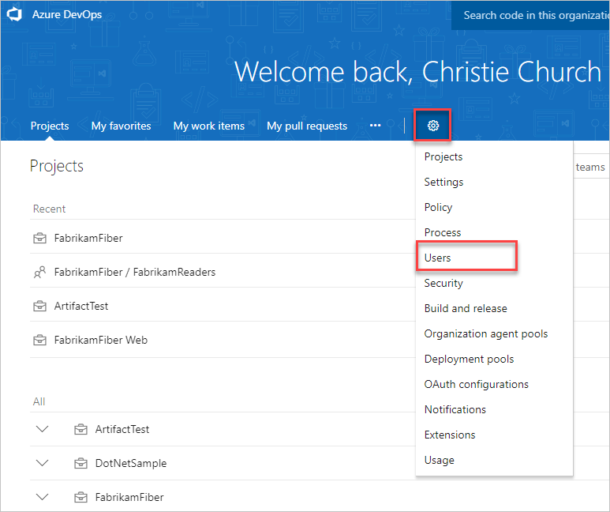
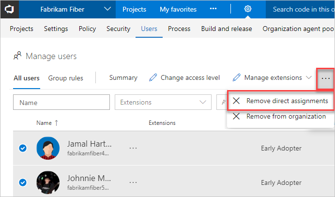

# Remove direct assignments from users in Azure DevOps

[!INCLUDE [version-vsts-only](../../_shared/version-vsts-only.md)]

To manage a user's resources only by the groups that they're in, you must remove the direct assignments. Resources that are directly assigned to a user via individual assignment stay assigned to the user, whether the resources are assigned or taken away from the user's groups.

## Prerequisites

* You must be a member of the **Project Collection Administrators** group for the organization that you would like to manage users' direct assignments.

## Remove assignments

[!INCLUDE [temp](../../_shared/new-navigation-cloud.md)] 

# [New navigation](#tab/new-nav)

1. Sign in to your organization (```https://dev.azure.com/{yourorganization}```).

2. Select  **Organization settings**.

   

3. Select the **Users** tab.

   

4. Select all users with resources that should be managed only by groups.

   

5. To confirm that you want to remove the direct assignments, select **Remove**.

# [Previous navigation](#tab/previous-nav)

1. Sign in to your organization (`https://dev.azure.com/{yourorganization}`).

2. Go to your **Users** settings.

   

3. Select all users with resources that should be managed only by groups.

4. From the command bar, select **Remove direct assignments**, or right-click and choose the same option from the menu.

   

5. To confirm that you want to remove the direct assignments, select **Remove**.

---

Direct assignments are removed from the users.

> [!Note]
> If a user isn't a member of any groups, then the user isn't affected.

## Related articles

* [What is Azure Active Directory B2B Collaboration?](/azure/active-directory/active-directory-b2b-what-is-azure-ad-b2b)

* [Migrate to group-based resource management](migrate-to-group-based-resource-management-in-vsts.md)

* [Assign access levels and extensions to users by group membership](assign-access-levels-and-extensions-by-group-membership.md)
