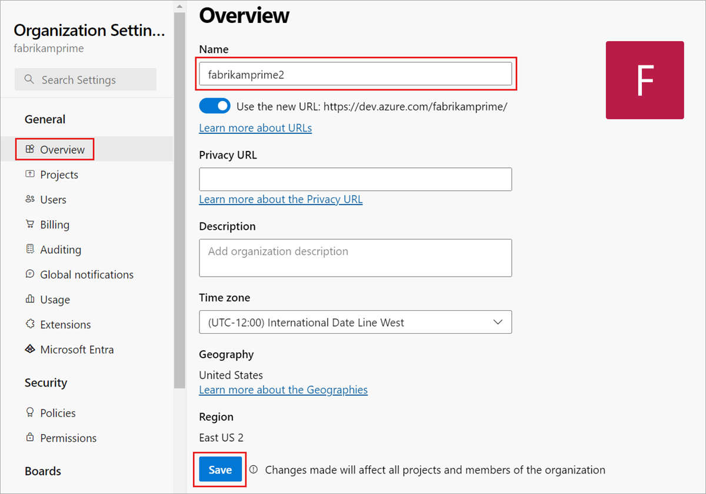

# Rename your organization in Azure DevOps

[!INCLUDE [version-vsts-only](../../includes/version-vsts-only.md)]

You can change your organization name (URL) at any time in Azure DevOps. This article shows you how.

> [!Caution]
> The rename operation affects your organization's connections and individuals who are currently working with your organization. Before you start, find out [what to do before and after renaming your organization](https://support.microsoft.com/kb/2793597).

## Prerequisites

To change your organization URL, you need at least Basic access and organization Owner permissions.
[How do I find the organization Owner?](../security/lookup-organization-owner-admin.md)

> [!NOTE]
> You can't rename an organization within one hour of the most recent rename operation.

## Rename your organization

[!INCLUDE [organization-name-limitation](../../includes/organization-name-limitation.md)]

1. Sign in to your organization (`https://dev.azure.com/{yourorganization}`).

2. Select  **Organization settings**.

   

3. Select **Overview**, enter a new name for the organization, and then select **Save**. Move the toggle to use the new URL, if you want.

   

4. Confirm that you want to rename your organization. Enter a new name for your organization and save your changes.

   

Your organization is renamed.

## Frequently asked questions (FAQs)

### Q: If I change the organization URL, can I switch back?

A: The organization URL setting is two-way toggle. You can turn on the new domain name URL. You can also turn off the new URL - then, you go back to using old URL format.  

## Related articles

- [Resolve orphaned organization](resolve-orphaned-organization.md)
- [Delete your organization](delete-your-organization.md)
- [Connect your organization to Azure Active Directory](connect-organization-to-azure-ad.md)

