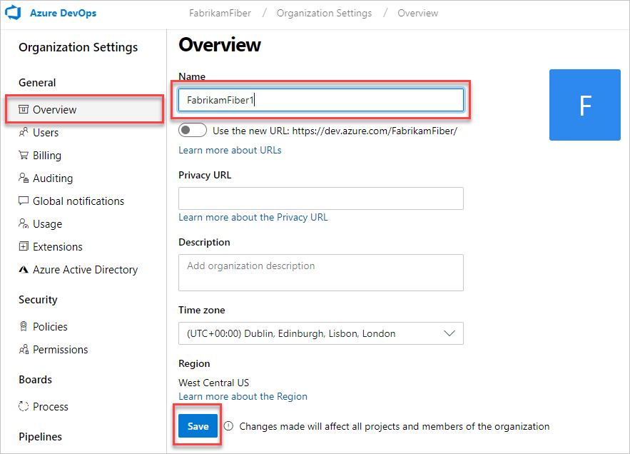

# Rename your organization in Azure DevOps

[!INCLUDE [version-vsts-only](../../_shared/version-vsts-only.md)]

You can change your organization name (URL) at any time in Azure DevOps. This article shows you how.

> [!Caution]
> The rename operation affects your organization's connections and individuals who are currently working with your organization. Before you start, find out [what to do before and after renaming your organization](https://support.microsoft.com/kb/2793597).

> [!NOTE]
> An organization can't be renamed within one hour of the most recent rename operation.

## Prerequisites

To change your organization URL, you need at least Basic access and organization Owner permissions.
[How do I find the organization owner?](faq-delete-restore-organization.md#find-owner)

## Rename your organization

1. Sign in to your organization (`https://dev.azure.com/{yourorganization}`).

2. Select  **Organization settings**.

   

3. Select **Overview**, enter a new name for the organization, and then select **Save**. Move the toggle to use the new URL, if desired.

   

4. Confirm that you want to rename your organization. Enter a new name for your organization and save your changes.

   

Your organization is renamed.

## Q: If I change the organization name, can I switch back? Is the toggle 2-way?

A: The organization URL setting is two-way toggle. You can turn on the new domain name URL. You can also turn the new URL off - then, you will go back to using old URL format.  

## Q: If I change the organization name, does the original URL still work (so that other team members can migrate at their own pace)?

A: Yes. The old URL will still be available when enable the new URL, but it will automatically jump to the new URL.
