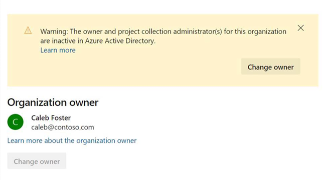
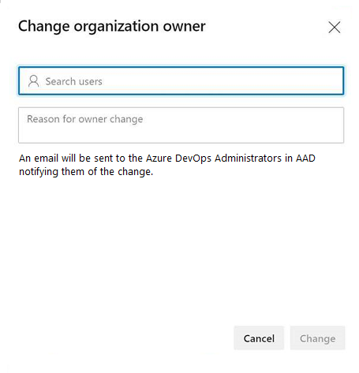

# Assign a new owner to your orphaned organization

[!INCLUDE [version-vsts-only](../../includes/version-vsts-only.md)]

An Azure DevOps orphaned organization occurs when the organization owner and all Project Collection Administrators are inactive or have left the company. This causes the organization to be without an administrator and no way of transferring administrator rights to another person. 

For organizations connected to Azure Active Directory (Azure AD), if your organization owner or all other Project Collection Administrators are inactive, you can transfer ownership to another user.

> [!NOTE]   
> If you simply want to change the organization owner and aren't under the banner of orphaned organization, then see [Change organization owner](change-organization-ownership.md). 

## Prerequisites

- You must have been granted the [Azure DevOps Administrator role](/azure/active-directory/users-groups-roles/directory-assign-admin-roles#azure-devops-administrator) in Azure AD.
- The Azure DevOps Administrator can only claim ownership of organizations where the current owner and all members of the Project Collection Administrators group are inactive in the backing Azure AD.
 

## Find your Azure DevOps Administrator when you are not the Azure DevOps Administrator 

1. To find your Azure DevOps Administrator, navigate to the [Azure portal](https://portal.azure.com/), as described [View and assign administrator roles in Azure Active Directory](/azure/active-directory/users-groups-roles/directory-manage-roles-portal). To learn more about Azure AD roles, see [Administrator role permissions in Azure Active Directory](/azure/active-directory/users-groups-roles/directory-assign-admin-roles).  
2. The Azure DevOps Administrator can then follow the instructions below to claim ownership of the target Azure DevOps organization.  

## When your company does not have an Azure DevOps Administrator

When your Azure AD tenant doesn't have an assigned Azure DevOps Administrator, complete the following steps:  
1. Find your Azure AD Global Administrator or Privileged Role Administrator. These can be found in the Azure portal, as described here. To learn more about Azure AD roles, click here.   
2. Ask the Azure AD Global Administrator or Privileged Role Administrator to assign the Azure DevOps Administrator role to the appropriate user(s). 

	> [!NOTE]   
	> Any changes to role membership may take up to an hour to propagate to Azure DevOps.  

3. The Azure DevOps Administrator can then follow the instructions below to claim ownership of the target Azure DevOps organization.  
 
## Assign new Azure DevOps owner 

1. Log into your account that has been granted the Azure DevOps Administrator role in AAD.  

1. Sign into the target organization.  

1. Select **Organization settings**.

> [!div class="mx-imgBorder"]  
>   

1. Select **Overview**, and then **Change owner** in the yellow message bar. 

	> [!div class="mx-imgBorder"]  
	> 

1. Select a user from the dropdown menu, or search for a user by entering the user's name, and then choose **Change**. You are required to provide a short justification. All Azure DevOps Administrators in your Azure Active Directory will receive a notification of the ownership transfer with your provided justification.  

	> [!div class="mx-imgBorder"]  
	>   

<!---

### When you have an Azure DevOps Administrator

When your Azure AD tenant has an assigned Azure DevOps Administrator, complete the following steps.

1. Sign in to an account that's granted the Azure DevOps Administrator role in Azure AD. 

2. Navigate to the orphaned organization and claim ownership.    You're required to provide a short justification. All Azure DevOps Administrators receive a notification.

3. [Transfer ownership of the organization](change-organization-ownership.md) to the appropriate user.
 

### When you don't have an Azure DevOps Administrator

When your Azure AD tenant doesn't have an assigned Azure DevOps Administrator, complete the following steps.

1. Escalate to your Azure AD Global Administrator or Privileged Role Administrator (as will be described in documentation.....) 

2. The Azure AD Global Administrator/Privileged Role Administrator assigns the Azure DevOps Administrator role to the appropriate user(s). 

3. The Azure DevOps Administrator can then navigate to the orphaned organization and claim ownership. They're required to provide a short justification. All Azure DevOps Administrators receive a notification.

4. The Azure DevOps Administrator then [transfers ownership to the appropriate user](change-organization-ownership.md). 

--> 

## Related articles

* [Change organization owner](change-organization-ownership.md)
* [Need help?](faq-delete-restore-organization.md#get-support)
* [Delete your organization from Azure DevOps](delete-your-organization.md)
