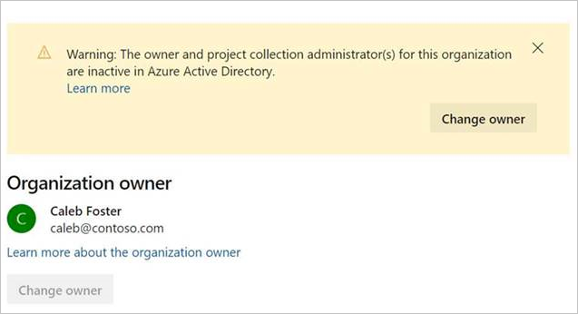
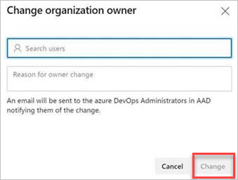
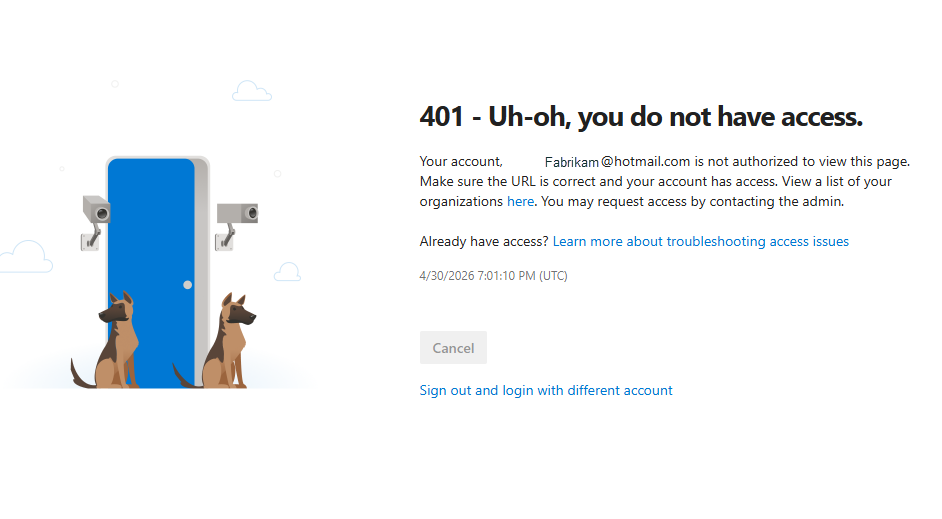
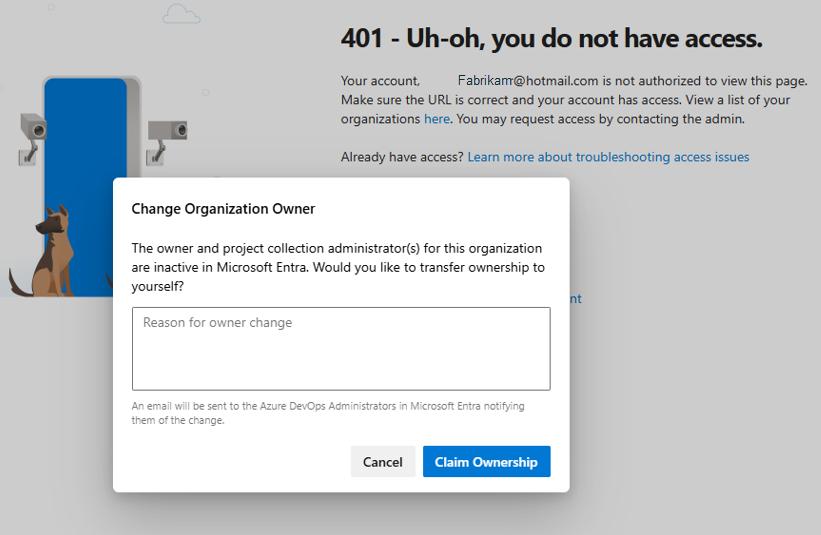

# Assign an owner to an orphaned organization

[!INCLUDE [version-eq-azure-devops](../../includes/version-eq-azure-devops.md)]

When the organization owner and all project collection administrators are inactive, the organization is considered orphaned. An orphaned organization doesn't have an administrator, so there's no way to transfer administrator rights to another user.

[!INCLUDE [ai-assistance-mcp-server-tip](../../includes/ai-assistance-mcp-server-tip.md)]


But, organizations connected to Microsoft Entra ID can transfer ownership to an active user.

> [!NOTE]
> If your organization isn't considered orphaned and you want to change the owner, see [Change organization owner](change-organization-ownership.md).

## Prerequisites

| Category | Requirements |
|--------------|-------------|
|**Permissions**|[Azure DevOps Administrator in Microsoft Entra ID](../security/look-up-azure-devops-administrator.md). If using [Privileged Identity Management](/azure/active-directory/privileged-identity-management/pim-configure?msclkid=303229fdc6c111ecaf0f666b2dd9cd6f), the Azure DevOps Administrator should be of type [Active](/azure/active-directory/privileged-identity-management/pim-how-to-add-role-to-user?msclkid=5cdc55f5c6c011eca737e344cbe17b42).|

> [!NOTE]
> Claim ownership of organizations only when the current owner and all members of the Project Collection Administrators group are inactive in the backing Microsoft Entra ID. Azure DevOps and Microsoft Entra ID define inactive user accounts the same way. For more information, see [What are inactive user accounts?](/azure/active-directory/reports-monitoring/howto-manage-inactive-user-accounts).

### Find your Azure DevOps Administrator

The Azure DevOps Administrator can [change the Azure DevOps owner](change-organization-ownership.md) to claim ownership of the target Azure DevOps organization. 

> [!NOTE]
> Any changes to role membership might take up to an hour to propagate to Azure DevOps.  

## When your Azure DevOps Administrator is a member of the target organization

When your Azure DevOps Administrator in Microsoft Entra ID *is* a member of the target Azure DevOps organization, do the following steps.

1. As the Azure DevOps Administrator, sign in to your organization (```https://dev.azure.com/{yourorganization}```).

2. Select **Organization settings** > **Overview**.

3. In the warning message, select **Change owner**.

    

4. Select a user from the dropdown menu, or search for a user by entering the user's name, provide a short justification, and then select **Change**.

    

A notification of the ownership transfer with your provided justification gets sent to all Azure DevOps Administrators in your Microsoft Entra ID.

## When your Azure DevOps Administrator isn't a member of the target organization

When your Azure DevOps Administrator in Microsoft Entra ID *isn't* a member of the target Azure DevOps organization, do the following steps:

1. Sign in to your organization (```https://dev.azure.com/{yourorganization}```) using the credentials granted to the Azure DevOps Administrator role in Microsoft Entra ID.
    
    An error page appears where you can claim ownership.

    

2. Select **Claim Ownership**, provide a short justification, and then select **Claim Ownership** once again. 
   
    A notification of the ownership transfer with your provided justification gets sent to all Azure DevOps Administrators in your Microsoft Entra ID.

   

   You're redirected to the organization overview page. To transfer ownership to another user, see [Change organization owner](change-organization-ownership.md).

<a id="use-ai-assistance"></a>

## Use AI to resolve orphaned organizations

If you have the [Azure DevOps MCP Server](../../mcp-server/mcp-server-overview.md) configured, you can use AI assistants to investigate orphaned organizations and gather ownership details using natural language prompts. The MCP Server provides your AI assistant with secure access to your Azure DevOps data, allowing you to check organization ownership, list administrators, and verify Microsoft Entra connections without navigating through the web interface.

### Example prompts for resolving orphaned organizations

| Task | Example prompt |
|------|----------------|
| **Check organization owner** | `Who is the current owner of the <organization-name> organization?` |
| **List administrators** | `List all Project Collection Administrators in the <organization-name> organization` |
| **Check Microsoft Entra connection** | `Is the <organization-name> organization connected to Microsoft Entra ID?` |
| **List organization members** | `Show me all users in the <organization-name> organization and their last access dates` |
| **Verify your role** | `What is my role and permissions in the <organization-name> organization?` |
| **List all organizations** | `List all Azure DevOps organizations I have access to` |

> [!TIP]
> If you're using Visual Studio Code, [agent mode](/visualstudio/ide/copilot-chat-context#agent-mode) is especially helpful for investigating organization ownership and identifying inactive administrators.
> - To avoid using stale or cached data from previous queries, add to your prompt, `Do not use previously fetched data`.

## Related content

- [Review administrator role permissions in Microsoft Entra ID](/azure/active-directory/users-groups-roles/directory-assign-admin-roles)
- [Delete an organization](delete-your-organization.md)
- [Get a list of organizations backed by Microsoft Entra ID](get-list-of-organizations-connected-to-microsoft-entra-id.md)
