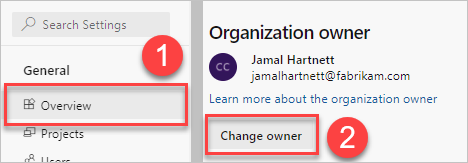

# Assign an owner to an orphaned organization

[!INCLUDE [version-eq-azure-devops](../../includes/version-eq-azure-devops.md)]

When the organization owner and all project collection administrators are inactive, the organization is considered orphaned. An orphaned organization doesn't have an administrator, so there's no way of transferring administrator rights to another user.

But, organizations that are connected to Azure AD can transfer ownership to an active user.

> [!NOTE]
> If your organization isn't considered orphaned and you want to change the owner, then see [Change organization owner](change-organization-ownership.md).

## Prerequisites

- You must be an [Azure DevOps Administrator](/azure/active-directory/users-groups-roles/directory-assign-admin-roles#azure-devops-administrator) in Azure AD. If you're using [Privileged Identity Management,](/azure/active-directory/privileged-identity-management/pim-configure?msclkid=303229fdc6c111ecaf0f666b2dd9cd6f) then the Azure DevOps Administrator must be of type [Active](/azure/active-directory/privileged-identity-management/pim-how-to-add-role-to-user?msclkid=5cdc55f5c6c011eca737e344cbe17b42). It isn't a requirement to be a Project Collection Administrator.
- The Azure DevOps Administrator role can only claim ownership of organizations when the current owner and all members of the Project Collection Administrators group are inactive in the backing Azure AD. Azure DevOps and Azure AD define inactive user accounts the same. For more information, see [What are inactive user accounts?](/azure/active-directory/reports-monitoring/howto-manage-inactive-user-accounts)
### Find your Azure DevOps Administrator

If you don't know who the Azure DevOps Administrator is for your organization, follow these steps to find out.

1. To find your Azure DevOps Administrator, go to the [Azure portal](https://portal.azure.com/), as described in [View and assign administrator roles in Azure AD](/azure/active-directory/users-groups-roles/directory-manage-roles-portal). For more information about Azure AD roles, see [Administrator role permissions in Azure AD](/azure/active-directory/users-groups-roles/directory-assign-admin-roles).  
2. The Azure DevOps Administrator can now complete the steps in [Change Azure DevOps owner](change-organization-ownership.md) to claim ownership of the target Azure DevOps organization.  

## When you don't have an Azure DevOps Administrator

When your Azure AD tenant hasn't assigned an Azure DevOps Administrator, complete the following steps.

1. Find your Azure AD Global Administrator or Privileged Role Administrator. These administrators can be found in the [Azure portal](https://portal.azure.com/), as described in [View and assign administrator roles in Azure AD](/azure/active-directory/users-groups-roles/directory-manage-roles-portal). To learn more about Azure AD roles, see [Administrator role permissions in Azure AD](/azure/active-directory/users-groups-roles/directory-assign-admin-roles).  
2. Ask the Azure AD Global Administrator or Privileged Role Administrator to assign the Azure DevOps Administrator role to the appropriate user(s).

    > [!NOTE]
    > Any changes to role membership may take up to an hour to propagate to Azure DevOps.  

3. The Azure DevOps Administrator can now complete the steps in [Change Azure DevOps owner](change-organization-ownership.md) to claim ownership of the target Azure DevOps organization.  

## When your Azure DevOps Administrator is a member of the target organization

Complete the following steps when your Azure DevOps Administrator in Azure AD *is* a member of the target Azure DevOps organization.

1. As the Azure DevOps Administrator, sign in to your organization (```https://dev.azure.com/{yourorganization}```).

2. Select **Organization settings**, and then **Overview**.

3. Within the warning message, select **Change owner**.

    

4. Select a user from the dropdown menu, or search for a user by entering the user's name, provide a short justification, and then select **Change**.

    

A notification of the ownership transfer with your provided justification gets sent to all Azure DevOps Administrators in your Azure AD.

## When your Azure DevOps Administrator isn't a member of the target organization

Complete the following steps when your Azure DevOps Administrator in Azure AD *isn't* a member of the target Azure DevOps organization.

1. Sign in to your organization (```https://dev.azure.com/{yourorganization}```) using the credentials granted to the Azure DevOps Administrator role in Azure AD.
    An error page appears where you can Claim Ownership.

      

2. Select **Claim Ownership**. Provide a short justification, and then select **Claim Ownership** once again. All Azure DevOps Administrators in your Azure AD receive a notification of the ownership transfer, which includes your provided justification.

   

   A notification of the ownership transfer with your provided justification is sent to all Azure DevOps Administrators in your Azure AD.

   You're redirected to the organization overview page. If you want to transfer ownership to another user, see [Change organization owner](change-organization-ownership.md).

## Related articles

- [Change organization owner](change-organization-ownership.md)
- [Administrator role permissions in Azure AD](/azure/active-directory/users-groups-roles/directory-assign-admin-roles).
- [Delete your organization](delete-your-organization.md)
- [Get list of organizations backed by Azure AD](get-list-of-organizations-connected-to-azure-active-directory.md)
